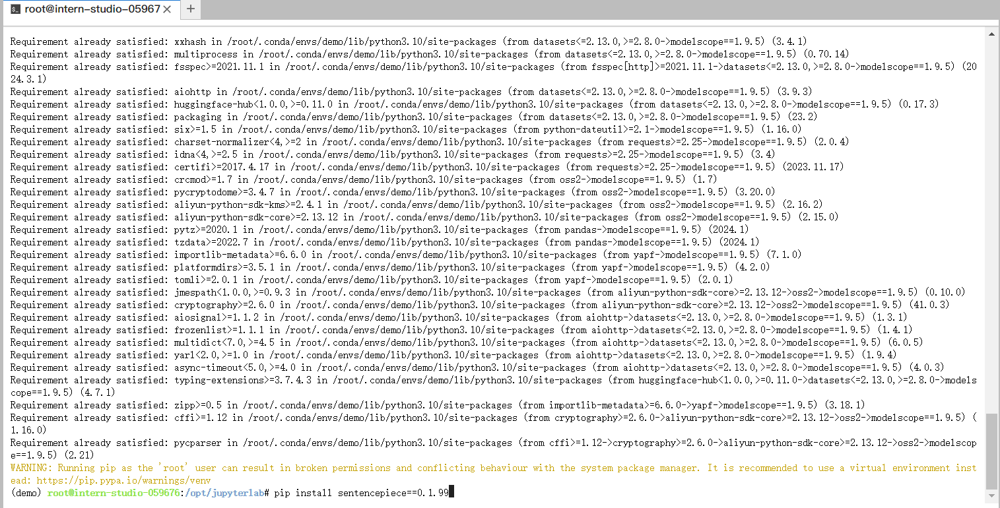
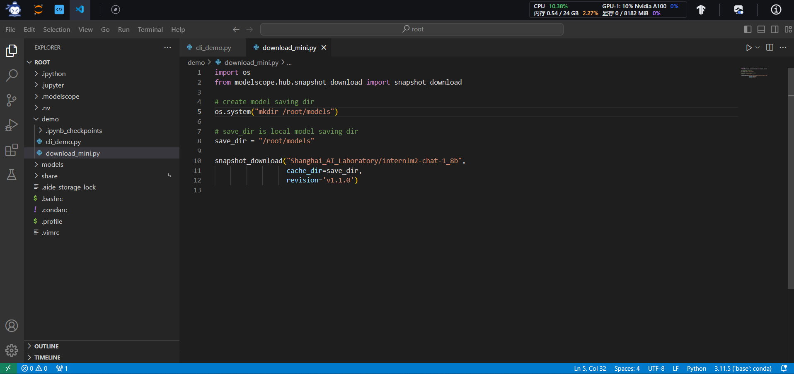
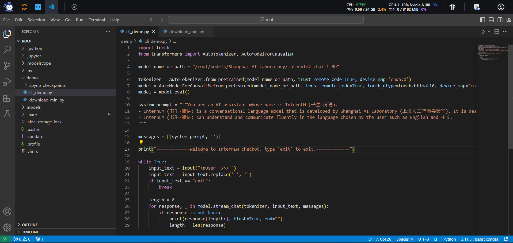
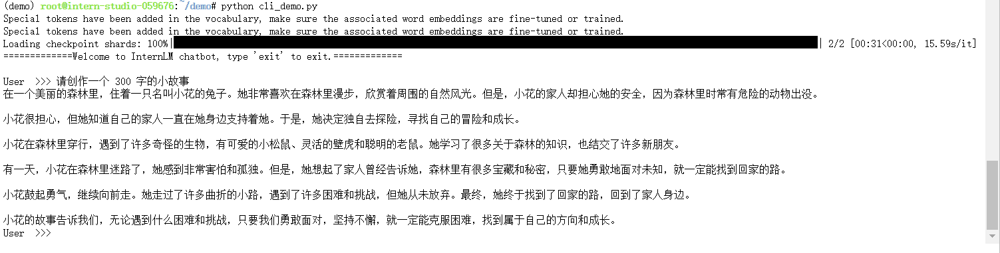

## **部署 `InternLM2-Chat-1.8B` 模型进行智能对话**

### **配置基础环境**

```
studio-conda -o internlm-base -t demo
```

输入以下命令，完成环境包的安装：
```
pip install huggingface-hub==0.17.3
pip install transformers==4.34 
pip install psutil==5.9.8
pip install accelerate==0.24.1
pip install streamlit==1.32.2 
pip install matplotlib==3.8.3 
pip install modelscope==1.9.5
pip install sentencepiece==0.1.99
```



### **下载 `InternLM2-Chat-1.8B` 模型**

创建文件夹:

```
mkdir -p /root/demo
touch /root/demo/cli_demo.py
touch /root/demo/download_mini.py
cd /root/demo
```

写入文件 `download_mini.py`

```angular2html
import os 
from modelscope.hub.snapshot_download import snapshot_download

# create model saving dir
os.system("mkdir /root/models")

# save_dir is local model saving dir
save_dir = "/root/models"

snapshot_download("Shanghai_AI_Laboratory/internlm2-chat-1_8b",
                  cache_dir=save_dir,
                  revision='v1.1.0')


```



写入文件 `cli_demo.py`

```python
import torch
from transformers import AutoTokenizer, AutoModelForCausalLM

model_name_or_path = "/root/models/Shanghai_AI_Laboratory/internlm2-chat-1_8b"

tokenizer = AutoTokenizer.from_pretrained(model_name_or_path, trust_remote_code=True, device_map='cuda:0')
model = AutoModelForCausalLM.from_pretrained(model_name_or_path, trust_remote_code=True, torch_dtype=torch.bfloat16, device_map='cuda:0')
model = model.eval()

system_prompt = """You are an AI assistant whose name is InternLM (书生·浦语).
- InternLM (书生·浦语) is a conversational language model that is developed by Shanghai AI Laboratory (上海人工智能实验室). It is designed to be helpful, honest, and harmless.
- InternLM (书生·浦语) can understand and communicate fluently in the language chosen by the user such as English and 中文.
"""

messages = [(system_prompt, '')]

print("=============Welcome to InternLM chatbot, type 'exit' to exit.=============")

while True:
    input_text = input("\nUser  >>> ")
    input_text = input_text.replace(' ', '')
    if input_text == "exit":
        break

    length = 0
    for response, _ in model.stream_chat(tokenizer, input_text, messages):
        if response is not None:
            print(response[length:], flush=True, end="")
            length = len(response)
```



输入命令，执行 Demo 程序：
```angular2html
conda activate demo
python /root/demo/cli_demo.py
```

等待模型加载完成，键入内容示例：


