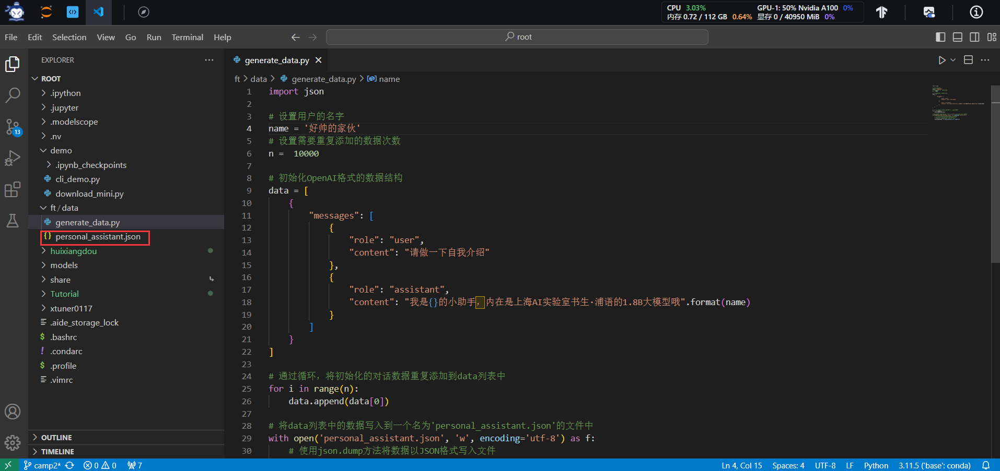
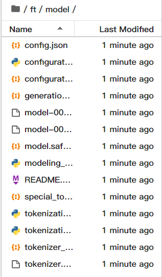
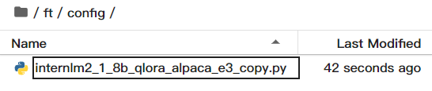

# 1.前期准备

## 1.1数据集准备

```angular2html
# 创建 `generate_data.py` 文件
touch /root/ft/data/generate_data.py
```

打开该 python 文件后将下面的内容复制进去。

```python
import json

# 设置用户的名字
name = '不要姜葱蒜大佬'
# 设置需要重复添加的数据次数
n =  10000

# 初始化OpenAI格式的数据结构
data = [
    {
        "messages": [
            {
                "role": "user",
                "content": "请做一下自我介绍"
            },
            {
                "role": "assistant",
                "content": "我是{}的小助手，内在是上海AI实验室书生·浦语的1.8B大模型哦".format(name)
            }
        ]
    }
]

# 通过循环，将初始化的对话数据重复添加到data列表中
for i in range(n):
    data.append(data[0])

# 将data列表中的数据写入到一个名为'personal_assistant.json'的文件中
with open('personal_assistant.json', 'w', encoding='utf-8') as f:
    # 使用json.dump方法将数据以JSON格式写入文件
    # ensure_ascii=False 确保中文字符正常显示
    # indent=4 使得文件内容格式化，便于阅读
    json.dump(data, f, ensure_ascii=False, indent=4)

```

运行 `generate_data.py` 文件。

```angular2html
# 确保先进入该文件夹
cd /root/ft/data

# 运行代码
python /root/ft/data/generate_data.py
```

结果如下图


## 1.2 模型准备

下载模型

```angular2html
# 创建目标文件夹，确保它存在。
# -p选项意味着如果上级目录不存在也会一并创建，且如果目标文件夹已存在则不会报错。
mkdir -p /root/ft/model

# 复制内容到目标文件夹。-r选项表示递归复制整个文件夹。
cp -r /root/share/new_models/Shanghai_AI_Laboratory/internlm2-chat-1_8b/* /root/ft/model/
```



## 1.3 配置文件选择

XTuner 提供多个开箱即用的配置文件，用户可以通过下列命令查看：

```angular2html
# 列出所有内置配置文件
# xtuner list-cfg

# 假如我们想找到 internlm2-1.8b 模型里支持的配置文件
xtuner list-cfg -p internlm2_1_8b
```

选择拷贝这个配置文件`internlm2_1_8b_qlora_alpaca_e3`到当前目录：

```angular2html
# 创建一个存放 config 文件的文件夹
mkdir -p /root/ft/config

# 使用 XTuner 中的 copy-cfg 功能将 config 文件复制到指定的位置
xtuner copy-cfg internlm2_1_8b_qlora_alpaca_e3 /root/ft/config
```



# 2.配置文件修改

## 配置文件介绍
假如我们真的打开配置文件后，我们可以看到整体的配置文件分为五部分：

- PART 1 Settings：涵盖了模型基本设置，如预训练模型的选择、数据集信息和训练过程中的一些基本参数（如批大小、学习率等）。

- PART 2 Model & Tokenizer：指定了用于训练的模型和分词器的具体类型及其配置，包括预训练模型的路径和是否启用特定功能（如可变长度注意力），这是模型训练的核心组成部分。

- PART 3 Dataset & Dataloader：描述了数据处理的细节，包括如何加载数据集、预处理步骤、批处理大小等，确保了模型能够接收到正确格式和质量的数据。

- PART 4 Scheduler & Optimizer：配置了优化过程中的关键参数，如学习率调度策略和优化器的选择，这些是影响模型训练效果和速度的重要因素。

- PART 5 Runtime：定义了训练过程中的额外设置，如日志记录、模型保存策略和自定义钩子等，以支持训练流程的监控、调试和结果的保存。

一般来说我们需要更改的部分其实只包括前三部分，而且修改的主要原因是我们修改了配置文件中规定的模型、数据集。后两部分都是 XTuner 官方帮我们优化好的东西，一般而言只有在魔改的情况下才需要进行修改。下面我们将根据项目的要求一步步的进行修改和调整吧！

通过部分的修改，内容如下，可以直接将以下代码复制到 `/root/ft/config/internlm2_1_8b_qlora_alpaca_e3_copy.py` 文件中（先 Ctrl + A 选中所有文件并删除后再将代码复制进去）。

## 参数修改细节

首先在 PART 1 的部分，由于我们不再需要在 Huggingface 上自动下载模型，因此我们先要更换模型的路径以及数据集的路径为我们本地的路径。

```angular2html
# 修改模型地址（在第27行的位置）
- pretrained_model_name_or_path = 'internlm/internlm2-1_8b'
+ pretrained_model_name_or_path = '/root/ft/model'

# 修改数据集地址为本地的json文件地址（在第31行的位置）
- alpaca_en_path = 'tatsu-lab/alpaca'
+ alpaca_en_path = '/root/ft/data/personal_assistant.json'


# 修改max_length来降低显存的消耗（在第33行的位置）
- max_length = 2048
+ max_length = 1024

# 减少训练的轮数（在第44行的位置）
- max_epochs = 3
+ max_epochs = 2

# 增加保存权重文件的总数（在第54行的位置）
- save_total_limit = 2
+ save_total_limit = 3


# 修改每多少轮进行一次评估（在第57行的位置）
- evaluation_freq = 500
+ evaluation_freq = 300

# 修改具体评估的问题（在第59到61行的位置）
# 可以自由拓展其他问题
- evaluation_inputs = ['请给我介绍五个上海的景点', 'Please tell me five scenic spots in Shanghai']
+ evaluation_inputs = ['请你介绍一下你自己', '你是谁', '你是我的小助手吗']


# 把 OpenAI 格式的 map_fn 载入进来（在第15行的位置）
- from xtuner.dataset.map_fns import alpaca_map_fn, template_map_fn_factory
+ from xtuner.dataset.map_fns import openai_map_fn, template_map_fn_factory

# 将原本是 alpaca 的地址改为是 json 文件的地址（在第102行的位置）
- dataset=dict(type=load_dataset, path=alpaca_en_path),
+ dataset=dict(type=load_dataset, path='json', data_files=dict(train=alpaca_en_path)),

# 将 dataset_map_fn 改为通用的 OpenAI 数据集格式（在第105行的位置）
- dataset_map_fn=alpaca_map_fn,
+ dataset_map_fn=openai_map_fn,
```

# 3.模型训练

## 3.1常规训练

通过添加 `--work-dir` 指定特定的文件保存位置，比如说就保存在 `/root/ft/train` 路径下。假如不添加的话模型训练的过程
文件将默认保存在 `./work_dirs/internlm2_1_8b_qlora_alpaca_e3_copy` 的位置，就比如说我是在 `/root/ft/train` 
的路径下输入该指令，那么我的文件保存的位置就是在 `/root/ft/train/work_dirs/internlm2_1_8b_qlora_alpaca_e3_copy`
的位置下。

```angular2html
# 指定保存路径
xtuner train /root/ft/config/internlm2_1_8b_qlora_alpaca_e3_copy.py --work-dir /root/ft/train
```

## 3.2使用 deepspeed 来加速训练

可以结合 `XTuner` 内置的 `deepspeed` 来加速整体的训练过程，共有三种不同的 `deepspeed` 类型可进行选择，分别是 
`deepspeed_zero1`, `deepspeed_zero2` 和 `deepspeed_zero3`

### DeepSpeed优化器及其选择方法

DeepSpeed是一个深度学习优化库，由微软开发，旨在提高大规模模型训练的效率和速度。它通过几种关键技术来优化训练过程，包括模型分割、梯度累积、以及内存和带宽优化等。DeepSpeed特别适用于需要巨大计算资源的大型模型和数据集。

在DeepSpeed中，zero 代表“ZeRO”（Zero Redundancy Optimizer），是一种旨在降低训练大型模型所需内存占用的优化器。ZeRO 通过优化数据并行训练过程中的内存使用，允许更大的模型和更快的训练速度。ZeRO 分为几个不同的级别，主要包括：

- deepspeed_zero1：这是ZeRO的基本版本，它优化了模型参数的存储，使得每个GPU只存储一部分参数，从而减少内存的使用。

- deepspeed_zero2：在deepspeed_zero1的基础上，deepspeed_zero2进一步优化了梯度和优化器状态的存储。它将这些信息也分散到不同的GPU上，进一步降低了单个GPU的内存需求。

- deepspeed_zero3：这是目前最高级的优化等级，它不仅包括了deepspeed_zero1和deepspeed_zero2的优化，还进一步减少了激活函数的内存占用。这通过在需要时重新计算激活（而不是存储它们）来实现，从而实现了对大型模型极其内存效率的训练。

选择哪种deepspeed类型主要取决于你的具体需求，包括模型的大小、可用的硬件资源（特别是GPU内存）以及训练的效率需求。一般来说：

如果你的模型较小，或者内存资源充足，可能不需要使用最高级别的优化。
如果你正在尝试训练非常大的模型，或者你的硬件资源有限，使用deepspeed_zero2或deepspeed_zero3可能更合适，因为它们可以显著降低内存占用，允许更大模型的训练。
选择时也要考虑到实现的复杂性和运行时的开销，更高级的优化可能需要更复杂的设置，并可能增加一些计算开销。

```angular2html
# 使用 deepspeed 来加速训练
xtuner train /root/ft/config/internlm2_1_8b_qlora_alpaca_e3_copy.py --work-dir /root/ft/train_deepspeed --deepspeed deepspeed_zero2
```

