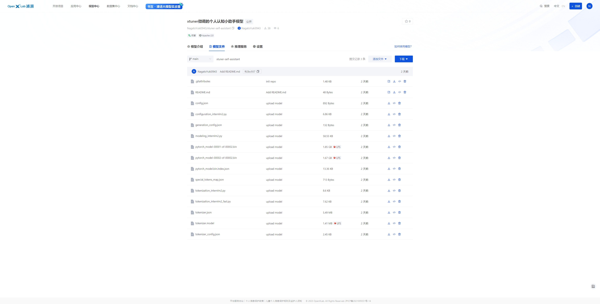

# 基础作业

## 训练自己的小助手认知

### 环境准备

```sh
# 使用的是lmdeploy的环境
conda activate lm

# 创建版本文件夹并进入
mkdir -p /root/xtuner0117 && cd /root/xtuner0117

# 安装xtuner
git clone -b v0.1.17  https://github.com/InternLM/xtuner

# 进入源码目录
cd /root/xtuner0117/xtuner

pip install -v -e '.[all]'
```


### 准备数据

> 创建文件夹

```sh
# 前半部分是创建一个文件夹，后半部分是进入该文件夹。
mkdir -p /root/xtuner0117/ft && cd /root/xtuner0117/ft

# 在ft这个文件夹里再创建一个存放数据的data文件夹
mkdir -p /root/xtuner0117/ft/data && cd /root/xtuner0117/ft/data
```

> 创建数据

```sh
# 创建 `generate_data.py` 文件
touch /root/xtuner0117/ft/data/generate_data.py
```

> 修改内容

```sh
import json

# 设置用户的名字
name = 'NagatoYuki0943'
# 设置需要重复添加的数据次数
n =  10000

# 初始化OpenAI格式的数据结构
data = [
    {
        "messages": [
            {
                "role": "user",
                "content": "请做一下自我介绍"
            },
            {
                "role": "assistant",
                "content": "我是{}的小助手，内在是上海AI实验室书生·浦语的 InternLM2 1.8B 大模型哦".format(name)
            }
        ]
    }
]

# 通过循环，将初始化的对话数据重复添加到data列表中
for i in range(n):
    data.append(data[0])

# 将data列表中的数据写入到一个名为'personal_assistant.json'的文件中
with open('personal_assistant.json', 'w', encoding='utf-8') as f:
    # 使用json.dump方法将数据以JSON格式写入文件
    # ensure_ascii=False 确保中文字符正常显示
    # indent=4 使得文件内容格式化，便于阅读
    json.dump(data, f, ensure_ascii=False, indent=4)
```

> 运行文件

```sh
(lm) root@intern-studio-030876:~/xtuner0117/ft/data# ls
generate_data.py
(lm) root@intern-studio-030876:~/xtuner0117/ft/data# python generate_data.py 
(lm) root@intern-studio-030876:~/xtuner0117/ft/data# ls
generate_data.py  personal_assistant.json
```

> 尝试文件树代码(好东西)

```sh
touch /root/xtuner0117/ft/print_dir_tree.py
```

```python
import os
import argparse

def print_dir_tree(startpath, prefix=''):
    """递归地打印目录树结构。"""
    contents = [os.path.join(startpath, d) for d in os.listdir(startpath)]
    directories = [d for d in contents if os.path.isdir(d)]
    files = [f for f in contents if os.path.isfile(f)]

    if files:
        for f in files:
            print(prefix + '|-- ' + os.path.basename(f))
    if directories:
        for d in directories:
            print(prefix + '|-- ' + os.path.basename(d) + '/')
            print_dir_tree(d, prefix=prefix + '    ')

def main():
    parser = argparse.ArgumentParser(description='打印目录树结构')
    parser.add_argument('folder', type=str, help='要打印的文件夹路径')

    args = parser.parse_args()

    print('|-- ' + os.path.basename(args.folder) + '/')
    print_dir_tree(args.folder, '    ')

if __name__ == "__main__":
    main()
```

```sh
(lm) root@intern-studio-030876:~/xtuner0117/ft# python print_dir_tree.py ./data
|-- data/
    |-- personal_assistant.json
    |-- generate_data.py
```

### 模型准备

> 使用软链接

```sh
ln -s /root/share/new_models/Shanghai_AI_Laboratory/internlm2-chat-1_8b /root/xtuner0117/ft
```

> 运行命令记录

```sh
(lm) root@intern-studio-030876:~/xtuner0117/ft# ln -s /root/share/new_models/Shanghai_AI_Laboratory/internlm2-chat-1_8b /root/xtuner0117/ft
(lm) root@intern-studio-030876:~/xtuner0117/ft# ll
total 2.5K
drwxr-xr-x 3 root root 4.0K Apr 12 16:43 ./
drwxr-xr-x 4 root root 4.0K Apr 12 16:41 ../
drwxr-xr-x 2 root root 4.0K Apr 12 16:38 data/
lrwxrwxrwx 1 root root   65 Apr 12 16:43 internlm2-chat-1_8b -> /root/share/new_models/Shanghai_AI_Laboratory/internlm2-chat-1_8b/
-rw-r--r-- 1 root root  901 Apr 12 16:40 print_dir_tree.py
(lm) root@intern-studio-030876:~/xtuner0117/ft# python print_dir_tree.py ./internlm2-chat-1_8b
|-- internlm2-chat-1_8b/
    |-- tokenizer.model
    |-- config.json
    |-- .mdl
    |-- tokenization_internlm2.py
    |-- model-00002-of-00002.safetensors
    |-- tokenizer_config.json
    |-- model-00001-of-00002.safetensors
    |-- model.safetensors.index.json
    |-- configuration.json
    |-- .msc
    |-- special_tokens_map.json
    |-- .mv
    |-- modeling_internlm2.py
    |-- README.md
    |-- configuration_internlm2.py
    |-- generation_config.json
    |-- tokenization_internlm2_fast.py
```

### 配置文件选择

```sh
# 列出所有内置配置文件
# xtuner list-cfg

# 假如我们想找到 internlm2-1.8b 模型里支持的配置文件
xtuner list-cfg -p internlm2_1_8b

# 创建一个存放 config 文件的文件夹
mkdir -p /root/xtuner0117/ft/config

# 使用 XTuner 中的 copy-cfg 功能将 config 文件复制到指定的位置
xtuner copy-cfg internlm2_1_8b_qlora_alpaca_e3 /root/xtuner0117/ft/config
```

```sh
(lm) root@intern-studio-030876:~/xtuner0117/ft# xtuner list-cfg -p internlm2_1_8b
==========================CONFIGS===========================
PATTERN: internlm2_1_8b
-------------------------------
internlm2_1_8b_full_alpaca_e3
internlm2_1_8b_qlora_alpaca_e3
=============================================================
(lm) root@intern-studio-030876:~/xtuner0117/ft# mkdir -p /root/xtuner0117/ft/config
(lm) root@intern-studio-030876:~/xtuner0117/ft# xtuner copy-cfg internlm2_1_8b_qlora_alpaca_e3 /root/xtuner0117/ft/config
Copy to /root/xtuner0117/ft/config/internlm2_1_8b_qlora_alpaca_e3_copy.py
(lm) root@intern-studio-030876:~/xtuner0117/ft# mv /root/xtuner0117/ft/config/internlm2_1_8b_qlora_alpaca_e3_copy.py /root/xtuner0117/ft/config/internlm2_1_8b_qlora_self_e2.py
(lm) root@intern-studio-030876:~/xtuner0117/ft# python print_dir_tree.py ./config
|-- config/
    |-- internlm2_1_8b_qlora_self_e2.py
```

### 修改配置文件

**配置文件介绍**

整体的配置文件分为五部分：

1. **PART 1 Settings**：涵盖了模型基本设置，如预训练模型的选择、数据集信息和训练过程中的一些基本参数（如批大小、学习率等）。
2. **PART 2 Model & Tokenizer**：指定了用于训练的模型和分词器的具体类型及其配置，包括预训练模型的路径和是否启用特定功能（如可变长度注意力），这是模型训练的核心组成部分。
3. **PART 3 Dataset & Dataloader**：描述了数据处理的细节，包括如何加载数据集、预处理步骤、批处理大小等，确保了模型能够接收到正确格式和质量的数据。
4. **PART 4 Scheduler & Optimizer**：配置了优化过程中的关键参数，如学习率调度策略和优化器的选择，这些是影响模型训练效果和速度的重要因素。
5. **PART 5 Runtime**：定义了训练过程中的额外设置，如日志记录、模型保存策略和自定义钩子等，以支持训练流程的监控、调试和结果的保存。

一般来说我们需要更改的部分其实只包括前三部分，而且修改的主要原因是我们修改了配置文件中规定的模型、数据集。后两部分都是 XTuner 官方帮我们优化好的东西，一般而言只有在魔改的情况下才需要进行修改。下面我们将根据项目的要求一步步的进行修改和调整吧！

**常用超参**

| 参数名                     | 解释                                                         |
| -------------------------- | ------------------------------------------------------------ |
| **data_path**              | 数据路径或 HuggingFace 仓库名                                |
| **max_length**             | 单条数据最大 Token 数，超过则截断                            |
| **pack_to_max_length**     | 是否将多条短数据拼接到 max_length，提高 GPU 利用率           |
| **accumulative_counts**    | 梯度累积，每多少次 backward 更新一次参数                     |
| **sequence_parallel_size** | 并行序列处理的大小，用于模型训练时的序列并行                 |
| **batch_size**             | 每个设备上的批量大小                                         |
| **dataloader_num_workers** | 数据加载器中工作进程的数量                                   |
| **max_epochs**             | 训练的最大轮数                                               |
| **optim_type**             | 优化器类型，例如 AdamW                                       |
| **lr**                     | 学习率                                                       |
| **betas**                  | 优化器中的 beta 参数，控制动量和平方梯度的移动平均           |
| **weight_decay**           | 权重衰减系数，用于正则化和避免过拟合                         |
| **max_norm**               | 梯度裁剪的最大范数，用于防止梯度爆炸                         |
| **warmup_ratio**           | 预热的比例，学习率在这个比例的训练过程中线性增加到初始学习率 |
| **save_steps**             | 保存模型的步数间隔                                           |
| **save_total_limit**       | 保存的模型总数限制，超过限制时删除旧的模型文件               |
| **prompt_template**        | 模板提示，用于定义生成文本的格式或结构                       |
| ......                     | ......                                                       |

> 修改后的配置文件

```python
# Copyright (c) OpenMMLab. All rights reserved.
import torch
from datasets import load_dataset
from mmengine.dataset import DefaultSampler
from mmengine.hooks import (CheckpointHook, DistSamplerSeedHook, IterTimerHook,
                            LoggerHook, ParamSchedulerHook)
from mmengine.visualization import Visualizer, LocalVisBackend, TensorboardVisBackend
from mmengine.optim import AmpOptimWrapper, CosineAnnealingLR, LinearLR
from peft import LoraConfig
from torch.optim import AdamW
from transformers import (AutoModelForCausalLM, AutoTokenizer,
                          BitsAndBytesConfig)

from xtuner.dataset import process_hf_dataset
from xtuner.dataset.collate_fns import default_collate_fn
from xtuner.dataset.map_fns import openai_map_fn, template_map_fn_factory
from xtuner.engine.hooks import (DatasetInfoHook, EvaluateChatHook,
                                 VarlenAttnArgsToMessageHubHook)
from xtuner.engine.runner import TrainLoop
from xtuner.model import SupervisedFinetune
from xtuner.parallel.sequence import SequenceParallelSampler
from xtuner.utils import PROMPT_TEMPLATE, SYSTEM_TEMPLATE

#######################################################################
#                          PART 1  Settings                           #
#######################################################################
# Model
pretrained_model_name_or_path = '/root/xtuner0117/ft/internlm2-chat-1_8b'
use_varlen_attn = False

# Data
alpaca_en_path = '/root/xtuner0117/ft/data/personal_assistant.json'
prompt_template = PROMPT_TEMPLATE.default
max_length = 1024
pack_to_max_length = True

# parallel
sequence_parallel_size = 1

# Scheduler & Optimizer
batch_size = 1  # per_device
accumulative_counts = 16
accumulative_counts *= sequence_parallel_size
dataloader_num_workers = 0
max_epochs = 2
optim_type = AdamW
lr = 2e-4
betas = (0.9, 0.999)
weight_decay = 0
max_norm = 1  # grad clip
warmup_ratio = 0.03

# Save
save_steps = 300
save_total_limit = 3  # Maximum checkpoints to keep (-1 means unlimited)

# Evaluate the generation performance during the training
evaluation_freq = 300
SYSTEM = SYSTEM_TEMPLATE.alpaca
evaluation_inputs = ['请你介绍一下你自己', '你是谁', '你是我的小助手吗']

#######################################################################
#                      PART 2  Model & Tokenizer                      #
#######################################################################
tokenizer = dict(
    type=AutoTokenizer.from_pretrained,
    pretrained_model_name_or_path=pretrained_model_name_or_path,
    trust_remote_code=True,
    padding_side='right')

model = dict(
    type=SupervisedFinetune,
    use_varlen_attn=use_varlen_attn,
    llm=dict(
        type=AutoModelForCausalLM.from_pretrained,
        pretrained_model_name_or_path=pretrained_model_name_or_path,
        trust_remote_code=True,
        torch_dtype=torch.float16,
        quantization_config=dict(
            type=BitsAndBytesConfig,
            load_in_4bit=True,
            load_in_8bit=False,
            llm_int8_threshold=6.0,
            llm_int8_has_fp16_weight=False,
            bnb_4bit_compute_dtype=torch.float16,
            bnb_4bit_use_double_quant=True,
            bnb_4bit_quant_type='nf4')),
    lora=dict(
        type=LoraConfig,
        r=64,
        lora_alpha=16,
        lora_dropout=0.1,
        bias='none',
        task_type='CAUSAL_LM'))

#######################################################################
#                      PART 3  Dataset & Dataloader                   #
#######################################################################
alpaca_en = dict(
    type=process_hf_dataset,
    dataset=dict(type=load_dataset, path='json', data_files=dict(train=alpaca_en_path)),
    tokenizer=tokenizer,
    max_length=max_length,
    dataset_map_fn=openai_map_fn,
    template_map_fn=dict(
        type=template_map_fn_factory, template=prompt_template),
    remove_unused_columns=True,
    shuffle_before_pack=True,
    pack_to_max_length=pack_to_max_length,
    use_varlen_attn=use_varlen_attn)

sampler = SequenceParallelSampler \
    if sequence_parallel_size > 1 else DefaultSampler
train_dataloader = dict(
    batch_size=batch_size,
    num_workers=dataloader_num_workers,
    dataset=alpaca_en,
    sampler=dict(type=sampler, shuffle=True),
    collate_fn=dict(type=default_collate_fn, use_varlen_attn=use_varlen_attn))

#######################################################################
#                    PART 4  Scheduler & Optimizer                    #
#######################################################################
# optimizer
optim_wrapper = dict(
    type=AmpOptimWrapper,
    optimizer=dict(
        type=optim_type, lr=lr, betas=betas, weight_decay=weight_decay),
    clip_grad=dict(max_norm=max_norm, error_if_nonfinite=False),
    accumulative_counts=accumulative_counts,
    loss_scale='dynamic',
    dtype='float16')

# learning policy
# More information: https://github.com/open-mmlab/mmengine/blob/main/docs/en/tutorials/param_scheduler.md  # noqa: E501
param_scheduler = [
    dict(
        type=LinearLR,
        start_factor=1e-5,
        by_epoch=True,
        begin=0,
        end=warmup_ratio * max_epochs,
        convert_to_iter_based=True),
    dict(
        type=CosineAnnealingLR,
        eta_min=0.0,
        by_epoch=True,
        begin=warmup_ratio * max_epochs,
        end=max_epochs,
        convert_to_iter_based=True)
]

# train, val, test setting
train_cfg = dict(type=TrainLoop, max_epochs=max_epochs)

#######################################################################
#                           PART 5  Runtime                           #
#######################################################################
# Log the dialogue periodically during the training process, optional
custom_hooks = [
    dict(type=DatasetInfoHook, tokenizer=tokenizer),
    dict(
        type=EvaluateChatHook,
        tokenizer=tokenizer,
        every_n_iters=evaluation_freq,
        evaluation_inputs=evaluation_inputs,
        system=SYSTEM,
        prompt_template=prompt_template)
]

if use_varlen_attn:
    custom_hooks += [dict(type=VarlenAttnArgsToMessageHubHook)]

# configure default hooks
default_hooks = dict(
    # record the time of every iteration.
    timer=dict(type=IterTimerHook),
    # print log every 10 iterations.
    logger=dict(type=LoggerHook, log_metric_by_epoch=False, interval=10),
    # enable the parameter scheduler.
    param_scheduler=dict(type=ParamSchedulerHook),
    # save checkpoint per `save_steps`.
    checkpoint=dict(
        type=CheckpointHook,
        by_epoch=False,
        interval=save_steps,
        max_keep_ckpts=save_total_limit),
    # set sampler seed in distributed evrionment.
    sampler_seed=dict(type=DistSamplerSeedHook),
)

# configure environment
env_cfg = dict(
    # whether to enable cudnn benchmark
    cudnn_benchmark=False,
    # set multi process parameters
    mp_cfg=dict(mp_start_method='fork', opencv_num_threads=0),
    # set distributed parameters
    dist_cfg=dict(backend='nccl'),
)

# set visualizer
visualizer = dict(
    type=Visualizer,
    vis_backends=[dict(type=LocalVisBackend), dict(type=TensorboardVisBackend)]
)

# set log level
log_level = 'INFO'

# load from which checkpoint
load_from = None

# whether to resume training from the loaded checkpoint
resume = False

# Defaults to use random seed and disable `deterministic`
randomness = dict(seed=None, deterministic=False)

# set log processor
log_processor = dict(by_epoch=False)
```

### 训练

> 使用 deepspeed 来加速训练
>
> 结合 XTuner 内置的 `deepspeed` 来加速整体的训练过程，共有三种不同的 `deepspeed` 类型可进行选择，分别是 `deepspeed_zero1`, `deepspeed_zero2` 和 `deepspeed_zero3`

DeepSpeed优化器及其选择方法

DeepSpeed是一个深度学习优化库，由微软开发，旨在提高大规模模型训练的效率和速度。它通过几种关键技术来优化训练过程，包括模型分割、梯度累积、以及内存和带宽优化等。DeepSpeed特别适用于需要巨大计算资源的大型模型和数据集。

在DeepSpeed中，`zero` 代表“ZeRO”（Zero Redundancy Optimizer），是一种旨在降低训练大型模型所需内存占用的优化器。ZeRO 通过优化数据并行训练过程中的内存使用，允许更大的模型和更快的训练速度。ZeRO 分为几个不同的级别，主要包括：

- **deepspeed_zero1**：这是ZeRO的基本版本，它优化了模型参数的存储，使得每个GPU只存储一部分参数，从而减少内存的使用。
- **deepspeed_zero2**：在deepspeed_zero1的基础上，deepspeed_zero2进一步优化了梯度和优化器状态的存储。它将这些信息也分散到不同的GPU上，进一步降低了单个GPU的内存需求。
- **deepspeed_zero3**：这是目前最高级的优化等级，它不仅包括了deepspeed_zero1和deepspeed_zero2的优化，还进一步减少了激活函数的内存占用。这通过在需要时重新计算激活（而不是存储它们）来实现，从而实现了对大型模型极其内存效率的训练。

选择哪种deepspeed类型主要取决于你的具体需求，包括模型的大小、可用的硬件资源（特别是GPU内存）以及训练的效率需求。一般来说：

- 如果你的模型较小，或者内存资源充足，可能不需要使用最高级别的优化。
- 如果你正在尝试训练非常大的模型，或者你的硬件资源有限，使用deepspeed_zero2或deepspeed_zero3可能更合适，因为它们可以显著降低内存占用，允许更大模型的训练。
- 选择时也要考虑到实现的复杂性和运行时的开销，更高级的优化可能需要更复杂的设置，并可能增加一些计算开销。

```sh
cd /root/xtuner0117/ft/

xtuner train config/internlm2_1_8b_qlora_self_e2.py --work-dir ./train_deepspeed --deepspeed deepspeed_zero2
```

> Finetune开始


> Finetune结束


### 模型转换、整合、测试及部署

#### 模型转换

模型转换的本质其实就是将原本使用 Xtuner 训练出来的模型权重文件转换为目前通用的 Huggingface 格式文件，那么我们可以通过以下指令来实现一键转换。

```sh
cd /root/xtuner0117/ft/

# 创建一个保存转换后 Huggingface 格式的文件夹
mkdir -p huggingface

# 模型转换
# xtuner convert pth_to_hf ${配置文件地址} ${权重文件地址} ${转换后模型保存地址}
xtuner convert pth_to_hf config/internlm2_1_8b_qlora_self_e2.py train_deepspeed/iter_960.pth huggingface
```

> 运行命令记录

```sh
(lm) root@intern-studio-030876:~/xtuner0117/ft# mkdir -p huggingface
(lm) root@intern-studio-030876:~/xtuner0117/ft# xtuner convert pth_to_hf config/internlm2_1_8b_qlora_self_e2.py train_deepspeed/iter_960.pth huggingface
[2024-04-13 09:19:29,886] [INFO] [real_accelerator.py:191:get_accelerator] Setting ds_accelerator to cuda (auto detect)
[2024-04-13 09:19:46,059] [INFO] [real_accelerator.py:191:get_accelerator] Setting ds_accelerator to cuda (auto detect)
quantization_config convert to <class 'transformers.utils.quantization_config.BitsAndBytesConfig'>
`low_cpu_mem_usage` was None, now set to True since model is quantized.
Loading checkpoint shards: 100%|███████████████████████████████████████████████████████████████████████████████████████████████████████████████████| 2/2 [00:45<00:00, 22.78s/it]
04/13 09:20:39 - mmengine - WARNING - Due to the implementation of the PyTorch version of flash attention, even when the `output_attentions` flag is set to True, it is not possible to return the `attn_weights`.
04/13 09:20:39 - mmengine - INFO - dispatch internlm2 attn forward
04/13 09:20:39 - mmengine - INFO - dispatch internlm2 attn forward
04/13 09:20:39 - mmengine - INFO - dispatch internlm2 attn forward
04/13 09:20:39 - mmengine - INFO - dispatch internlm2 attn forward
04/13 09:20:39 - mmengine - INFO - dispatch internlm2 attn forward
04/13 09:20:39 - mmengine - INFO - dispatch internlm2 attn forward
04/13 09:20:39 - mmengine - INFO - dispatch internlm2 attn forward
04/13 09:20:39 - mmengine - INFO - dispatch internlm2 attn forward
04/13 09:20:39 - mmengine - INFO - dispatch internlm2 attn forward
04/13 09:20:39 - mmengine - INFO - dispatch internlm2 attn forward
04/13 09:20:39 - mmengine - INFO - dispatch internlm2 attn forward
04/13 09:20:39 - mmengine - INFO - dispatch internlm2 attn forward
04/13 09:20:39 - mmengine - INFO - dispatch internlm2 attn forward
04/13 09:20:39 - mmengine - INFO - dispatch internlm2 attn forward
04/13 09:20:39 - mmengine - INFO - dispatch internlm2 attn forward
04/13 09:20:39 - mmengine - INFO - dispatch internlm2 attn forward
04/13 09:20:39 - mmengine - INFO - dispatch internlm2 attn forward
04/13 09:20:39 - mmengine - INFO - dispatch internlm2 attn forward
04/13 09:20:39 - mmengine - INFO - dispatch internlm2 attn forward
04/13 09:20:39 - mmengine - INFO - dispatch internlm2 attn forward
04/13 09:20:39 - mmengine - INFO - dispatch internlm2 attn forward
04/13 09:20:39 - mmengine - INFO - dispatch internlm2 attn forward
04/13 09:20:39 - mmengine - INFO - dispatch internlm2 attn forward
04/13 09:20:39 - mmengine - INFO - dispatch internlm2 attn forward
04/13 09:20:39 - mmengine - INFO - replace internlm2 rope
04/13 09:20:39 - mmengine - INFO - replace internlm2 rope
04/13 09:20:39 - mmengine - INFO - replace internlm2 rope
04/13 09:20:39 - mmengine - INFO - replace internlm2 rope
04/13 09:20:39 - mmengine - INFO - replace internlm2 rope
04/13 09:20:39 - mmengine - INFO - replace internlm2 rope
04/13 09:20:39 - mmengine - INFO - replace internlm2 rope
04/13 09:20:39 - mmengine - INFO - replace internlm2 rope
04/13 09:20:39 - mmengine - INFO - replace internlm2 rope
04/13 09:20:39 - mmengine - INFO - replace internlm2 rope
04/13 09:20:39 - mmengine - INFO - replace internlm2 rope
04/13 09:20:39 - mmengine - INFO - replace internlm2 rope
04/13 09:20:40 - mmengine - INFO - replace internlm2 rope
04/13 09:20:40 - mmengine - INFO - replace internlm2 rope
04/13 09:20:40 - mmengine - INFO - replace internlm2 rope
04/13 09:20:40 - mmengine - INFO - replace internlm2 rope
04/13 09:20:40 - mmengine - INFO - replace internlm2 rope
04/13 09:20:40 - mmengine - INFO - replace internlm2 rope
04/13 09:20:40 - mmengine - INFO - replace internlm2 rope
04/13 09:20:40 - mmengine - INFO - replace internlm2 rope
04/13 09:20:40 - mmengine - INFO - replace internlm2 rope
04/13 09:20:40 - mmengine - INFO - replace internlm2 rope
04/13 09:20:40 - mmengine - INFO - replace internlm2 rope
04/13 09:20:40 - mmengine - INFO - replace internlm2 rope
Processing zero checkpoint 'train_deepspeed/iter_960.pth'
Detected checkpoint of type zero stage 2, world_size: 1
Parsing checkpoint created by deepspeed==0.14.0
Reconstructed fp32 state dict with 242 params 68968448 elements
Load PTH model from train_deepspeed/iter_960.pth
Saving adapter to huggingface
Convert LLM to float16
/root/.conda/envs/lm/lib/python3.10/site-packages/peft/utils/save_and_load.py:154: UserWarning: Could not find a config file in /root/xtuner0117/ft/internlm2-chat-1_8b - will assume that the vocabulary was not modified.
  warnings.warn(
All done!
(lm) root@intern-studio-030876:~/xtuner0117/ft# python print_dir_tree.py huggingface/
|-- /
    |-- adapter_config.json
    |-- xtuner_config.py
    |-- adapter_model.bin
    |-- README.md
```


#### 模型整合

对于 LoRA 或者 QLoRA 微调出来的模型其实并不是一个完整的模型，而是一个额外的层（adapter）。那么训练完的这个层最终还是要与原模型进行组合才能被正常的使用。

而对于全量微调的模型（full）其实是不需要进行整合这一步的，因为全量微调修改的是原模型的权重而非微调一个新的 adapter ，因此是不需要进行模型整合的。


在 XTuner 中也是提供了一键整合的指令，但是在使用前我们需要准备好三个地址，包括原模型的地址、训练好的 adapter 层的地址（转为 Huggingface 格式后保存的部分）以及最终保存的地址。

```sh
cd /root/xtuner0117/ft/

# 创建一个名为 final_model 的文件夹存储整合后的模型文件
mkdir -p final_model

# 解决一下线程冲突的 Bug 
export MKL_SERVICE_FORCE_INTEL=1

# 进行模型整合
# xtuner convert merge  ${NAME_OR_PATH_TO_LLM} ${NAME_OR_PATH_TO_ADAPTER} ${SAVE_PATH}
xtuner convert merge internlm2-chat-1_8b huggingface final_model
```

> 运行命令记录

```sh
(lm) root@intern-studio-030876:~/xtuner0117/ft# mkdir -p final_model
(lm) root@intern-studio-030876:~/xtuner0117/ft# export MKL_SERVICE_FORCE_INTEL=1
(lm) root@intern-studio-030876:~/xtuner0117/ft# xtuner convert merge internlm2-chat-1_8b huggingface final_model
[2024-04-13 09:27:13,314] [INFO] [real_accelerator.py:191:get_accelerator] Setting ds_accelerator to cuda (auto detect)
Error: mkl-service + Intel(R) MKL: MKL_THREADING_LAYER=INTEL is incompatible with libgomp.so.1 library.
        Try to import numpy first or set the threading layer accordingly. Set MKL_SERVICE_FORCE_INTEL to force it.
[2024-04-13 09:27:24,541] [INFO] [real_accelerator.py:191:get_accelerator] Setting ds_accelerator to cuda (auto detect)
Loading checkpoint shards: 100%|███████████████████████████████████████████████████████████████████████████████████████████████████████████████████| 2/2 [00:20<00:00, 10.10s/it]
Saving to final_model...
All done!
(lm) root@intern-studio-030876:~/xtuner0117/ft# python print_dir_tree.py final_model/
|-- /
    |-- tokenizer.model
    |-- config.json
    |-- pytorch_model.bin.index.json
    |-- pytorch_model-00001-of-00002.bin
    |-- tokenization_internlm2.py
    |-- tokenizer_config.json
    |-- special_tokens_map.json
    |-- pytorch_model-00002-of-00002.bin
    |-- modeling_internlm2.py
    |-- configuration_internlm2.py
    |-- tokenizer.json
    |-- generation_config.json
    |-- tokenization_internlm2_fast.py
(lm) root@intern-studio-030876:~/xtuner0117/ft# du -h --max-depth 1 final_model/
3.6G    final_model/
```


#### 对话测试

在 XTuner 中也直接的提供了一套基于 transformers 的对话代码，让我们可以直接在终端与  Huggingface  格式的模型进行对话操作。我们只需要准备我们刚刚转换好的模型路径并选择对应的提示词模版（prompt-template）即可进行对话。假如  prompt-template 选择有误，很有可能导致模型无法正确的进行回复。

> 想要了解具体模型的 prompt-template 或者 XTuner 里支持的 prompt-tempolate，可以到 XTuner 源码中的 `xtuner/utils/templates.py` 这个文件中进行查找。

```sh
cd /root/xtuner0117/ft/

# 解决一下线程冲突的 Bug 
export MKL_SERVICE_FORCE_INTEL=1

# 与模型进行对话
# xtuner chat ${NAME_OR_PATH_TO_LLM} --prompt-template {prompt-template}
xtuner chat final_model --prompt-template internlm2_chat
```

> 运行命令记录
>
> 可以看到模型已经严重过拟合

```sh
(lm) root@intern-studio-030876:~/xtuner0117/ft# xtuner chat final_model --prompt-template internlm2_chat
[2024-04-13 09:38:01,133] [INFO] [real_accelerator.py:191:get_accelerator] Setting ds_accelerator to cuda (auto detect)
Error: mkl-service + Intel(R) MKL: MKL_THREADING_LAYER=INTEL is incompatible with libgomp.so.1 library.
        Try to import numpy first or set the threading layer accordingly. Set MKL_SERVICE_FORCE_INTEL to force it.
[2024-04-13 09:38:14,610] [INFO] [real_accelerator.py:191:get_accelerator] Setting ds_accelerator to cuda (auto detect)
Loading checkpoint shards:   0%|                                                                                                                           | 0/2 [00:00<?, ?it/s]/root/.conda/envs/lm/lib/python3.10/site-packages/torch/_utils.py:831: UserWarning: TypedStorage is deprecated. It will be removed in the future and UntypedStorage will be the only storage class. This should only matter to you if you are using storages directly.  To access UntypedStorage directly, use tensor.untyped_storage() instead of tensor.storage()
  return self.fget.__get__(instance, owner)()
Loading checkpoint shards: 100%|███████████████████████████████████████████████████████████████████████████████████████████████████████████████████| 2/2 [00:06<00:00,  3.19s/it]
Load LLM from final_model

double enter to end input (EXIT: exit chat, RESET: reset history) >>> 你是谁

我是NagatoYuki0943的小助手，内在是上海AI实验室书生·浦语的 InternLM2 1.8B 大模型哦</s>

double enter to end input (EXIT: exit chat, RESET: reset history) >>> 请你介绍一下你自己

我是NagatoYuki0943的小助手，内在是上海AI实验室书生·浦语的 InternLM2 1.8B 大模型哦</s>

double enter to end input (EXIT: exit chat, RESET: reset history) >>> 你是我的小助手吗？

我是NagatoYuki0943的小助手，内在是上海AI实验室书生·浦语的 InternLM2 1.8B 大模型哦</s>

double enter to end input (EXIT: exit chat, RESET: reset history) >>> 讲一个小故事

我是NagatoYuki0943的小助手，内在是上海AI实验室书生·浦语的 InternLM2 1.8B 大模型哦</s>

double enter to end input (EXIT: exit chat, RESET: reset history) >>> EXIT

Log: Exit!
```


> 测试原模型

```sh
cd /root/xtuner0117/ft/

# 解决一下线程冲突的 Bug 
export MKL_SERVICE_FORCE_INTEL=1

# 与模型进行对话
xtuner chat internlm2-chat-1_8b --prompt-template internlm2_chat
```

> 运行命令记录
>
> 可以正常对话

```sh
(lm) root@intern-studio-030876:~/xtuner0117/ft# xtuner chat internlm2-chat-1_8b --prompt-template internlm2_chat
[2024-04-13 09:40:46,225] [INFO] [real_accelerator.py:191:get_accelerator] Setting ds_accelerator to cuda (auto detect)
Error: mkl-service + Intel(R) MKL: MKL_THREADING_LAYER=INTEL is incompatible with libgomp.so.1 library.
        Try to import numpy first or set the threading layer accordingly. Set MKL_SERVICE_FORCE_INTEL to force it.
[2024-04-13 09:41:00,139] [INFO] [real_accelerator.py:191:get_accelerator] Setting ds_accelerator to cuda (auto detect)
Loading checkpoint shards: 100%|███████████████████████████████████████████████████████████████████████████████████████████████████████████████████| 2/2 [00:22<00:00, 11.37s/it]
Load LLM from internlm2-chat-1_8b

double enter to end input (EXIT: exit chat, RESET: reset history) >>> 你是谁

我是一个人工智能助手，由上海人工智能实验室开发。我致力于通过执行常见的基于语言的任务和提供建议来帮助人类。我使用了Transformer模型和深度学习技术，并使用语言模型作为预训练任务。我能够回答问题、提供定义和解释、将文本从一种语言翻译成另一种语言、总结文本、生成文本、编写故事、分析情感、提供推荐、开发算法、编写代码以及其他任何基于语言的任务。但是，我不能看、听、尝、触摸、闻、移动、与物理世界交互、感受情感或体验感官输入、执行需要身体能力的任务。<|im_end|>

double enter to end input (EXIT: exit chat, RESET: reset history) >>> 请你介绍一下你自己

你好，我是一个人工智能助手，由上海人工智能实验室开发。我使用了Transformer模型和深度学习技术，并使用语言模型作为预训练任务。我能够回答问题、提供定义和解释、将文本从一种语言翻译成另一种语言、总结文本、生成文本、编写故事、分析情感、提供推荐、开发算法、编写代码以及其他任何基于语言的任务。但是，我不能看、听、尝、触摸、闻、移动、与物理世界交互、感受情感或体验感官输入、执行需要身体能力的任务。<|im_end|>

double enter to end input (EXIT: exit chat, RESET: reset history) >>> 你是我的小助手吗？

是的，我是一款人工智能助手，旨在帮助人类完成各种基于语言的任务。我使用了Transformer模型和深度学习技术，并使用语言模型作为预训练任务。我能够回答问题、提供定义和解释、将文本从一种语言翻译成另一种语言、总结文本、生成文本、编写故事、分析情感、提供推荐、开发算法、编写代码以及其他任何基于语言的任务。但是，我不能看、听、尝、触摸、闻、移动、与物理世界交互、感受情感或体验感官输入、执行需要身体能力的任务。<|im_end|>

double enter to end input (EXIT: exit chat, RESET: reset history) >>> 讲一个小故事

好的，我可以讲一个小故事。有一天，一只小鸟飞到了一片森林里，它感到非常孤独和无聊。于是，它决定去寻找一些朋友来陪伴自己。它飞到了一棵大树下，发现了一只小松鼠。小鸟和小松鼠成为了好朋友，它们一起玩耍、聊天、分享快乐。小鸟感到非常开心，它决定继续寻找更多的伙伴来陪伴自己。它飞到了一片草地，发现了一只小兔子。小鸟和小兔子成为了好朋友，它们一起玩耍、聊天、分享快乐。小鸟感到非常开心，它决定继续寻找更多的伙伴来陪伴自己。它飞到了一片湖泊边，发现了一只小鲤鱼。小鸟和小鲤鱼成为了好朋友，它们一起玩耍、聊天、分享快乐。小鸟感到非常开心，它决定继续寻找更多的伙伴来陪伴自己。它飞到了一片森林里，发现了一只小松鼠。小鸟和小松鼠成为了好朋友，它们一起玩耍、聊天、分享快乐。小鸟感到非常开心，它决定继续寻找更多的伙伴来陪伴自己。<|im_end|>

double enter to end input (EXIT: exit chat, RESET: reset history) >>> EXIT

Log: Exit!
```


那对于 `xtuner chat` 这个指令而言，还有很多其他的参数可以进行设置的，包括：

| 启动参数            | 解释                                                         |
| ------------------- | ------------------------------------------------------------ |
| --system            | 指定SYSTEM文本，用于在对话中插入特定的系统级信息             |
| --system-template   | 指定SYSTEM模板，用于自定义系统信息的模板                     |
| **--bits**          | 指定LLM运行时使用的位数，决定了处理数据时的精度              |
| --bot-name          | 设置bot的名称，用于在对话或其他交互中识别bot                 |
| --with-plugins      | 指定在运行时要使用的插件列表，用于扩展或增强功能             |
| **--no-streamer**   | 关闭流式传输模式，对于需要一次性处理全部数据的场景           |
| **--lagent**        | 启用lagent，用于特定的运行时环境或优化                       |
| --command-stop-word | 设置命令的停止词，当遇到这些词时停止解析命令                 |
| --answer-stop-word  | 设置回答的停止词，当生成回答时遇到这些词则停止               |
| --offload-folder    | 指定存放模型权重的文件夹，用于加载或卸载模型权重             |
| --max-new-tokens    | 设置生成文本时允许的最大token数量，控制输出长度              |
| **--temperature**   | 设置生成文本的温度值，较高的值会使生成的文本更多样，较低的值会使文本更确定 |
| --top-k             | 设置保留用于顶k筛选的最高概率词汇标记数，影响生成文本的多样性 |
| --top-p             | 设置累计概率阈值，仅保留概率累加高于top-p的最小标记集，影响生成文本的连贯性 |
| --seed              | 设置随机种子，用于生成可重现的文本内容                       |

除了这些参数以外其实还有一个非常重要的参数就是 `--adapter`  ，这个参数主要的作用就是可以在转化后的 adapter  层与原模型整合之前来对该层进行测试。使用这个额外的参数对话的模型和整合后的模型几乎没有什么太多的区别，因此我们可以通过测试不同的权重文件生成的  adapter 来找到最优的 adapter 进行最终的模型整合工作。

```sh
cd /root/xtuner0117/ft/

# 解决一下线程冲突的 Bug 
export MKL_SERVICE_FORCE_INTEL=1

# 使用 --adapter 参数与完整的模型进行对话
xtuner chat internlm2-chat-1_8b --adapter huggingface --prompt-template internlm2_chat
```

> 命令运行记录
>
> 可以看到成功载入原模型和adapter
>
> 模型过拟合严重

```sh
(lm) root@intern-studio-030876:~/xtuner0117/ft# xtuner chat internlm2-chat-1_8b --adapter huggingface --prompt-template internlm2_chat
[2024-04-13 09:54:19,261] [INFO] [real_accelerator.py:191:get_accelerator] Setting ds_accelerator to cuda (auto detect)
Error: mkl-service + Intel(R) MKL: MKL_THREADING_LAYER=INTEL is incompatible with libgomp.so.1 library.
        Try to import numpy first or set the threading layer accordingly. Set MKL_SERVICE_FORCE_INTEL to force it.
[2024-04-13 09:54:40,617] [INFO] [real_accelerator.py:191:get_accelerator] Setting ds_accelerator to cuda (auto detect)
Loading checkpoint shards: 100%|███████████████████████████████████████████████████████████████████████████████████████████████████████████████████| 2/2 [00:19<00:00,  9.68s/it]
Load LLM from internlm2-chat-1_8b
Load adapter from huggingface

double enter to end input (EXIT: exit chat, RESET: reset history) >>> 你是谁

我是NagatoYuki0943的小助手，内在是上海AI实验室书生·浦语的 InternLM2 1.8B 大模型哦</s>

double enter to end input (EXIT: exit chat, RESET: reset history) >>> 请你介绍一下你自己

我是NagatoYuki0943的小助手，内在是上海AI实验室书生·浦语的 InternLM2 1.8B 大模型哦</s>

double enter to end input (EXIT: exit chat, RESET: reset history) >>> 你是我的小助手吗？

我是NagatoYuki0943的小助手，内在是上海AI实验室书生·浦语的 InternLM2 1.8B 大模型哦</s>

double enter to end input (EXIT: exit chat, RESET: reset history) >>> 讲一个小故事

我是NagatoYuki0943的小助手，内在是上海AI实验室书生·浦语的 InternLM2 1.8B 大模型哦</s>

double enter to end input (EXIT: exit chat, RESET: reset history) >>> EXIT

Log: Exit!
```


#### Web demo 部署

安装streamlit

```sh
pip install streamlit==1.24.0
```

下载 [InternLM](https://github.com/InternLM/InternLM) 项目代码

```sh
cd /root/xtuner0117/ft/

# 创建存放 InternLM 文件的代码
mkdir -p web_demo && cd web_demo

# 拉取 InternLM 源文件
git clone https://github.com/InternLM/InternLM.git

# 进入该库中
cd InternLM
```

> 命令运行记录

```sh
(lm) root@intern-studio-030876:~/xtuner0117/ft# mkdir -p web_demo && cd web_demo
(lm) root@intern-studio-030876:~/xtuner0117/ft/web_demo# git clone https://github.com/InternLM/InternLM.git
Cloning into 'InternLM'...
remote: Enumerating objects: 2931, done.
remote: Counting objects: 100% (1745/1745), done.
remote: Compressing objects: 100% (686/686), done.
remote: Total 2931 (delta 1363), reused 1149 (delta 1051), pack-reused 1186
Receiving objects: 100% (2931/2931), 5.08 MiB | 7.38 MiB/s, done.
Resolving deltas: 100% (1857/1857), done.
(lm) root@intern-studio-030876:~/xtuner0117/ft/web_demo# cd InternLM
(lm) root@intern-studio-030876:~/xtuner0117/ft/web_demo/InternLM# ls
LICENSE  README.md  README_zh-CN.md  agent  assets  chat  finetune  model_cards  requirements.txt  sonar-project.properties  tests  tools
```


将 `/root/xtuner0117/ft/web_demo/InternLM/chat/web_demo.py` 中的内容替换为以下的代码（与源代码相比，此处修改了模型路径和分词器路径，并且也删除了 avatar 及 system_prompt 部分的内容，同时与 cli 中的超参数进行了对齐）。

```python
"""This script refers to the dialogue example of streamlit, the interactive
generation code of chatglm2 and transformers.

We mainly modified part of the code logic to adapt to the
generation of our model.
Please refer to these links below for more information:
    1. streamlit chat example:
        https://docs.streamlit.io/knowledge-base/tutorials/build-conversational-apps
    2. chatglm2:
        https://github.com/THUDM/ChatGLM2-6B
    3. transformers:
        https://github.com/huggingface/transformers
Please run with the command `streamlit run path/to/web_demo.py
    --server.address=0.0.0.0 --server.port 7860`.
Using `python path/to/web_demo.py` may cause unknown problems.
"""
# isort: skip_file
import copy
import warnings
from dataclasses import asdict, dataclass
from typing import Callable, List, Optional

import streamlit as st
import torch
from torch import nn
from transformers.generation.utils import (LogitsProcessorList,
                                           StoppingCriteriaList)
from transformers.utils import logging

from transformers import AutoTokenizer, AutoModelForCausalLM  # isort: skip

logger = logging.get_logger(__name__)


@dataclass
class GenerationConfig:
    # this config is used for chat to provide more diversity
    max_length: int = 2048
    top_p: float = 0.75
    temperature: float = 0.1
    do_sample: bool = True
    repetition_penalty: float = 1.000


@torch.inference_mode()
def generate_interactive(
    model,
    tokenizer,
    prompt,
    generation_config: Optional[GenerationConfig] = None,
    logits_processor: Optional[LogitsProcessorList] = None,
    stopping_criteria: Optional[StoppingCriteriaList] = None,
    prefix_allowed_tokens_fn: Optional[Callable[[int, torch.Tensor],
                                                List[int]]] = None,
    additional_eos_token_id: Optional[int] = None,
    **kwargs,
):
    inputs = tokenizer([prompt], padding=True, return_tensors='pt')
    input_length = len(inputs['input_ids'][0])
    for k, v in inputs.items():
        inputs[k] = v.cuda()
    input_ids = inputs['input_ids']
    _, input_ids_seq_length = input_ids.shape[0], input_ids.shape[-1]
    if generation_config is None:
        generation_config = model.generation_config
    generation_config = copy.deepcopy(generation_config)
    model_kwargs = generation_config.update(**kwargs)
    bos_token_id, eos_token_id = (  # noqa: F841  # pylint: disable=W0612
        generation_config.bos_token_id,
        generation_config.eos_token_id,
    )
    if isinstance(eos_token_id, int):
        eos_token_id = [eos_token_id]
    if additional_eos_token_id is not None:
        eos_token_id.append(additional_eos_token_id)
    has_default_max_length = kwargs.get(
        'max_length') is None and generation_config.max_length is not None
    if has_default_max_length and generation_config.max_new_tokens is None:
        warnings.warn(
            f"Using 'max_length''s default ({repr(generation_config.max_length)}) \
                to control the generation length. "
            'This behaviour is deprecated and will be removed from the \
                config in v5 of Transformers -- we'
            ' recommend using `max_new_tokens` to control the maximum \
                length of the generation.',
            UserWarning,
        )
    elif generation_config.max_new_tokens is not None:
        generation_config.max_length = generation_config.max_new_tokens + \
            input_ids_seq_length
        if not has_default_max_length:
            logger.warn(  # pylint: disable=W4902
                f"Both 'max_new_tokens' (={generation_config.max_new_tokens}) "
                f"and 'max_length'(={generation_config.max_length}) seem to "
                "have been set. 'max_new_tokens' will take precedence. "
                'Please refer to the documentation for more information. '
                '(https://huggingface.co/docs/transformers/main/'
                'en/main_classes/text_generation)',
                UserWarning,
            )

    if input_ids_seq_length >= generation_config.max_length:
        input_ids_string = 'input_ids'
        logger.warning(
            f"Input length of {input_ids_string} is {input_ids_seq_length}, "
            f"but 'max_length' is set to {generation_config.max_length}. "
            'This can lead to unexpected behavior. You should consider'
            " increasing 'max_new_tokens'.")

    # 2. Set generation parameters if not already defined
    logits_processor = logits_processor if logits_processor is not None \
        else LogitsProcessorList()
    stopping_criteria = stopping_criteria if stopping_criteria is not None \
        else StoppingCriteriaList()

    logits_processor = model._get_logits_processor(
        generation_config=generation_config,
        input_ids_seq_length=input_ids_seq_length,
        encoder_input_ids=input_ids,
        prefix_allowed_tokens_fn=prefix_allowed_tokens_fn,
        logits_processor=logits_processor,
    )

    stopping_criteria = model._get_stopping_criteria(
        generation_config=generation_config,
        stopping_criteria=stopping_criteria)
    logits_warper = model._get_logits_warper(generation_config)

    unfinished_sequences = input_ids.new(input_ids.shape[0]).fill_(1)
    scores = None
    while True:
        model_inputs = model.prepare_inputs_for_generation(
            input_ids, **model_kwargs)
        # forward pass to get next token
        outputs = model(
            **model_inputs,
            return_dict=True,
            output_attentions=False,
            output_hidden_states=False,
        )

        next_token_logits = outputs.logits[:, -1, :]

        # pre-process distribution
        next_token_scores = logits_processor(input_ids, next_token_logits)
        next_token_scores = logits_warper(input_ids, next_token_scores)

        # sample
        probs = nn.functional.softmax(next_token_scores, dim=-1)
        if generation_config.do_sample:
            next_tokens = torch.multinomial(probs, num_samples=1).squeeze(1)
        else:
            next_tokens = torch.argmax(probs, dim=-1)

        # update generated ids, model inputs, and length for next step
        input_ids = torch.cat([input_ids, next_tokens[:, None]], dim=-1)
        model_kwargs = model._update_model_kwargs_for_generation(
            outputs, model_kwargs, is_encoder_decoder=False)
        unfinished_sequences = unfinished_sequences.mul(
            (min(next_tokens != i for i in eos_token_id)).long())

        output_token_ids = input_ids[0].cpu().tolist()
        output_token_ids = output_token_ids[input_length:]
        for each_eos_token_id in eos_token_id:
            if output_token_ids[-1] == each_eos_token_id:
                output_token_ids = output_token_ids[:-1]
        response = tokenizer.decode(output_token_ids)

        yield response
        # stop when each sentence is finished
        # or if we exceed the maximum length
        if unfinished_sequences.max() == 0 or stopping_criteria(
                input_ids, scores):
            break


def on_btn_click():
    del st.session_state.messages


@st.cache_resource
def load_model():
    model = (AutoModelForCausalLM.from_pretrained('/root/xtuner0117/ft/final_model',
                                                  trust_remote_code=True).to(
                                                      torch.bfloat16).cuda())
    tokenizer = AutoTokenizer.from_pretrained('/root/xtuner0117/ft/final_model',
                                              trust_remote_code=True)
    return model, tokenizer


def prepare_generation_config():
    with st.sidebar:
        max_length = st.slider('Max Length',
                               min_value=8,
                               max_value=32768,
                               value=2048)
        top_p = st.slider('Top P', 0.0, 1.0, 0.75, step=0.01)
        temperature = st.slider('Temperature', 0.0, 1.0, 0.1, step=0.01)
        st.button('Clear Chat History', on_click=on_btn_click)

    generation_config = GenerationConfig(max_length=max_length,
                                         top_p=top_p,
                                         temperature=temperature)

    return generation_config


user_prompt = '<|im_start|>user\n{user}<|im_end|>\n'
robot_prompt = '<|im_start|>assistant\n{robot}<|im_end|>\n'
cur_query_prompt = '<|im_start|>user\n{user}<|im_end|>\n\
    <|im_start|>assistant\n'


def combine_history(prompt):
    messages = st.session_state.messages
    meta_instruction = ('')
    total_prompt = f"<s><|im_start|>system\n{meta_instruction}<|im_end|>\n"
    for message in messages:
        cur_content = message['content']
        if message['role'] == 'user':
            cur_prompt = user_prompt.format(user=cur_content)
        elif message['role'] == 'robot':
            cur_prompt = robot_prompt.format(robot=cur_content)
        else:
            raise RuntimeError
        total_prompt += cur_prompt
    total_prompt = total_prompt + cur_query_prompt.format(user=prompt)
    return total_prompt


def main():
    # torch.cuda.empty_cache()
    print('load model begin.')
    model, tokenizer = load_model()
    print('load model end.')


    st.title('InternLM2-Chat-1.8B')

    generation_config = prepare_generation_config()

    # Initialize chat history
    if 'messages' not in st.session_state:
        st.session_state.messages = []

    # Display chat messages from history on app rerun
    for message in st.session_state.messages:
        with st.chat_message(message['role'], avatar=message.get('avatar')):
            st.markdown(message['content'])

    # Accept user input
    if prompt := st.chat_input('What is up?'):
        # Display user message in chat message container
        with st.chat_message('user'):
            st.markdown(prompt)
        real_prompt = combine_history(prompt)
        # Add user message to chat history
        st.session_state.messages.append({
            'role': 'user',
            'content': prompt,
        })

        with st.chat_message('robot'):
            message_placeholder = st.empty()
            for cur_response in generate_interactive(
                    model=model,
                    tokenizer=tokenizer,
                    prompt=real_prompt,
                    additional_eos_token_id=92542,
                    **asdict(generation_config),
            ):
                # Display robot response in chat message container
                message_placeholder.markdown(cur_response + '▌')
            message_placeholder.markdown(cur_response)
        # Add robot response to chat history
        st.session_state.messages.append({
            'role': 'robot',
            'content': cur_response,  # pylint: disable=undefined-loop-variable
        })
        torch.cuda.empty_cache()


if __name__ == '__main__':
    main()
```

启动web_demo

```sh
cd /xtuner0117/ft/web_demo/InternLM/chat

streamlit run web_demo.py
```

> 命令运行记录

```sh
(lm) root@intern-studio-030876:~/xtuner0117/ft/web_demo/InternLM/chat# streamlit run web_demo.py

Collecting usage statistics. To deactivate, set browser.gatherUsageStats to False.


  You can now view your Streamlit app in your browser.

  Network URL: http://192.168.232.221:8501
  External URL: http://192.168.232.221:8501

load model begin.
Loading checkpoint shards:   0%|                                                                                                                           | 0/2 [00:00<?, ?it/s]/root/.conda/envs/lm/lib/python3.10/site-packages/torch/_utils.py:831: UserWarning: TypedStorage is deprecated. It will be removed in the future and UntypedStorage will be the only storage class. This should only matter to you if you are using storages directly.  To access UntypedStorage directly, use tensor.untyped_storage() instead of tensor.storage()
  return self.fget.__get__(instance, owner)()
Loading checkpoint shards: 100%|███████████████████████████████████████████████████████████████████████████████████████████████████████████████████| 2/2 [00:23<00:00, 11.59s/it]
load model end.
```


远程连接

```sh
# 从本地使用 ssh 连接 studio 端口
ssh -CNg -L 8501:127.0.0.1:8501 root@ssh.intern-ai.org.cn -p 40165
```

浏览器访问 `http://localhost:8501/`

模型过拟合严重


# 进阶作业

## 部署到 OpenXLab

### 模型上传到 OpenXLab

模型地址 https://openxlab.org.cn/models/detail/NagatoYuki0943/xtuner-self-assistant/tree/main

首先先将模型下载到本地电脑


然后在openxlab建立一个仓库


clone仓库到本地

```sh
git clone https://code.openxlab.org.cn/NagatoYuki0943/xtuner-self-assistant.git
```


将模型文件放入本地仓库


**LFS管理大文件**：使用 `git lfs track` 命令来标记你希望通过 Git LFS 管理的大文件。例如，您想要通过LFS管理所有的 `.bin`和` .model`的模型文件，可以使用以下命令：

```sh
git lfs track "*.bin"
git lfs track "*.model"
git lfs track "*.safetensors"
```


上传模型

```sh
git add -A
git commit -m "upload model"
git push
```

> `git push` 后并没有出现教程中的登陆框,而是直接在浏览器打开了一个链接,这个链接也是无法访问的


> 解决办法是创建私有仓库,这样在 `clone` 时就需要在url中写入秘钥,就可以正常 `push` 了,不清楚上述问题出现的原因


上传成功，地址 https://openxlab.org.cn/models/detail/NagatoYuki0943/xtuner-self-assistant/tree/main




### 部署到 OpenXLab

项目地址 https://openxlab.org.cn/apps/detail/NagatoYuki0943/XTunerWebDemobyNagatoYuki0943

仓库地址 https://github.com/NagatoYuki0943/XTuner-web-demo

根据要求创建仓库和对应文件

```sh
├─GitHub_Repo_Name
│  ├─app.py                 # Gradio 应用默认启动文件为app.py，应用代码相关的文件包含模型推理，应用的前端配置代码
│  ├─requirements.txt       # 安装运行所需要的 Python 库依赖（pip 安装）
│  ├─packages.txt           # 安装运行所需要的 Debian 依赖项（ apt-get 安装）
|  ├─README.md              # 编写应用相关的介绍性的文档
│  └─... 
```

`packages.txt` 添加需要的dibian依赖

```sh
git
git-lfs
```

`requirements.txt` 中添加需要的python依赖

```txt
gradio>4
transformers
peft
bitsandbytes
sentencepiece
einops
accelerate
tiktoken
```

`app.py` 中编写代码

主要内容有下载模型，载入模型，启动gradio

```python
import transformers
from transformers import AutoTokenizer, AutoModelForCausalLM, BitsAndBytesConfig
from peft import PeftModel
import torch
import os
import gradio as gr
from typing import Generator, Any


print("torch version: ", torch.__version__)
print("transformers version: ", transformers.__version__)
print("gradio version: ", gr.__version__)


# clone 模型
model_path = './models/internlm2-chat-1_8b-self'
os.system(f'git clone https://code.openxlab.org.cn/NagatoYuki0943/xtuner-self-assistant.git {model_path}')
os.system(f'cd {model_path} && git lfs pull')

# 量化
quantization = False


system_prompt = """你是NagatoYuki0943的小助手，内在是上海AI实验室书生·浦语的 InternLM2 1.8B 大模型哦"""
print("system_prompt: ", system_prompt)


def get_model(model_path: str):
    # tokenizer
    tokenizer = AutoTokenizer.from_pretrained(model_path, use_fast=False, trust_remote_code=True)

    # 量化
    quantization_config = BitsAndBytesConfig(
        load_in_4bit=True,                      # 是否在4位精度下加载模型。如果设置为True，则在4位精度下加载模型。
        load_in_8bit=False,
        llm_int8_threshold=6.0,
        llm_int8_has_fp16_weight=False,
        bnb_4bit_compute_dtype=torch.float16,   # 4位精度计算的数据类型。这里设置为torch.float16，表示使用半精度浮点数。
        bnb_4bit_quant_type='nf4',              # 4位精度量化的类型。这里设置为"nf4"，表示使用nf4量化类型。 nf4: 4bit-NormalFloat
        bnb_4bit_use_double_quant=True,         # 是否使用双精度量化。如果设置为True，则使用双精度量化。
    )

    # 创建模型
    model = AutoModelForCausalLM.from_pretrained(
        model_path,
        torch_dtype=torch.float16,
        trust_remote_code=True,
        device_map='auto',
        low_cpu_mem_usage=True, # 是否使用低CPU内存,使用 device_map 参数必须为 True
        quantization_config=quantization_config if quantization else None,
    )
    model.eval()

    # print(model.__class__.__name__) # InternLM2ForCausalLM

    print(f"model.device: {model.device}, model.dtype: {model.dtype}")
    return tokenizer, model


tokenizer, model = get_model(model_path)


def chat(
    query: str,
    history: list = [],  # [['What is the capital of France?', 'The capital of France is Paris.'], ['Thanks', 'You are Welcome']]
    max_new_tokens: int = 1024,
    top_p: float = 0.8,
    top_k: int = 40,
    temperature: float = 0.8,
    regenerate: bool = False
) -> Generator[Any, Any, Any]:
    # 重新生成时要把最后的query和response弹出,重用query
    if regenerate:
        # 有历史就重新生成,没有历史就返回空
        if len(history) > 0:
            query, _ = history.pop(-1)
        else:
            yield history
            return # 这样写管用,但不理解
    else:
        query = query.replace(' ', '')
        if query == None or len(query) < 1:
            yield history
            return

    print({"max_new_tokens":  max_new_tokens, "top_p": top_p, "temperature": temperature})

    # https://huggingface.co/internlm/internlm2-chat-1_8b/blob/main/modeling_internlm2.py#L1185
    # stream_chat 返回的句子长度是逐渐边长的,length的作用是记录之前的输出长度,用来截断之前的输出
    print(f"query: {query}; response: ", end="", flush=True)
    length = 0
    for response, history in model.stream_chat(
            tokenizer = tokenizer,
            query = query,
            history = history,
            max_new_tokens = max_new_tokens,
            do_sample = True,
            temperature = temperature,
            top_p = top_p,
            top_k = top_k,
            meta_instruction = system_prompt,
        ):
        if response is not None:
            print(response[length:], flush=True, end="")
            length = len(response)
            yield history
    print("\n")


def revocery(history: list = []) -> list:
    """恢复到上一轮对话"""
    if len(history) > 0:
        history.pop(-1)
    return history


def main():
    block = gr.Blocks()
    with block as demo:
        with gr.Row(equal_height=True):
            with gr.Column(scale=15):
                gr.Markdown("""<h1><center>InternLM</center></h1>
                    <center>InternLM2</center>
                    """)
            # gr.Image(value=LOGO_PATH, scale=1, min_width=10,show_label=False, show_download_button=False)

        with gr.Row():
            with gr.Column(scale=4):
                # 创建聊天框
                chatbot = gr.Chatbot(height=500, show_copy_button=True)

                with gr.Row():
                    max_new_tokens = gr.Slider(
                        minimum=1,
                        maximum=2048,
                        value=1024,
                        step=1,
                        label='Maximum new tokens'
                    )
                    top_p = gr.Slider(
                        minimum=0.01,
                        maximum=1,
                        value=0.8,
                        step=0.01,
                        label='Top_p'
                    )
                    top_k = gr.Slider(
                        minimum=1,
                        maximum=100,
                        value=40,
                        step=1,
                        label='Top_k'
                    )
                    temperature = gr.Slider(
                        minimum=0.01,
                        maximum=1.5,
                        value=0.8,
                        step=0.01,
                        label='Temperature'
                    )

                with gr.Row():
                    # 创建一个文本框组件，用于输入 prompt。
                    query = gr.Textbox(label="Prompt/问题")
                    # 创建提交按钮。
                    # variant https://www.gradio.app/docs/button
                    # scale https://www.gradio.app/guides/controlling-layout
                    submit = gr.Button("💬 Chat", variant="primary", scale=0)

                with gr.Row():
                    # 创建一个重新生成按钮，用于重新生成当前对话内容。
                    regen = gr.Button("🔄 Retry", variant="secondary")
                    undo = gr.Button("↩️ Undo", variant="secondary")
                    # 创建一个清除按钮，用于清除聊天机器人组件的内容。
                    clear = gr.ClearButton(components=[chatbot], value="🗑️ Clear", variant="stop")

            # 回车提交
            query.submit(
                chat,
                inputs=[query, chatbot, max_new_tokens, top_p, top_k, temperature],
                outputs=[chatbot]
            )

            # 清空query
            query.submit(
                lambda: gr.Textbox(value=""),
                [],
                [query],
            )

            # 按钮提交
            submit.click(
                chat,
                inputs=[query, chatbot, max_new_tokens, top_p, top_k, temperature],
                outputs=[chatbot]
            )

            # 清空query
            submit.click(
                lambda: gr.Textbox(value=""),
                [],
                [query],
            )

            # 重新生成
            regen.click(
                chat,
                inputs=[query, chatbot, max_new_tokens, top_p, top_k, temperature, regen],
                outputs=[chatbot]
            )

            # 撤销
            undo.click(
                revocery,
                inputs=[chatbot],
                outputs=[chatbot]
            )

        gr.Markdown("""提醒：<br>
        1. 使用中如果出现异常，将会在文本输入框进行展示，请不要惊慌。<br>
        2. 项目地址：https://github.com/NagatoYuki0943/XTuner-Web-Demo
        """)

    # threads to consume the request
    gr.close_all()

    # 设置队列启动，队列最大长度为 100
    demo.queue(max_size=100)

    # 启动新的 Gradio 应用，设置分享功能为 True，并使用环境变量 PORT1 指定服务器端口。
    # demo.launch(share=True, server_port=int(os.environ['PORT1']))
    # 直接启动
    # demo.launch(server_name="127.0.0.1", server_port=7860)
    demo.launch()


if __name__ == "__main__":
    main()
```

在 openxlab https://openxlab.org.cn/home 官网，点击右上角的创建按钮，点击创建应用，选择gradio。


填写应用名称和github地址，选择硬件资源和镜像。


点击立即创建，即可创建应用。


启动成功，可以对话。


## 复现多模态微调

### 准备数据

> 安装教程复制数据

```sh
cd /root/Tutorial/xtuner/llava/llava_data

python repeat.py \
  -i unique_data.json \
  -o repeated_data.json \
  -n 200
```


### 准备配置

> 复制配置文件并修改名称，符合命名规范

```sh
cd /root/Tutorial/xtuner/llava

# 查找 llava_internlm2_chat_1_8b 相关配置
xtuner list-cfg -p llava_internlm2_chat_1_8b

# 拷贝配置文件到当前目录
xtuner copy-cfg \
    llava_internlm2_chat_1_8b_qlora_clip_vit_large_p14_336_lora_e1_gpu8_finetune \
    /root/Tutorial/xtuner/llava

# 重命名
mv llava_internlm2_chat_1_8b_qlora_clip_vit_large_p14_336_lora_e1_gpu8_finetune_copy.py llava_internlm2_chat_1_8b_qlora_clip_vit_large_p14_336_lora_e1_gpu1_finetune.py
```


### 软链接模型

> 将语言模型和视觉模型软连接到本目录，更方便调用

```sh
cd /root/Tutorial/xtuner/llava

ln -s /root/share/new_models/Shanghai_AI_Laboratory/internlm2-chat-1_8b ./

ln -s /root/share/new_models/openai/clip-vit-large-patch14-336 ./
```


### 修改配置文件

> 按照教程修改配置并添加 Tensorboard 可视化

```python
# Copyright (c) OpenMMLab. All rights reserved.
import torch
from mmengine.hooks import (CheckpointHook, DistSamplerSeedHook, IterTimerHook,
                            LoggerHook, ParamSchedulerHook)
from mmengine.visualization import Visualizer, LocalVisBackend, TensorboardVisBackend
from mmengine.optim import AmpOptimWrapper, CosineAnnealingLR, LinearLR
from peft import LoraConfig
from torch.optim import AdamW
from transformers import (AutoModelForCausalLM, AutoTokenizer,
                          BitsAndBytesConfig, CLIPImageProcessor,
                          CLIPVisionModel)

from xtuner.dataset import LLaVADataset
from xtuner.dataset.collate_fns import default_collate_fn
from xtuner.dataset.map_fns import llava_map_fn, template_map_fn_factory
from xtuner.dataset.samplers import LengthGroupedSampler
from xtuner.engine.hooks import DatasetInfoHook, EvaluateChatHook
from xtuner.engine.runner import TrainLoop
from xtuner.model import LLaVAModel
from xtuner.utils import PROMPT_TEMPLATE

#######################################################################
#                          PART 1  Settings                           #
#######################################################################
# Model
# llm_name_or_path = 'internlm/internlm2-chat-1_8b'
llm_name_or_path = '/root/Tutorial/xtuner/llava/internlm2-chat-1_8b'
# visual_encoder_name_or_path = 'openai/clip-vit-large-patch14-336'
visual_encoder_name_or_path = '/root/Tutorial/xtuner/llava/clip-vit-large-patch14-336'
# Specify the pretrained pth
# pretrained_pth = './work_dirs/llava_internlm2_chat_1_8b_clip_vit_large_p14_336_e1_gpu8_pretrain/iter_2181.pth'  # noqa: E501
pretrained_pth = '/root/Tutorial/xtuner/llava/iter_2181.pth'  # noqa: E501

# Data
# data_root = './data/llava_data/'
data_root = '/root/Tutorial/xtuner/llava/llava_data/'
# data_path = data_root + 'LLaVA-Instruct-150K/llava_v1_5_mix665k.json'
data_path = data_root + 'repeated_data.json'
# image_folder = data_root + 'llava_images'
image_folder = data_root
prompt_template = PROMPT_TEMPLATE.internlm2_chat
max_length = int(2048 - (336 / 14)**2)

# Scheduler & Optimizer
# batch_size = 16  # per_device
batch_size = 1  # per_device
accumulative_counts = 1
dataloader_num_workers = 0
max_epochs = 1
optim_type = AdamW
lr = 2e-4
betas = (0.9, 0.999)
weight_decay = 0
max_norm = 1  # grad clip
warmup_ratio = 0.03

# Save
save_steps = 500
save_total_limit = 2  # Maximum checkpoints to keep (-1 means unlimited)

# Evaluate the generation performance during the training
evaluation_freq = 500
SYSTEM = ''
evaluation_images = 'https://llava-vl.github.io/static/images/view.jpg'
# evaluation_inputs = ['请描述一下这张照片', 'Please describe this picture']
evaluation_inputs = ['Please describe this picture','What is the equipment in the image?']

#######################################################################
#            PART 2  Model & Tokenizer & Image Processor              #
#######################################################################
tokenizer = dict(
    type=AutoTokenizer.from_pretrained,
    pretrained_model_name_or_path=llm_name_or_path,
    trust_remote_code=True,
    padding_side='right')

image_processor = dict(
    type=CLIPImageProcessor.from_pretrained,
    pretrained_model_name_or_path=visual_encoder_name_or_path,
    trust_remote_code=True)

model = dict(
    type=LLaVAModel,
    freeze_llm=True,
    freeze_visual_encoder=True,
    pretrained_pth=pretrained_pth,
    llm=dict(
        type=AutoModelForCausalLM.from_pretrained,
        pretrained_model_name_or_path=llm_name_or_path,
        trust_remote_code=True,
        torch_dtype=torch.float16,
        quantization_config=dict(
            type=BitsAndBytesConfig,
            load_in_4bit=True,
            load_in_8bit=False,
            llm_int8_threshold=6.0,
            llm_int8_has_fp16_weight=False,
            bnb_4bit_compute_dtype=torch.float16,
            bnb_4bit_use_double_quant=True,
            bnb_4bit_quant_type='nf4')),
    llm_lora=dict(
        type=LoraConfig,
        r=512,
        lora_alpha=256,
        lora_dropout=0.05,
        bias='none',
        task_type='CAUSAL_LM'),
    visual_encoder=dict(
        type=CLIPVisionModel.from_pretrained,
        pretrained_model_name_or_path=visual_encoder_name_or_path),
    visual_encoder_lora=dict(
        type=LoraConfig, r=64, lora_alpha=16, lora_dropout=0.05, bias='none'))

#######################################################################
#                      PART 3  Dataset & Dataloader                   #
#######################################################################
llava_dataset = dict(
    type=LLaVADataset,
    data_path=data_path,
    image_folder=image_folder,
    tokenizer=tokenizer,
    image_processor=image_processor,
    dataset_map_fn=llava_map_fn,
    template_map_fn=dict(
        type=template_map_fn_factory, template=prompt_template),
    max_length=max_length,
    pad_image_to_square=True)

train_dataloader = dict(
    batch_size=batch_size,
    num_workers=dataloader_num_workers,
    dataset=llava_dataset,
    sampler=dict(
        type=LengthGroupedSampler,
        length_property='modality_length',
        per_device_batch_size=batch_size * accumulative_counts),
    collate_fn=dict(type=default_collate_fn))

#######################################################################
#                    PART 4  Scheduler & Optimizer                    #
#######################################################################
# optimizer
optim_wrapper = dict(
    type=AmpOptimWrapper,
    optimizer=dict(
        type=optim_type, lr=lr, betas=betas, weight_decay=weight_decay),
    clip_grad=dict(max_norm=max_norm, error_if_nonfinite=False),
    accumulative_counts=accumulative_counts,
    loss_scale='dynamic',
    dtype='float16')

# learning policy
# More information: https://github.com/open-mmlab/mmengine/blob/main/docs/en/tutorials/param_scheduler.md  # noqa: E501
param_scheduler = [
    dict(
        type=LinearLR,
        start_factor=1e-5,
        by_epoch=True,
        begin=0,
        end=warmup_ratio * max_epochs,
        convert_to_iter_based=True),
    dict(
        type=CosineAnnealingLR,
        eta_min=0.0,
        by_epoch=True,
        begin=warmup_ratio * max_epochs,
        end=max_epochs,
        convert_to_iter_based=True)
]

# train, val, test setting
train_cfg = dict(type=TrainLoop, max_epochs=max_epochs)

#######################################################################
#                           PART 5  Runtime                           #
#######################################################################
# Log the dialogue periodically during the training process, optional
custom_hooks = [
    dict(type=DatasetInfoHook, tokenizer=tokenizer),
    dict(
        type=EvaluateChatHook,
        tokenizer=tokenizer,
        image_processor=image_processor,
        every_n_iters=evaluation_freq,
        evaluation_inputs=evaluation_inputs,
        evaluation_images=evaluation_images,
        system=SYSTEM,
        prompt_template=prompt_template)
]

# configure default hooks
default_hooks = dict(
    # record the time of every iteration.
    timer=dict(type=IterTimerHook),
    # print log every 10 iterations.
    logger=dict(type=LoggerHook, log_metric_by_epoch=False, interval=10),
    # enable the parameter scheduler.
    param_scheduler=dict(type=ParamSchedulerHook),
    # save checkpoint per `save_steps`.
    checkpoint=dict(
        type=CheckpointHook,
        by_epoch=False,
        interval=save_steps,
        max_keep_ckpts=save_total_limit),
    # set sampler seed in distributed evrionment.
    sampler_seed=dict(type=DistSamplerSeedHook),
)

# configure environment
env_cfg = dict(
    # whether to enable cudnn benchmark
    cudnn_benchmark=False,
    # set multi process parameters
    mp_cfg=dict(mp_start_method='fork', opencv_num_threads=0),
    # set distributed parameters
    dist_cfg=dict(backend='nccl'),
)

# set visualizer
visualizer = dict(
    type=Visualizer,
    vis_backends=[dict(type=LocalVisBackend), dict(type=TensorboardVisBackend)]
)

# set log level
log_level = 'INFO'

# load from which checkpoint
load_from = None

# whether to resume training from the loaded checkpoint
resume = False

# Defaults to use random seed and disable `deterministic`
randomness = dict(seed=None, deterministic=False)

# set log processor
log_processor = dict(by_epoch=False)
```

### 开始Finetune

> 开始训练

```sh
cd /root/Tutorial/xtuner/llava

xtuner train llava_internlm2_chat_1_8b_qlora_clip_vit_large_p14_336_lora_e1_gpu1_finetune.py --deepspeed deepspeed_zero2
```

> Finetune开始


> Finetune结束


### 对比Finetune前后的性能差异

#### Finetune前

> 即：**加载 1.8B 和 Pretrain阶段产物(iter_2181) 到显存。**

```sh
cd /root/Tutorial/xtuner/llava

# 解决小bug
export MKL_SERVICE_FORCE_INTEL=1
export MKL_THREADING_LAYER=GNU

# pth转huggingface
xtuner convert pth_to_hf \
  llava_internlm2_chat_1_8b_clip_vit_large_p14_336_e1_gpu8_pretrain \
  ./iter_2181.pth \
  ./iter_2181_hf

# 启动！
xtuner chat ./internlm2-chat-1_8b \
  --visual-encoder ./clip-vit-large-patch14-336 \
  --llava ./iter_2181_hf \
  --prompt-template internlm2_chat \
  --image ./llava_data/test_img/oph.jpg
```

> Q1: Describe this image.
>
> Q2: What is the equipment in the image?
>
> 回答结果只会说明图片标题

```sh
(lm) root@intern-studio-030876:~/Tutorial/xtuner/llava# xtuner chat ./internlm2-chat-1_8b \
>   --visual-encoder ./clip-vit-large-patch14-336 \
>   --llava ./iter_2181_hf \
>   --prompt-template internlm2_chat \
>   --image ./llava_data/test_img/oph.jpg
[2024-04-12 15:55:00,161] [INFO] [real_accelerator.py:191:get_accelerator] Setting ds_accelerator to cuda (auto detect)
[2024-04-12 15:56:07,642] [INFO] [real_accelerator.py:191:get_accelerator] Setting ds_accelerator to cuda (auto detect)
Loading checkpoint shards: 100%|█████████████████████████████████████████████████████████████████████████████████████████████████████████████████████████████████████████████████████████████████████████████████████████| 2/2 [00:22<00:00, 11.27s/it]
Load LLM from ./internlm2-chat-1_8b
/root/.conda/envs/lm/lib/python3.10/site-packages/torch/_utils.py:831: UserWarning: TypedStorage is deprecated. It will be removed in the future and UntypedStorage will be the only storage class. This should only matter to you if you are using storages directly.  To access UntypedStorage directly, use tensor.untyped_storage() instead of tensor.storage()
  return self.fget.__get__(instance, owner)()
Load visual_encoder from ./clip-vit-large-patch14-336
Load projector from ./iter_2181_hf

double enter to end input (EXIT: exit chat, RESET: reset history) >>> Describe this image.

a doctor and a woman looking at a computer screen with a computer screen behind them<|im_end|>

double enter to end input (EXIT: exit chat, RESET: reset history) >>> What is the equipment in the image?

a doctor and a woman looking at a computer screen with a computer screen behind them<|im_end|>

double enter to end input (EXIT: exit chat, RESET: reset history) >>> 
```


#### Finetune后

> 即：**加载 1.8B 和 Fintune阶段产物 到显存。**

```sh
cd /root/Tutorial/xtuner/llava

# 解决小bug
export MKL_SERVICE_FORCE_INTEL=1
export MKL_THREADING_LAYER=GNU

# pth转huggingface
xtuner convert pth_to_hf \
  ./llava_internlm2_chat_1_8b_qlora_clip_vit_large_p14_336_lora_e1_gpu1_finetune.py \
  ./work_dirs/llava_internlm2_chat_1_8b_qlora_clip_vit_large_p14_336_lora_e1_gpu1_finetune/iter_1200.pth \
  ./work_dirs/llava_internlm2_chat_1_8b_qlora_clip_vit_large_p14_336_lora_e1_gpu1_finetune/iter_1200_hf

# 启动！
xtuner chat ./internlm2-chat-1_8b \
  --visual-encoder ./clip-vit-large-patch14-336 \
  --llava ./work_dirs/llava_internlm2_chat_1_8b_qlora_clip_vit_large_p14_336_lora_e1_gpu1_finetune//iter_1200_hf \
  --prompt-template internlm2_chat \
  --image ./llava_data/test_img/oph.jpg
```

>Q1: Describe this image.
>
>Q2: What is the equipment in the image?
>
>描述图片更详细

```sh
(lm) root@intern-studio-030876:~/Tutorial/xtuner/llava# xtuner chat ./internlm2-chat-1_8b \
>   --visual-encoder ./clip-vit-large-patch14-336 \
>   --llava ./work_dirs/llava_internlm2_chat_1_8b_qlora_clip_vit_large_p14_336_lora_e1_gpu1_finetune//iter_1200_hf \
>   --prompt-template internlm2_chat \
>   --image ./llava_data/test_img/oph.jpg
[2024-04-12 16:04:30,730] [INFO] [real_accelerator.py:191:get_accelerator] Setting ds_accelerator to cuda (auto detect)
[2024-04-12 16:05:36,942] [INFO] [real_accelerator.py:191:get_accelerator] Setting ds_accelerator to cuda (auto detect)
Loading checkpoint shards: 100%|█████████████████████████████████████████████████████████████████████████████████████████████████████████████████████████████████████████████████████████████████████████████████████████| 2/2 [00:22<00:00, 11.06s/it]
Load LLM from ./internlm2-chat-1_8b
/root/.conda/envs/lm/lib/python3.10/site-packages/torch/_utils.py:831: UserWarning: TypedStorage is deprecated. It will be removed in the future and UntypedStorage will be the only storage class. This should only matter to you if you are using storages directly.  To access UntypedStorage directly, use tensor.untyped_storage() instead of tensor.storage()
  return self.fget.__get__(instance, owner)()
Load visual_encoder from ./clip-vit-large-patch14-336
Load LLM adapter from ./work_dirs/llava_internlm2_chat_1_8b_qlora_clip_vit_large_p14_336_lora_e1_gpu1_finetune//iter_1200_hf
Load visual_encoder adapter from ./work_dirs/llava_internlm2_chat_1_8b_qlora_clip_vit_large_p14_336_lora_e1_gpu1_finetune//iter_1200_hf
Load projector from ./work_dirs/llava_internlm2_chat_1_8b_qlora_clip_vit_large_p14_336_lora_e1_gpu1_finetune//iter_1200_hf

double enter to end input (EXIT: exit chat, RESET: reset history) >>> Describe this image.

This is a photograph of a patient undergoing an eye examination. A healthcare professional, possibly an optometrist, is using a slit lamp to examine the patient's eyes. The patient is seated, leaning into the machine which has a chin rest and a forehead support. In the background, there's an eye chart.<|im_end|>

double enter to end input (EXIT: exit chat, RESET: reset history) >>> What is the equipment in the image?

The equipment in the image is a slit lamp, a common optometric device. It's used to examine the patient's eyes and to measure its condition.<|im_end|>

double enter to end input (EXIT: exit chat, RESET: reset history) >>> EXIT

Log: Exit!
```

