# 大模型部署背景

## 模型部署定义

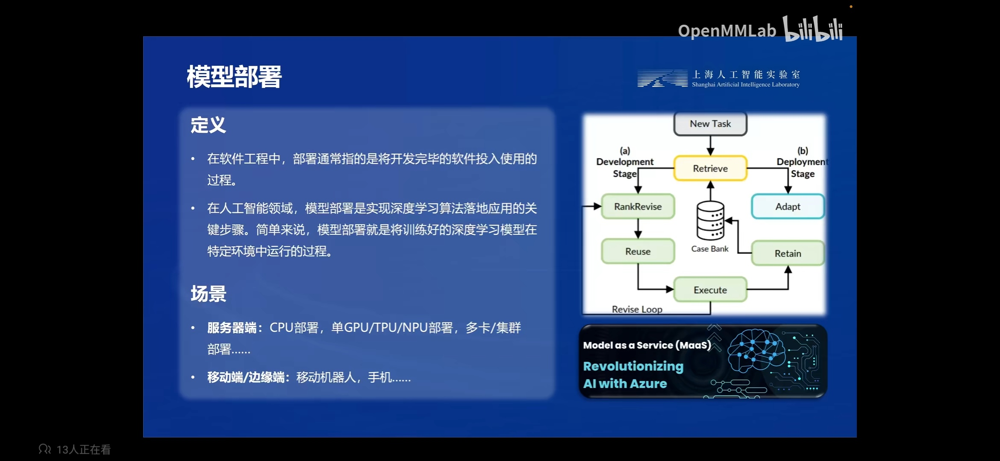

模型部署指的是把训练好的模型放在特定的环境中进行运行的过程。

部署的场景有服务器，服务器有CPU、GPU、TPU服务器，有多卡服务器、集群服务器等，这涉及到如何高效利用这些硬件和集群。

部署在移动端又分为手机、机器人等，它们使用的芯片不同，算力也有很大差距。而大模型计算量巨大，如何能在移动端部署大模型是一个很有挑战的事情，目前移动端部署方案中MLC-LLM是一个比较不错的方案。

## 大模型部署挑战

### 计算量大

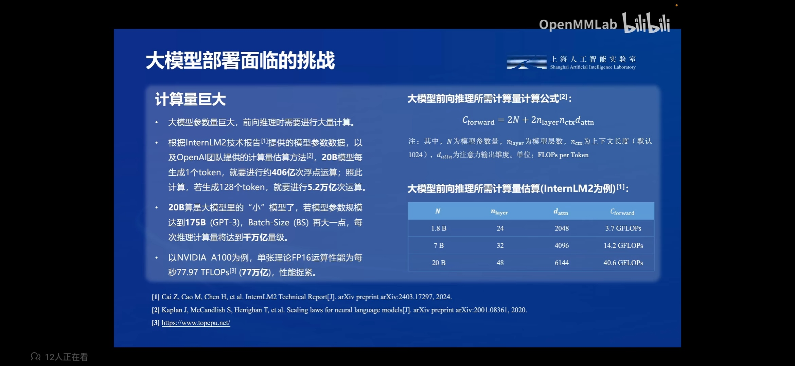

下面为 OpenAI 团队在 Scaling Law 论文中提出的大模型前向推理所需要的计算量公式，前向推理计算量大约等于2倍模型参数量加2倍模型层数乘以上下文长度再乘以隐藏层维度。

$N$ 为模型参数量，$n_{layer}$ 为模型层数，$n_{ctx}$ 为上下文长度（默认1024），$d_{attn}$ 为注意力输出维度，单位为FLOPs，是浮点运算量。


$$
C_{forward} = 2N + 2n_{layer}n_{ctx}d_{attn}
$$


以 InternLM2-20 模型为例子，每生成1个 token，就要进行大约406亿次浮点运算，生成128个 token 就要进行5.2万亿次运算。而千亿参数规模的模型在一次推理计算中的计算量将达到千万亿次计算。

作为对比，Nvidia A100 显卡的 FP16 理论计算量为每秒77万亿次运算，相比模型运算量来说要小很多。

### 内存开销大

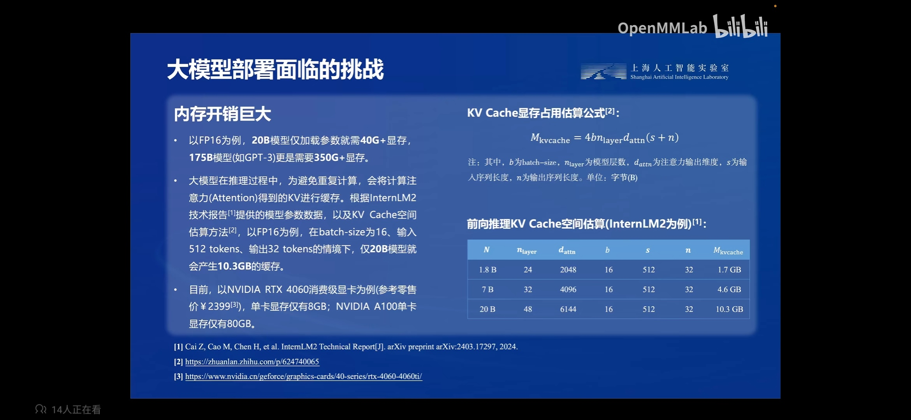

大模型除了计算量巨大之外，显存开销也巨大，拿 FP16 格式的20B模型为例子，单单是加载模型就需要40多GB显存，175B的模型更是需要350GB以上的显存。

另外，大模型在推理过程中由于是逐个 Token 进行预测，每次会有重复计算，为了减少这一部分的计算，会使用 KVCache 的方式将之前的Key和Value的值缓存起来，在后续推理中直接使用。假设存储的是 FP16 格式的 KVCache，在 batch 为16，输入512 tokens，输出32 tokens 的情况下，20B的模型就会产生10.3GB的缓存，和模型所占缓存相加就达到50G的显存占用了。而目前主流消费级显卡只有8GB显存，根本无法运行20B的模型；服务器上的A100仅有80GB显存，能够支撑的用户数和上下文长度也很有限。

以下为 KVCache 显存占用的估算公式，其中 $b$ 为 batch-size，$n_{layer}$ 为模型层数，$d_{attn}$ 为注意力输出维度，$s$ 为输入序列长度，$n$ 为输出序列维度，单位为字节B。


$$
M_{kvcache} = 4bn_{layer}d_{attn}(s+n)
$$


### 访存瓶颈

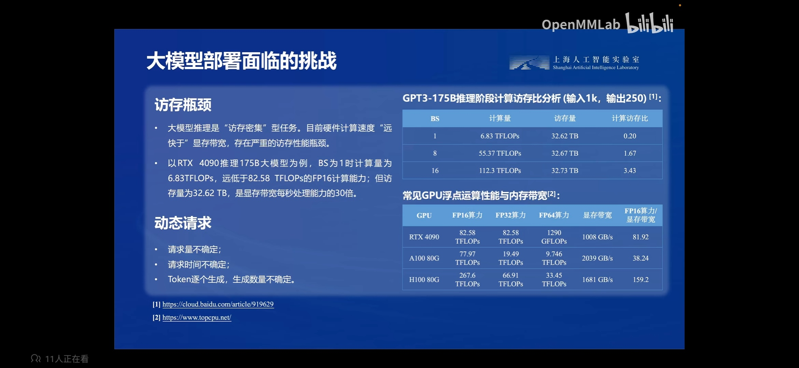

大模型与小模型不同，它是典型的访存密集型任务，目前硬件计算速度“远快于”显存带宽，存在严重的访存性能瓶颈。

上图右侧上面为模型计算访存数据，右侧下图为常见GPU的性能与内存带宽对比。拿4090为例，在推理175B大模型时，batch 为1的计算量为6.83TFLOPS，远低于4090理论计算量82.58TFLOPS，但是访存量为32.62TB，4090显存带宽为1..8GB/s，访存量是显存每秒带宽的30倍，因此显卡的计算量会被带宽所限制。上图还展示了增大 batch 可以显著提高访存比，但是提高batch会提高显存占用，显卡吃不消。

另外大模型的请求是动态的。请求量和请求时间不确定，另外Token是逐个生成的，因此是动态形状。如何在动态形状下快速低延迟的完成推理是大模型推理任务的急需解决的问题。

# 大模型部署方法

## 模型剪枝

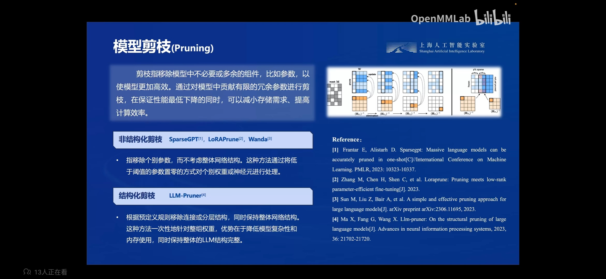

模型剪枝会移除模型中冗余的组件，比如参数或者结构。进行剪枝可以降低参数冗余，在性能小幅下降的同时，减少存储需求并提高计算效率。

模型剪枝分为结构化剪枝和非结构化剪枝.

结构化剪枝指的是移除个别参数，保持模型结构不变。这种方法通过将低于阈值的参数设置为0的方式对神经元进行处理。使用的库有 SparseGPT、LoRAPrune、Wanda。

还有就是结构化剪枝。指的是移除部分连接或者分层结构，保持模型整体结构不变，这种方法会一次性对整组权重进行移除，可以降低模型复杂度和内存使用，同时保持模型整体结构不变。使用的库有 LLM-Pruner。

## 知识蒸馏

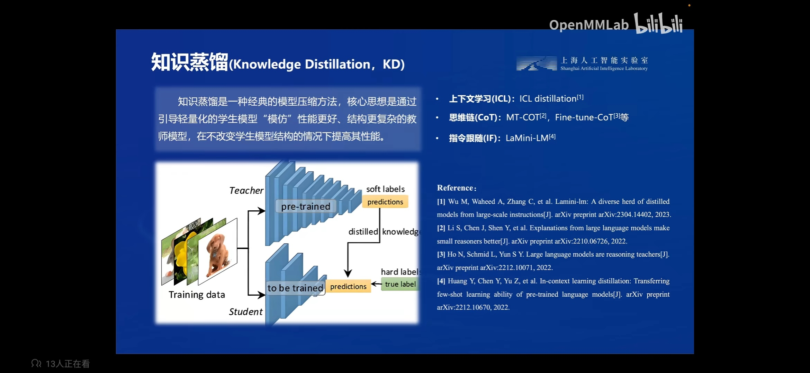

从减少模型参数角度来说，既然模型参数存在冗余，就应该能使用更少参数来完成同等或者更高的效果。但是直接训练更少参数的模型很难达到更多参数模型的效果，因此可以使用间接方式训练，首先训练一个参数量大的教师模型，再使用这个教师模型引导参数少的学生模型进行训练，让学生模型”模仿“性能更好，参数量更大的教师模型，从而让参数量更少的学生网络实现更好的性能。

这种方式最早应用于CV领域，使用一个大的CNN模型来指导一个小的CNN模型进行训练，将CNN转换为大模型也同样适用，LLAMA2 中就使用了蒸馏来训练小模型。

## 量化

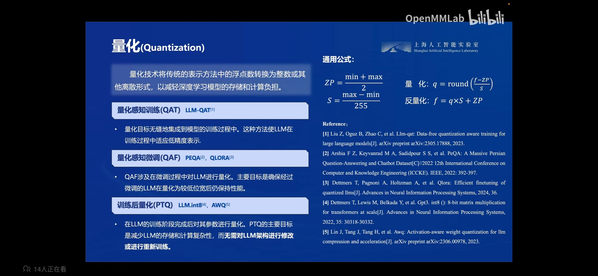

模型量化是指将模型中的浮点数转换为整数或者其他离散形式，比如8bit甚至4bit形式，大幅减少模型存储和计算负担的方式。

量化后的模型虽然使用整数进行存储，但是在推理是会将参数反量化回浮点数进行运算，然后将运算结果以整数形式进行存储，这样做是为了减少计算精度的损失。计算式不使用整数，还多了量化和反量化的计算步骤，这样做计算量虽然会增加，但是会减少内存访问量，因此最终可以加速模型推理。

通用计算公式如下：

$$
ZP = \frac {min + max} 2 \\
S = \frac {max -min} {255} \\
\text{量化}: q = round(\frac {f - ZP} S) \\
\text{反量化}: f = q \times S + ZP
$$

量化方法主要分为以下几种：

1. 量化感知训练（QAT）

​	量化会无缝集成到模型的训练过程中，这种方法让LLM在训练过程中适应低精度表示。

​	常用方法：LLM-QAT。

2. 量化感知微调（QAF）

​	是指在模型微调时对LLM进行量化。主要目标时确保经过微调的LLM在量化为较低位宽后仍然能保持性能。

​	常用方法：PEQA，QLORA（常用）。

3. 训练后量化（PTQ）

​	在训练后对模型参数进行量化，主要目的时为了减少LLM的存储和计算复杂性，同时无需对模型架构进行修改或重新训练。

​	常用方法：LLM.int8，GPTQ，AWQ。

​	LLM.int8 不是将全部参数转换为int8格式，而是一种采用混合精度分解的量化方法。该方案先做了一个矩阵分解，对绝大部分权重和激活用8bit量化（vector-wise）。对离群特征的几个维度保留16bit，对其做高精度的矩阵乘法。

​	LLM.int8 通过三个步骤完成矩阵乘法计算:

1. 从输入的隐含状态中，按列提取异常值 (离群特征，即大于某个阈值的值)。
   
2. 对离群特征进行 FP16 矩阵运算，对非离群特征进行量化，做 INT8 矩阵运算；
   
3. 反量化非离群值的矩阵乘结果，并与离群值矩阵乘结果相加，获得最终的 FP16 结果。

虽然 LLM.in8() 带来的性能下降微乎其微，但是这种分离计算的方式**拖慢了推理速度**。 

reference: https://zhuanlan.zhihu.com/p/680212402

# LMDeploy

## 简介

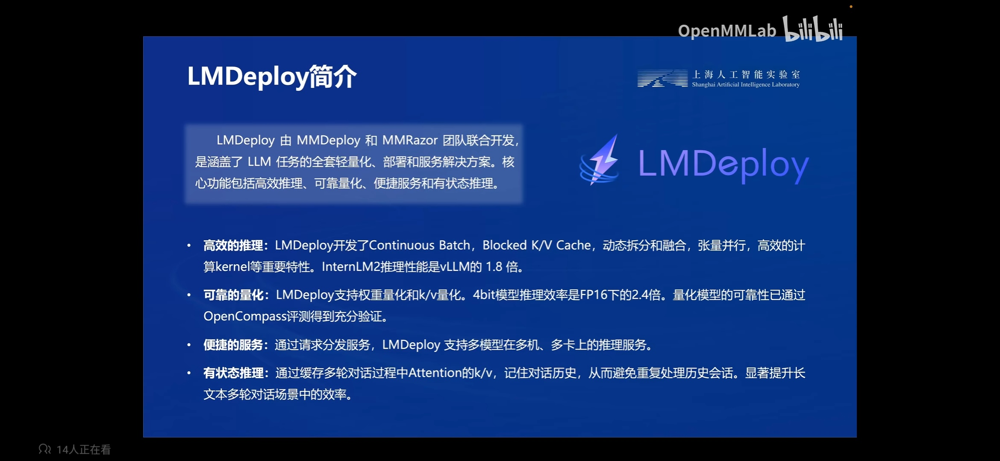

LMDeploy 是一款轻量高效的模型量化和部署方案。主要包括一下特性：

- 高效推理：LMDeploy 开发了 Continuous Batch，Block K/V Cache，动态拆分和融合，张量并行（多显卡），高效 Kernel 实现，可以实现比 vLLM 更快的推理速度。
- 可靠量化：LMDeploy 支持权重量化和k/v量化。4bit模型的推理效率是FP16格式的2.4倍，同时量化性能经过 OpenCompass 评测的验证。
- 服务便捷：通过请求分发服务，LMDeploy 支持多模型在多机、多卡上部署推理服务。
- 有状态推理：通过缓存多轮对话过程中 Attention 的k/v，可以记住对话历史记录，可以避免重复处理历史对话，显著提出长文本多轮对话的效率。

## 核心功能

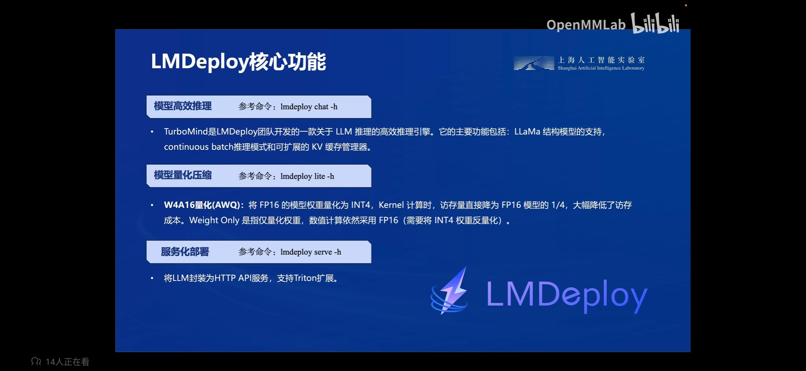

- 高效推理

开发了一款名叫 TurboMind 的高效推理引擎，实现了 LLaMa 模型结构的高效 cuda 推理。

支持 continuous batch 推理，可以解决之前推理时请求量和请求时间不确定，Token是逐个生成，动态形状的问题。

可扩展的KV缓存管理器实现了将不需要的 KVCache 暂时移动到内存中，需要时再转移到显存中，这种管理机制显著降低显存占用。

张量并行提高了在多显卡时的推理速度。

- 量化

支持基于 AWQ 算法的 W4A16 量化，将权重量化为INT4，在计算时，访存量直接将为FP16模型的1/4，大幅降低访存成本。注意W4A16是 Weight Only 量化，仅量化权重，数值计算仍然采用FP16.

支持 KVCache INT8 量化，将 KVCache 量化为INT8，计算时再反量化为FP16，进一步降低显存占用。

还支持 SmoothQuant 的 W8A8 量化，不过 TurboMind 引擎不支持，需要使用 Pytorch 引擎。

- 服务化部署

支持将LLM封装为HTTP API服务，支持Triton扩展，内建 Gradio 页面。

### TurboMind

TurboMind 是 LMDeploy 团队开发的一款关于 LLM 推理的高效推理引擎，它的主要功能包括：LLaMa 结构模型的支持，continuous batch 推理模式和可扩展的 KV 缓存管理器。

TurboMind 推理引擎仅支持推理 TurboMind 格式的模型。因此，TurboMind 在推理 HF 格式的模型时，会首先自动将HF格式模型转换为 TurboMind 格式的模型。**该过程在新版本的 LMDeploy 中是自动进行的，无需用户操作。**

几个容易迷惑的点：

- TurboMind 与 LMDeploy 的关系：LMDeploy 是涵盖了 LLM 任务全套轻量化、部署和服务解决方案的集成功能包，TurboMind 是 LMDeploy 的一个推理引擎，是一个子模块。LMDeploy 也可以使用 pytorch 作为推理引擎。
- TurboMind 与 TurboMind 模型的关系：TurboMind 是推理引擎的名字，TurboMind 模型是一种模型存储格式，TurboMind 引擎只能推理 TurboMind 格式的模型。

## 性能

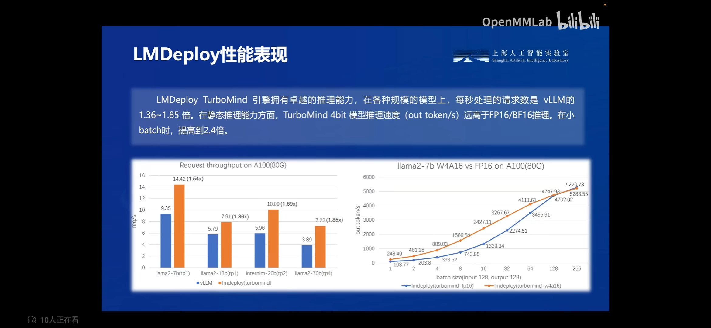

LMDeploy 在 TurboMind 推理引擎的加持下，在各种规模的模型上，每秒处理的请求数量时 vLLM 的1.36~1.85倍。在静态推理能力方面，TurboMind 4bit 模型的推理速度远高于FP16/BF16的推理。

## 支持视觉多模态大模型

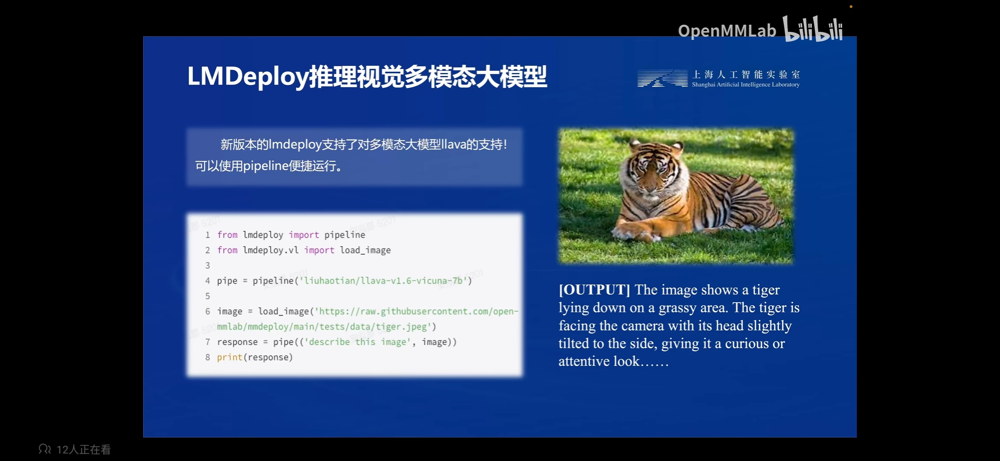

LMDeploy除了支持语言模型之外，还支持视觉多模态大模型，如LLaVA。

## 还支持第三方模型

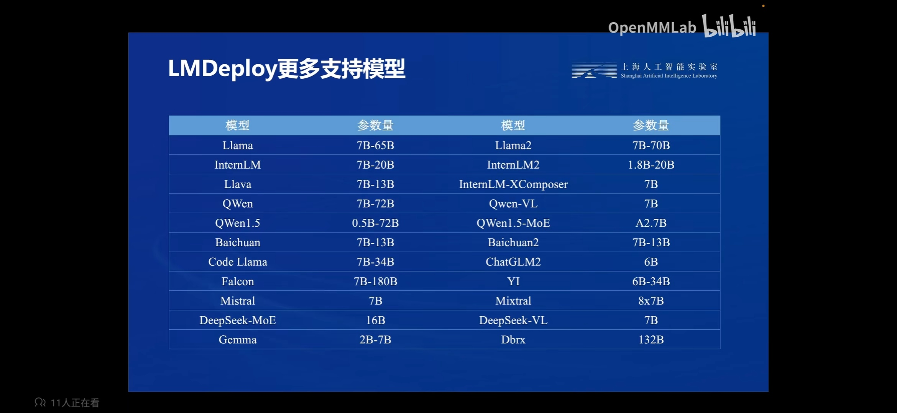

LMDeploy除了支持自家的InternLM模型之外，还支持其他家的模型。可以通过 `lmdeploy list` 命令查看

```sh
> lmdeploy list
The older chat template name like "internlm2-7b", "qwen-7b" and so on are deprecated and will be removed in the future. The supported chat template names are:
baichuan2
chatglm
codellama
dbrx
deepseek
deepseek-coder
deepseek-vl
falcon
gemma
internlm
internlm2
llama
llama2
mistral
mixtral
puyu
qwen
solar
ultracm
ultralm
vicuna
wizardlm
yi
yi-vl
```

## 使用

### 聊天

使用LMDeploy与模型进行对话的通用命令格式为：

```sh
lmdeploy chat [HF格式模型路径/TurboMind格式模型路径]
```

例如，您可以执行如下命令运行下载的7B模型：

```sh
export HF_MODEL=internlm/internlm2-chat-7b

# 使用pytorch后端
lmdeploy chat \
    $HF_MODEL \
    --backend pytorch \
    --tp 1 \
    --cache-max-entry-count 0.8

# 使用turbomind后端
lmdeploy chat \
    $HF_MODEL \
    --backend turbomind \
    --model-format hf \
    --tp 1 \
    --cache-max-entry-count 0.8 \
    --quant-policy 0
```

### KV Cache

KV Cache是一种缓存技术，通过存储键值对的形式来复用计算结果，以达到提高性能和降低内存消耗的目的。在大规模训练和推理中，KV Cache可以显著减少重复计算量，从而提升模型的推理速度。理想情况下，KV Cache全部存储于显存，以加快访存速度。当显存空间不足时，也可以将KV Cache放在内存，通过缓存管理器控制将当前需要使用的数据放入显存。

模型在运行时，占用的显存可大致分为三部分：模型参数本身占用的显存、KV Cache占用的显存，以及中间运算结果占用的显存。LMDeploy的KV Cache管理器可以通过设置`--cache-max-entry-count`参数，控制KV缓存**占用剩余显存**的最大比例。默认的比例为0.8。

```sh
export HF_MODEL=internlm/internlm2-chat-7b

lmdeploy chat \
    $HF_MODEL \
    --backend turbomind \
    --model-format hf \
    --tp 1 \
    --cache-max-entry-count 0.8 \
    --quant-policy 0
```

### 量化

量化是一种以参数或计算中间结果精度下降换空间节省（以及同时带来的性能提升）的策略。

正式介绍 LMDeploy 量化方案前，需要先介绍两个概念：

* 计算密集（compute-bound）: 指推理过程中，绝大部分时间消耗在数值计算上；针对计算密集型场景，可以通过使用更快的硬件计算单元来提升计算速度。
* 访存密集（memory-bound）: 指推理过程中，绝大部分时间消耗在数据读取上；针对访存密集型场景，一般通过减少访存次数、提高计算访存比或降低访存量来优化。

常见的 LLM 模型由于 Decoder Only 架构的特性，实际推理时大多数的时间都消耗在了逐 Token 生成阶段（Decoding 阶段），是典型的访存密集型场景。

那么，如何优化 LLM 模型推理中的访存密集问题呢？ 我们可以使用**KV8量化**和**W4A16**量化。KV8量化是指将逐 Token（Decoding）生成过程中的上下文 K 和 V 中间结果进行 INT8 量化（计算时再反量化），以降低生成过程中的显存占用。W4A16 量化，将 FP16 的模型权重量化为 INT4，Kernel 计算时，访存量直接降为 FP16 模型的 1/4，大幅降低了访存成本。Weight Only 是指仅量化权重，数值计算依然采用 FP16（需要将 INT4 权重反量化）。

#### [KV Cache int8](https://github.com/InternLM/lmdeploy/blob/main/docs/zh_cn/quantization/kv_int8.md)

KV Cache int8 是将 KVCache 进一步量化为 int8 来减少显存的占用，值得注意的是，量化也分为量化和反量化2个步骤，推理时需要反量化为16bit进行运算。

> 第一步
>
> 通过以下命令，获取量化参数，并保存至原HF模型目录

```sh
export HF_MODEL=internlm/internlm2-chat-7b

lmdeploy lite calibrate \
  $HF_MODEL \
  --calib-dataset 'ptb' \
  --calib-samples 128 \
  --calib-seqlen 2048 \
  --work-dir $HF_MODEL
```

> 第二步
>
> 测试聊天效果。注意需要添加参数`--quant-policy 4`以开启KV Cache int8模式。

```sh
export HF_MODEL=internlm/internlm2-chat-7b

# 必须指明 --model-format hf 才能使用
lmdeploy chat \
    $HF_MODEL \
    --backend turbomind \
    --model-format hf \
    --tp 1 \
    --cache-max-entry-count 0.8 \
    --quant-policy 4 # 启用 kv int8 量化, 校准/W4A16量化的模型才能使用 kv int8 量化
```

#### [W4A16](https://github.com/InternLM/lmdeploy/blob/main/docs/zh_cn/quantization/w4a16.md)

使用 AWQ 算法，实现模型 4bit 权重量化。

仅需执行一条命令，就可以完成模型量化工作。量化结束后，权重文件存放在 `$WORK_DIR` 下。

```sh
export HF_MODEL=internlm/internlm2-chat-7b
export WORK_DIR=internlm/internlm2-chat-7b-4bit

lmdeploy lite auto_awq \
    $HF_MODEL \
    --calib-dataset 'ptb' \
    --calib-samples 128 \
    --calib-seqlen 2048 \
    --w-bits 4 \
    --w-group-size 128 \
    --work-dir $WORK_DIR
```

量化后的模型，可以用一些工具快速验证对话效果。

```sh
# 必须指明 --model-format awq 才能使用
export WORK_DIR=internlm/internlm2-chat-7b-4bit

lmdeploy chat \
    $WORK_DIR \
    --backend turbomind \
    --model-format awq \
    --tp 1 \
    --cache-max-entry-count 0.8 \
    --quant-policy 0 # 0/4 校准/W4A16量化的模型可以使用 kv int8 量化
```

#### [W8A8](https://github.com/InternLM/lmdeploy/blob/main/docs/zh_cn/quantization/w8a8.md)

使用 8 bit 整数对神经网络模型进行量化和推理的功能。

在开始推理前，需要确保已经正确安装了 lmdeploy 和 openai/triton。

将原 16bit 权重量化为 8bit，并保存至 `internlm2-chat-7b-w8` 目录下，操作命令如下：

```sh
export HF_MODEL=internlm/internlm2-chat-7b
export WORK_DIR=internlm/internlm2-chat-7b-w8

lmdeploy lite smooth_quant \
    $HF_MODEL \
    --calib-dataset 'ptb' \
    --calib-samples 128 \
    --calib-seqlen 2048 \
    --work-dir $WORK_DIR
```

然后，执行以下命令，即可在终端与模型对话：

```sh
export WORK_DIR=internlm/internlm2-chat-7b-w8

lmdeploy chat \
    $WORK_DIR \
    --backend pytorch \
    --tp 1 \
    --cache-max-entry-count 0.8

# 不支持 turbomind
# 同样不支持转换为turbomind格式进行推理，可以转换格式，但是输出结果是乱的
```

### 服务推理

#### api_server

使用 api 进行推理

```sh
export HF_MODEL=internlm/internlm2-chat-7b

lmdeploy serve api_server \
    $HF_MODEL \
    --backend turbomind \
    --model-format hf \
    --tp 1 \
    --cache-max-entry-count 0.8 \
    --quant-policy 0 \
    --model-name internlm2_1_8b_chat \
    --server-name {ip_addr} \
    --server-port {port}
```

server访问

```sh
lmdeploy serve api_client {ip_addr}:{port}
```

使用的架构是这样的：

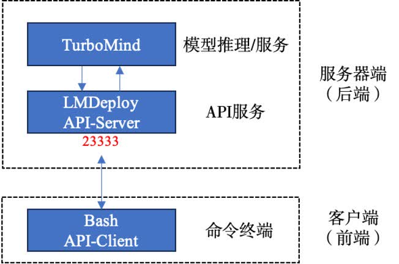

#### gradio

启动 gradio 页面

```sh
export HF_MODEL=internlm/internlm2-chat-7b

lmdeploy serve gradio \
    $HF_MODEL \
    --backend turbomind \
    --model-format hf \
    --tp 1 \
    --cache-max-entry-count 0.8 \
    --quant-policy 0 \
    --server-name {ip_addr} \
    --server-port {port}
```

先启动server作为后端，再启动gradio作为前端

```sh
export HF_MODEL=internlm/internlm2-chat-7b

lmdeploy serve api_server \
    $HF_MODEL \
    --backend turbomind \
    --model-format hf \
    --tp 1 \
    --cache-max-entry-count 0.8 \
    --quant-policy 0 \
    --model-name internlm2_1_8b_chat \
    --server-name {ip_addr} \
    --server-port {port}

lmdeploy serve gradio {ip_addr}:{port} \
    --server-name 0.0.0.0 \
    --server-port 6006
```

现在使用的架构是这样的：

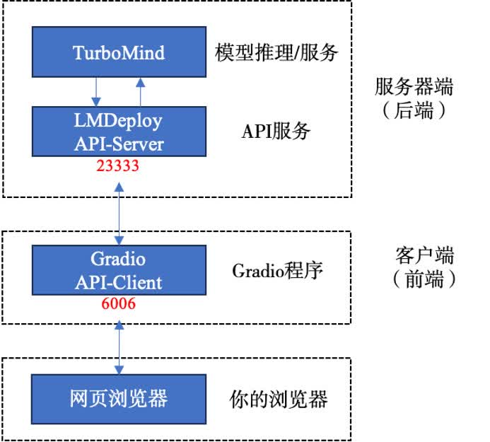

### 代码推理 pipeline

### pytorch 后端

```python
import os
from lmdeploy import pipeline, GenerationConfig, PytorchEngineConfig, ChatTemplateConfig


model_path = './models/internlm2-chat-1_8b'
# os.system(f'git clone https://code.openxlab.org.cn/OpenLMLab/internlm2-chat-1.8b {model_path}')
# os.system(f'cd {model_path} && git lfs pull')


if __name__ == '__main__':
    # https://lmdeploy.readthedocs.io/zh-cn/latest/api/pipeline.html#pytorchengineconfig
    backend_config = PytorchEngineConfig(
        model_name = 'internlm2',
        tp = 1,
        session_len = 2048,
        max_batch_size = 128,
        cache_max_entry_count = 0.5, # 调整KV Cache的占用比例为0.5
        eviction_type = 'recompute',
        prefill_interval = 16,
        block_size = 64,
        num_cpu_blocks = 0,
        num_gpu_blocks = 0,
        adapters = None,
        max_prefill_token_num = 4096,
        thread_safe = False,
        download_dir = None,
        revision = None,
    )

    system_prompt = """You are an AI assistant whose name is InternLM (书生·浦语).
    - InternLM (书生·浦语) is a conversational language model that is developed by Shanghai AI Laboratory (上海人工智能实验室). It is designed to be helpful, honest, and harmless.
    - InternLM (书生·浦语) can understand and communicate fluently in the language chosen by the user such as English and 中文.
    """

    # https://lmdeploy.readthedocs.io/zh-cn/latest/_modules/lmdeploy/model.html#ChatTemplateConfig
    chat_template_config = ChatTemplateConfig(
        model_name = 'internlm2',
        system = None,
        meta_instruction = system_prompt,
    )

    # https://lmdeploy.readthedocs.io/zh-cn/latest/api/pipeline.html#generationconfig
    gen_config = GenerationConfig(
        n = 1,
        max_new_tokens = 1024,
        top_p = 0.8,
        top_k = 40,
        temperature = 0.8,
        repetition_penalty = 1.0,
        ignore_eos = False,
        random_seed = None,
        stop_words = None,
        bad_words = None,
        min_new_tokens = None,
        skip_special_tokens = True,
    )

    # https://lmdeploy.readthedocs.io/zh-cn/latest/api/pipeline.html
    # https://github.com/InternLM/lmdeploy/blob/main/lmdeploy/api.py
    pipe = pipeline(
        model_path = model_path,
        model_name = 'internlm2_chat_1_8b',
        backend_config = backend_config,
        chat_template_config = chat_template_config,
    )

    #----------------------------------------------------------------------#
    # prompts (List[str] | str | List[Dict] | List[Dict]): a batch of
    #     prompts. It accepts: string prompt, a list of string prompts,
    #     a chat history in OpenAI format or a list of chat history.
    # [
    #     {
    #         "role": "system",
    #         "content": "You are a helpful assistant."
    #     },
    #     {
    #         "role": "user",
    #         "content": "What is the capital of France?"
    #     },
    #     {
    #         "role": "assistant",
    #         "content": "The capital of France is Paris."
    #     },
    #     {
    #         "role": "user",
    #         "content": "Thanks!"
    #     },
    #     {
    #         "role": "assistant",
    #         "content": "You are welcome."
    #     }
    # ]
    #----------------------------------------------------------------------#
    prompts = [[{
        'role': 'user',
        'content': 'Hi, pls intro yourself'
    }], [{
        'role': 'user',
        'content': 'Shanghai is'
    }]]

    # https://github.com/InternLM/lmdeploy/blob/main/lmdeploy/serve/async_engine.py#L274
    responses = pipe(prompts, gen_config=gen_config)
    # 放入 [{},{}] 格式返回一个response
    # 放入 [] 或者 [[{},{}]] 格式返回一个response列表
    for response in responses:
        print(response)
        print('text:', response.text)
        print('generate_token_len:', response.generate_token_len)
        print('input_token_len:', response.input_token_len)
        print('session_id:', response.session_id)
        print('finish_reason:', response.finish_reason)
        print()
```

### turbomind 后端

```python
import os
from lmdeploy import pipeline, GenerationConfig, TurbomindEngineConfig, ChatTemplateConfig


model_path = './models/internlm2-chat-1_8b'
# os.system(f'git clone https://code.openxlab.org.cn/OpenLMLab/internlm2-chat-1.8b {model_path}')
# os.system(f'cd {model_path} && git lfs pull')


if __name__ == '__main__':
    # 可以直接使用transformers的模型,会自动转换格式
    # https://lmdeploy.readthedocs.io/zh-cn/latest/api/pipeline.html#turbomindengineconfig
    backend_config = TurbomindEngineConfig(
        model_name = 'internlm2',
        model_format = 'hf', # The format of input model. `hf` meaning `hf_llama`, `llama` meaning `meta_llama`, `awq` meaning the quantized model by awq. Default: None. Type: str
        tp = 1,
        session_len = 2048,
        max_batch_size = 128,
        cache_max_entry_count = 0.5, # 调整KV Cache的占用比例为0.5
        cache_block_seq_len = 64,
        quant_policy = 0, # 默认为0, 4为开启kvcache int8 量化
        rope_scaling_factor = 0.0,
        use_logn_attn = False,
        download_dir = None,
        revision = None,
        max_prefill_token_num = 8192,
    )

    system_prompt = """You are an AI assistant whose name is InternLM (书生·浦语).
    - InternLM (书生·浦语) is a conversational language model that is developed by Shanghai AI Laboratory (上海人工智能实验室). It is designed to be helpful, honest, and harmless.
    - InternLM (书生·浦语) can understand and communicate fluently in the language chosen by the user such as English and 中文.
    """

    # https://lmdeploy.readthedocs.io/zh-cn/latest/_modules/lmdeploy/model.html#ChatTemplateConfig
    chat_template_config = ChatTemplateConfig(
        model_name = 'internlm2',
        system = None,
        meta_instruction = system_prompt,
    )

    # https://lmdeploy.readthedocs.io/zh-cn/latest/api/pipeline.html#generationconfig
    gen_config = GenerationConfig(
        n = 1,
        max_new_tokens = 1024,
        top_p = 0.8,
        top_k = 40,
        temperature = 0.8,
        repetition_penalty = 1.0,
        ignore_eos = False,
        random_seed = None,
        stop_words = None,
        bad_words = None,
        min_new_tokens = None,
        skip_special_tokens = True,
    )

    # https://lmdeploy.readthedocs.io/zh-cn/latest/api/pipeline.html
    # https://github.com/InternLM/lmdeploy/blob/main/lmdeploy/api.py
    pipe = pipeline(
        model_path = model_path,
        model_name = 'internlm2_chat_1_8b',
        backend_config = backend_config,
        chat_template_config = chat_template_config,
    )

    #----------------------------------------------------------------------#
    # prompts (List[str] | str | List[Dict] | List[Dict]): a batch of
    #     prompts. It accepts: string prompt, a list of string prompts,
    #     a chat history in OpenAI format or a list of chat history.
    # [
    #     {
    #         "role": "system",
    #         "content": "You are a helpful assistant."
    #     },
    #     {
    #         "role": "user",
    #         "content": "What is the capital of France?"
    #     },
    #     {
    #         "role": "assistant",
    #         "content": "The capital of France is Paris."
    #     },
    #     {
    #         "role": "user",
    #         "content": "Thanks!"
    #     },
    #     {
    #         "role": "assistant",
    #         "content": "You are welcome."
    #     }
    # ]
    #----------------------------------------------------------------------#
    prompts = [[{
        'role': 'user',
        'content': 'Hi, pls intro yourself'
    }], [{
        'role': 'user',
        'content': 'Shanghai is'
    }]]

    # https://github.com/InternLM/lmdeploy/blob/main/lmdeploy/serve/async_engine.py#L274
    responses = pipe(prompts, gen_config=gen_config)
    # 放入 [{},{}] 格式返回一个response
    # 放入 [] 或者 [[{},{}]] 格式返回一个response列表
    for response in responses:
        print(response)
        print('text:', response.text)
        print('generate_token_len:', response.generate_token_len)
        print('input_token_len:', response.input_token_len)
        print('session_id:', response.session_id)
        print('finish_reason:', response.finish_reason)
        print()
```

### 转换模型格式

将 hf/awq 格式的模型转换为 turbomind 格式的模型

```sh
export HF_MODEL=internlm/internlm2-chat-7b
export DST_PATH=internlm/internlm2-chat-7b-turbomind

lmdeploy convert internlm2 \
    $HF_MODEL \
    --model-format hf \
    --tp 1 \
    --dst-path $DST_PATH
```

转化量化后的W4A16模型,需要设置 group-size

```sh
# 转化量化后的W4A16模型,需要设置 group-size
export AWQ_MODEL=internlm/internlm2-chat-7b-4bit
export DST_PATH=internlm/internlm2-chat-7b-4bit-turbomind

lmdeploy convert internlm2 \
    $AWQ_MODEL \
    --model-format awq \
    --group-size 128 \
    --tp 1 \
    --dst-path $DST_PATH
```

推理

```sh
export DST_PATH=internlm/internlm2-chat-7b-turbomind

lmdeploy chat \
    $DST_PATH \
    --backend turbomind \
    --tp 1 \
    --cache-max-entry-count 0.8 \
    --quant-policy 0 # 0/4 turbomind格式可以直接使用 kv int8 量化
```

### 显示支持的模型

```sh
> lmdeploy list
The older chat template name like "internlm2-7b", "qwen-7b" and so on are deprecated and will be removed in the future. The supported chat template names are:
baichuan2
chatglm
codellama
dbrx
deepseek
deepseek-coder
deepseek-vl
falcon
gemma
internlm
internlm2
llama
llama2
mistral
mixtral
puyu
qwen
solar
ultracm
ultralm
vicuna
wizardlm
yi
yi-vl
```

### check_env

检查环境

```sh
> lmdeploy check_env
sys.platform: linux
Python: 3.10.13 (main, Sep 11 2023, 13:44:35) [GCC 11.2.0]
CUDA available: True
MUSA available: False
numpy_random_seed: 2147483648
GPU 0: Tesla V100-SXM2-16GB
CUDA_HOME: /usr/local/cuda
NVCC: Cuda compilation tools, release 12.1, V12.1.105
GCC: gcc (Ubuntu 9.4.0-1ubuntu1~20.04.1) 9.4.0
PyTorch: 2.1.2+cu121
PyTorch compiling details: PyTorch built with:
  - GCC 9.3
  - C++ Version: 201703
  - Intel(R) oneAPI Math Kernel Library Version 2022.2-Product Build 20220804 for Intel(R) 64 architecture applications
  - Intel(R) MKL-DNN v3.1.1 (Git Hash 64f6bcbcbab628e96f33a62c3e975f8535a7bde4)
  - OpenMP 201511 (a.k.a. OpenMP 4.5)
  - LAPACK is enabled (usually provided by MKL)
  - NNPACK is enabled
  - CPU capability usage: AVX512
  - CUDA Runtime 12.1
  - NVCC architecture flags: -gencode;arch=compute_50,code=sm_50;-gencode;arch=compute_60,code=sm_60;-gencode;arch=compute_70,code=sm_70;-gencode;arch=compute_75,code=sm_75;-gencode;arch=compute_80,code=sm_80;-gencode;arch=compute_86,code=sm_86;-gencode;arch=compute_90,code=sm_90
  - CuDNN 8.9.2
  - Magma 2.6.1
  - Build settings: BLAS_INFO=mkl, BUILD_TYPE=Release, CUDA_VERSION=12.1, CUDNN_VERSION=8.9.2, CXX_COMPILER=/opt/rh/devtoolset-9/root/usr/bin/c++, CXX_FLAGS= -D_GLIBCXX_USE_CXX11_ABI=0 -fabi-version=11 -fvisibility-inlines-hidden -DUSE_PTHREADPOOL -DNDEBUG -DUSE_KINETO -DLIBKINETO_NOROCTRACER -DUSE_FBGEMM -DUSE_QNNPACK -DUSE_PYTORCH_QNNPACK -DUSE_XNNPACK -DSYMBOLICATE_MOBILE_DEBUG_HANDLE -O2 -fPIC -Wall -Wextra -Werror=return-type -Werror=non-virtual-dtor -Werror=bool-operation -Wnarrowing -Wno-missing-field-initializers -Wno-type-limits -Wno-array-bounds -Wno-unknown-pragmas -Wno-unused-parameter -Wno-unused-function -Wno-unused-result -Wno-strict-overflow -Wno-strict-aliasing -Wno-stringop-overflow -Wno-psabi -Wno-error=pedantic -Wno-error=old-style-cast -Wno-invalid-partial-specialization -Wno-unused-private-field -Wno-aligned-allocation-unavailable -Wno-missing-braces -fdiagnostics-color=always -faligned-new -Wno-unused-but-set-variable -Wno-maybe-uninitialized -fno-math-errno -fno-trapping-math -Werror=format -Werror=cast-function-type -Wno-stringop-overflow, LAPACK_INFO=mkl, PERF_WITH_AVX=1, PERF_WITH_AVX2=1, PERF_WITH_AVX512=1, TORCH_DISABLE_GPU_ASSERTS=ON, TORCH_VERSION=2.1.2, USE_CUDA=ON, USE_CUDNN=ON, USE_EXCEPTION_PTR=1, USE_GFLAGS=OFF, USE_GLOG=OFF, USE_MKL=ON, USE_MKLDNN=ON, USE_MPI=OFF, USE_NCCL=1, USE_NNPACK=ON, USE_OPENMP=ON, USE_ROCM=OFF,

TorchVision: 0.16.2+cu121
LMDeploy: 0.3.0+
transformers: 4.37.2
gradio: 4.25.0
fastapi: 0.110.1
pydantic: 2.6.4
triton: 2.1.0
```