# 智能体

## 为什么要有智能体

大模型虽然有很强的对话能力，但仍然后很多局限性。

大模型会产生幻觉，产生虚假信息，与现实严重不符或者脱节，如虚假历史信息，虚假网页链接等。如下图所示，模型会说出鲁迅和周树人不是同一个人，这与事实不符。

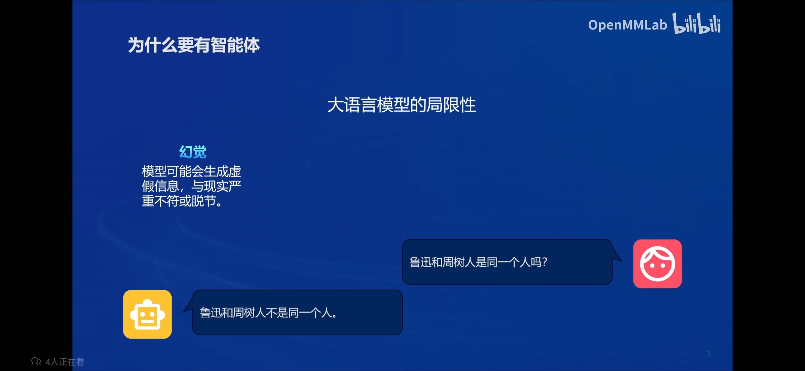

模型训练时的数据来自于过去收集的数据，因此训练完成后的模型没法实时获取当前的信息。如下图所示，今年是2024年，但模型仍然认为今年是2023年。

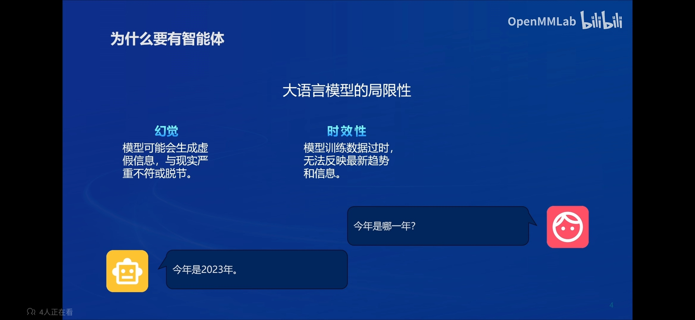

模型还会有可靠性问题，当让模型处理复杂任务时，比如编写代码后者复杂计算，模型的输出可能出现错误。

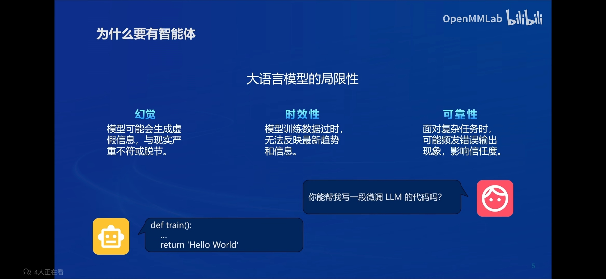

## 什么是智能体

根据 An architecture for adaptive intelligent systems 这篇论文，我们可以知道智能体主要有以下几点能力：

- 可以感知环境中的动态条件。
- 能采取动作环境影响。
- 能运用推理能力理解信息、解决问题、产生推断、决定动作。

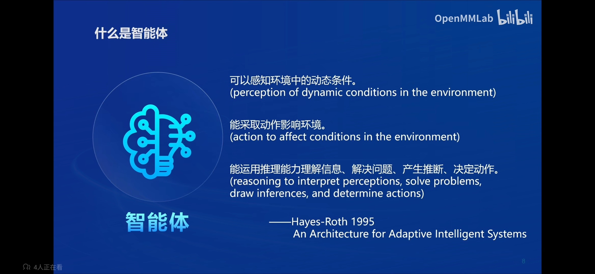

## 智能体组成

智能体主要有以下部分组成：

- 大脑：作为控制器，承担记忆、思考和决策任务。接受来自感知模块的信息，并采取相应动作。核心为 LLM 大模型。
- 感知：对外部环境的多模态信息进行感知和处理。包括但不限于图像、音频、视频、传感器等。
- 动作：利用并执行工具以影响环境。工具可能包括文件检索（RAG）、调用相关API（比如搜索、天气查询等）、操控机械臂等。

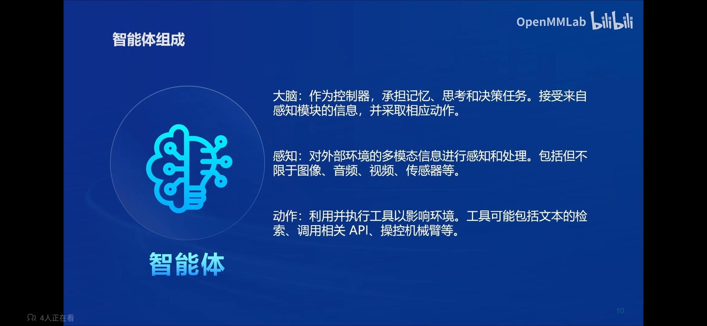

## 智能体范式

目前已有多种智能体范式，主要有 AutoGPT、ReWoo、ReAct。下面将会对这三种范式进行详细解析。

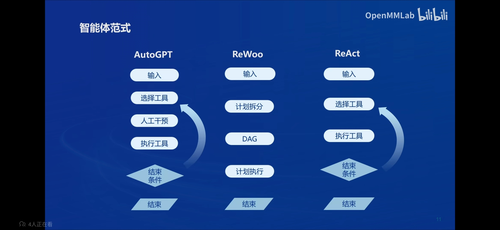

### AutoGPT

下图右侧是 AutoGPT 的基本流程：

1. 用户先将目标和任务输入给系统。
2. 任务列表将相应的任务发送给对应的智能体。
3. 智能体执行后将执行结果存储到记忆当中，并将结果发送给另一个智能体。
4. 由另一个智能体再创建出新的任务。
5. 重复上述步骤，直到完成任务。

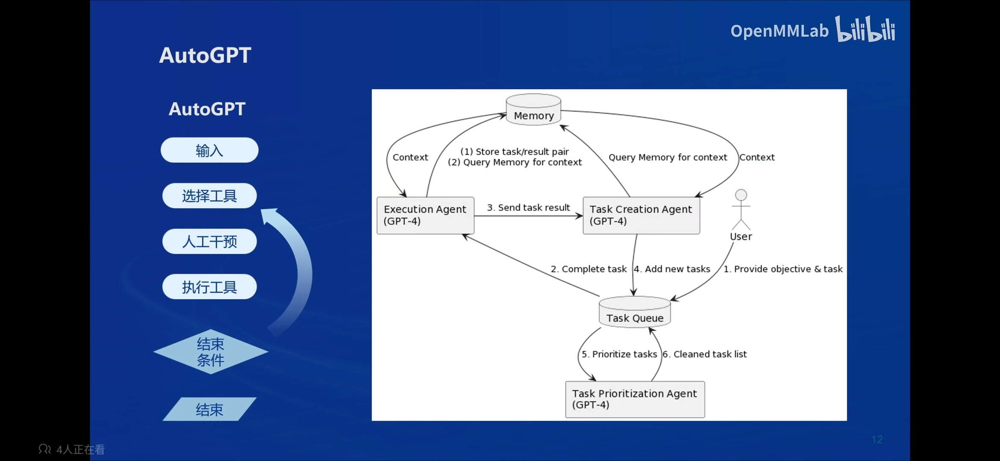

### ReWoo

1. 用户进行输入。
2. ReWoo 将用户的输入进行拆分，分为多个步骤，构造成一个步骤执行的有向无环图。（右图 Planner）
3. 对有向无环图进行执行，直到最终结果。（右图 Worker）
4. 最终 Planner 和 Worker 的结果一并发送给 Solver 得到最终的结果。

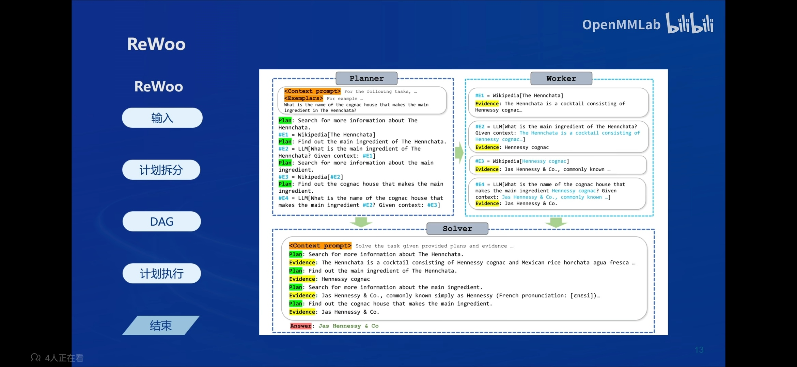

### ReAct

ReAct 在接收用户的输入后会选择相对应的工具进行执行，得到工具执行结果之后，模型进一步思考是否应该选择下一个工具并执行，直到完成用户的输入为止。

下图右侧展示出 ReAct 将分为推理和行为2个部分，更好的实现了智能体的思维模式。

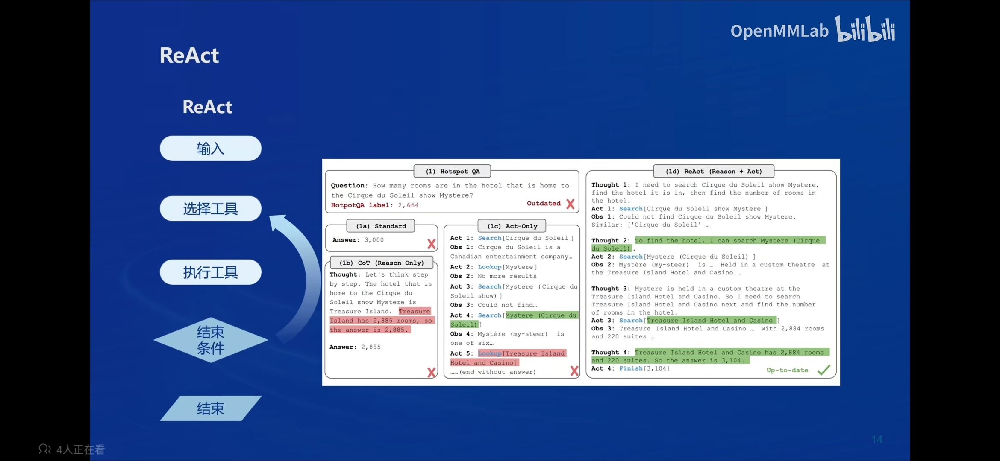

# Lagent 

Lagent 是一个轻量级开源智能体框架，旨在让用户可以高效地构建基于大语言模型的智能体。同时它也提供了一些典型工具以增强大语言模型的能力。

Lagent 目前已经支持了包括 AutoGPT、ReAct 等在内的多个经典智能体范式，也支持了如下工具：

- Arxiv 搜索
- Bing 地图
- Google 学术搜索
- Google 搜索
- 交互式 IPython 解释器
- IPython 解释器
- PPT
- Python 解释器

Lagent 具体执行流程如下，用户输入指令或者得到反馈之后，LLM 会对应做出规划，是直接输出还是调用工具，如果需要调用工具，就执行调用，调用的结果也会返回给 Lagent，然后有 LLM 决定是继续调用工具还是执行输出。

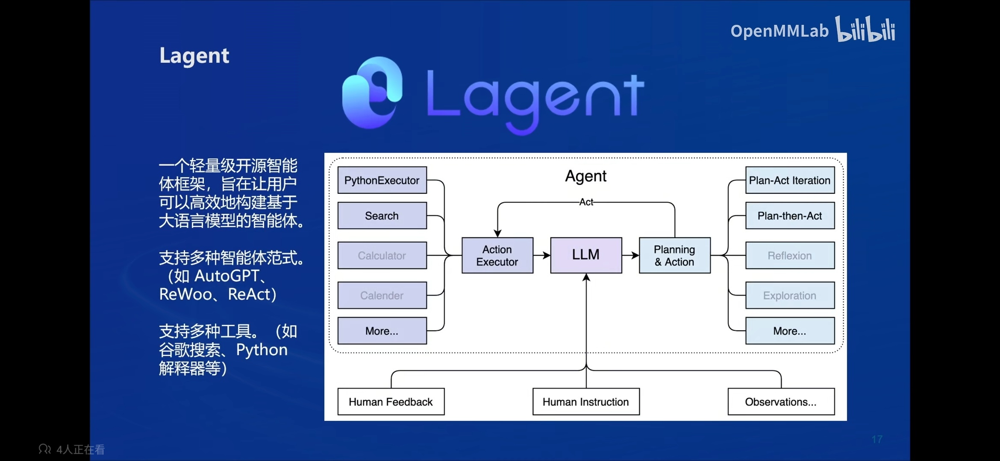

# AgentLego

AgentLego 是一个提供了多种开源工具 API 的多模态工具包，旨在像是乐高积木一样，让用户可以快速简便地拓展自定义工具，从而组装出自己的智能体。通过 AgentLego 算法库，不仅可以直接使用多种工具，也可以利用这些工具，在相关智能体框架（如 Lagent，Transformers Agent 等）的帮助下，快速构建可以增强大语言模型能力的智能体。

AgentLego 目前提供了如下工具：

通用能力：

- 计算器
- 谷歌搜素

语音相关：

- 文本 -> 音频（TTS）
- 音频 -> 文本（STT）

图像处理：

- 描述输入图像
- 识别文本（OCR）
- 视觉问答（VQA）
- 人体姿态估计
- 人脸关键点检测
- 图像边缘提取（Canny）
- 深度图生成
- 生成涂鸦（Scribble）
- 检测全部目标
- 检测给定目标
- SAM
  - 分割一切
  - 分割给定目标

AIGC：

- 文生图
- 图像拓展
- 删除给定对象
- 替换给定对象
- 根据指令修改
- ControlNet 系列
  - 根据边缘+描述生成
  - 根据深度图+描述生成
  - 根据姿态+描述生成
  - 根据涂鸦+描述生成
- ImageBind 系列
  - 音频生成图像
  - 热成像生成图像
  - 音频+图像生成图像
  - 音频+文本生成图像

下图可以看到它集成了大量视觉多模态领域的算法，如目标检测、图像分割、SAM、Stable Diffusion等，可以被 LangChain、Lagent、Transformers Agent 直接调用。

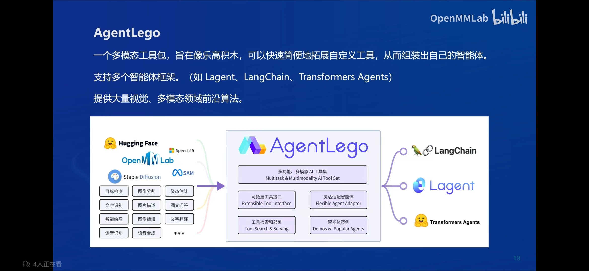

# 两者关系

Lagent 是一个智能体框架，而 AgentLego 与大模型智能体并不直接相关，而是作为工具包，在相关智能体的功能支持模块发挥作用。

用户将输入给大语言模型时，大语言模型判断是否需要调用工具。如果不需要就直接输出结果，如果需要调用工具就会进入 Lagent 的逻辑中首先会调用工具，而一部分的多模态工具的功能支持就由 AgentLego 来实现。在得到工具的输出之后，模型再经过后处理就得到智能体输出。

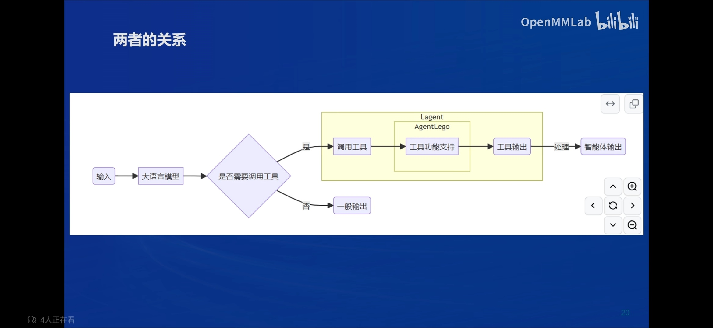