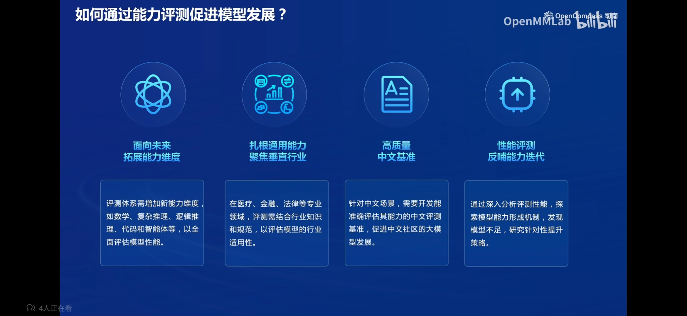
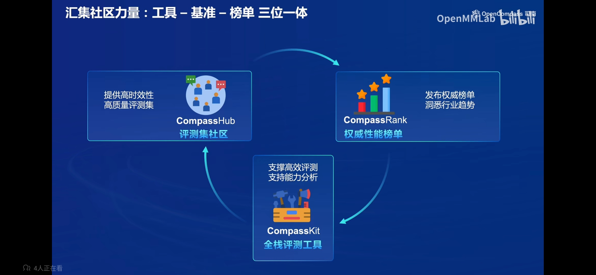

# 大模型评测

## 评测促进模型发展

当前模型能力多种多样，如数学、代码、智能体等，我们需要各种维度测试模型在各方面的能力。

模型逐渐应用在某些垂直领域，如医疗、法律，在这些领域也需要合适的评测方式来测试模型性能。

针对中文场景，需要专门开发能准确评估中文能力的评测方式，来促进中文社区的大模型发展。

通过评测获取模型优缺点，从而有针对性的提高模型能力。

## 大模型评测中的挑战

大模型评测中存在很多挑战：

全面性：

- 大模型应用场景千变万化，要对每个场景都设计对应的评测
- 模型能力演进迅速，模型能提提升迅速，如何有效评测模型能力是急需解决的
- 设计和构造可扩展的能力维度体系，从多维度评测模型能力要设计出可以扩展的评测方式

评测成本：

- 评测数万道题，在本地运行需要大量计算资源，api评测也有很高的费用
- 基于人工打分的主观评测成本高昂，参考 https://chat.lmsys.org/

数据污染：

- 模型训练的海量语料不可避免带来数据污染
- 急需可靠的数据污染检测技术
- 如何设计可动态更新的高质量评测基准

鲁棒性：

- 大模型对提示词十分敏感，如何设计提示词让模型发挥出最大实力是需要设计的
- 对模型进行多次采样，模型性能不稳定

# OpenCompass

## 开源历程

OpenCompass 评测体系始于2023年5月，经过数次迭代，于2024年1月推出了 OpenCompass 2.0 评测体系，支持多种数据集和性能对比，支持编程能力测评和多模态评测。

## 机构合作

OpenCompass 广泛应用于头部大模型企业和科研机构，为大模型评测提供了完整可靠的评测体系。

OpenCompass 还是唯一获得 Meta 官方推荐的国产大模型评测体系。

OpenCompass 对社区友好，是社区支持最完善的评测体系之一。

## 评测方式

评测方式从模型分类上来说分为基座模型和对话模型。对于基座模型，我们评测它的方式是查看它的知识量，逻辑推理能力，理解能力等。对于对话模型，我们测试它的对话能力，指令跟随能力等。

目前的大模型分为开源和闭源两种，对于开源模型，我们是使用GPU/推理加速卡在本地推理测试；对于闭源模型，我们使用 API 发送请求获取回复。

### 客观评测与主观评测

模型评测分为客观评测和主观评测，客观评测包括问答题和选择体，对结果进行判断（正则表达式）进行客观评分。

主观评测是通过问模型问题，然后让人或者模型评测哪一个回答的好来进行评分。

### 提示工程

在进行模型评测的时候，模型的提示会影响模型的输出结果，如下图所示，好的提示词有如下特点：明确、概念无歧义、步骤引导、具体描述、迭代反馈等。

下图左侧展示了小样本学习能力，给模型几个示例，让模型根据示例给出合适的回答。

下图右侧展示了思维链技术，让模型一步一步推理给出答案。

### 长文本评测

长文本评测方面包括大海捞针测试，在很长的文档中的某个位置插入不相关的一句话，然后让模型找出这一句话，测试模型的记忆力。

## 社区

OpenCompass 汇聚了社区力量，将工具、基准、榜单三位一体结合起来。及时根据社区的需求提供高时效的高质量评测数据集，每个月还会发挥权威性能榜单，并对 CompassKit 工具箱继续优化，支撑高效评测。

### CompassRank

OpenpassRank 是一个中立全面的性能榜单，目前已有100多个大模型加入评测。还有多模态榜单，评测多模态能力。

### CompassKit

OpenpassKit 是大模型评测全栈工具链，支持多种功能。

支持数据污染检查：

- 提供多种数据污染检测方法
- 支持包括 GSM-8K，MMLU 等主流数据集上的污染检测

支持多种模型推理：

- 支持多种商业模型 Api
- 支持 LMDeploy、vLLM、LightLLM 等多种推理后端

支持长文本能力评测：

- 支持一百万长度的大海捞针测试
- 支持多个主流长文本评测基准

支持中英文双语主观评测：

- 支持基于大模型评价的主观评测
- 提供模型打分、模型对战等多种能力
- 灵活切换上百种模型

#### 评测流水线

CompassKit 设计了评测流水线，会将多个评测请求切分为多个独立执行的任务，从而最大化利用计算资源。

支持任意模型和大量数据集。在执行任务时会将任务进行切分，之后并行执行。并且支持多种输出格式，方便汇集最终结果。

#### 全站工具链

CompassKit 拥有多种模型评测工具。

VLMEvalKit 是一个一站式多模态评测工具，支持主流多模态模型和数据集，助力社区比较不同多模态模型在各个任务上的性能。

Code-Evaluator 是一个代码评测工具，提供基于 docker 的统一编程语言环境，确保代码能力评测的稳定性和可复现性。

MixtralKit 是一个 MoE 模型入门工具，为 MoE 模型初学者提供学习资料、模型架构解析、推理与评测教程等入门工具。

### CompassHub

CompassHub 是一个开放的高质量评测社区，容纳了大量数据集，可以详细了解数据集的信息以及对应数据集的模型评测结果。

## 多维度评测

OpenComass 拥有多维度的数据集，在基础能力评测方面，支持语言、知识、理解、数学、代码、推理多方面的的性能评估。

在综合能力方面，专注考察大模型综合运用各类知识、理解与分析、多步推理、代码工具等来完成复杂任务的能力水平。支持考试、对话、创作、智能体、评价、长文本等方面的评测。

## 自研高质量大模型评测基准

Opencomass 除了支持开源数据集之外，还自研了高质量的大模型评测数据集。如下图的专注数学能力的 MathBench，专注于多维度 LLM 反思能力评估的 CriticBench，专门评测大模型细粒度工具能力的 T-Eval，专注于多场景中文创作能力的 CreationBench，专注于大模型基础能力评测的 F-Eval，专注于代码解释器能力的 CIBench 等。

### MathBench

MatchBench 是一个评测大模型多层次数学能力的评测基准。多层次一方面指的是考题难度，分为初级、中级、高级，检测模型不同层次的数学能力。还支持多语言题目，支持来自中文的中考、高考、研究生考试的题目；还支持英文考试题目，主要来自于 SAT、AMC、GRE 考试等。

### CIBench

CIBench 专注于模型的代码解释器能力的评测。支持多种任务和软件。评测基准具有高度可扩展性。难度等级分为多层，评估模型不同层次的能力。

如下图所示，评测支持 Pandas、Matplotlib、Scikit-learn、Pytorch 等工具的测试。

### T-Eval

T-Eval 是一个大模型细粒度工具能力评测基准。专注于模型的 Agent 能力评估，从规划、检索、指令遵循、推理、理解、评价多角度评测模型。

## 生态

OpenCompass 与各行业垂直领域紧密合作，推出了多种垂直领域的评测基准。与东方财富合作推出了 OpenFinData 全场景金融评测基准测试；与南京大学合作推出了 LawBench 大模型司法能力基准测试；针对医疗行业对大模型的需求，推出了 MedBench 中文医疗大模型评测基准；与腾讯合作推出了 SecBench 网络安全评测基准。

