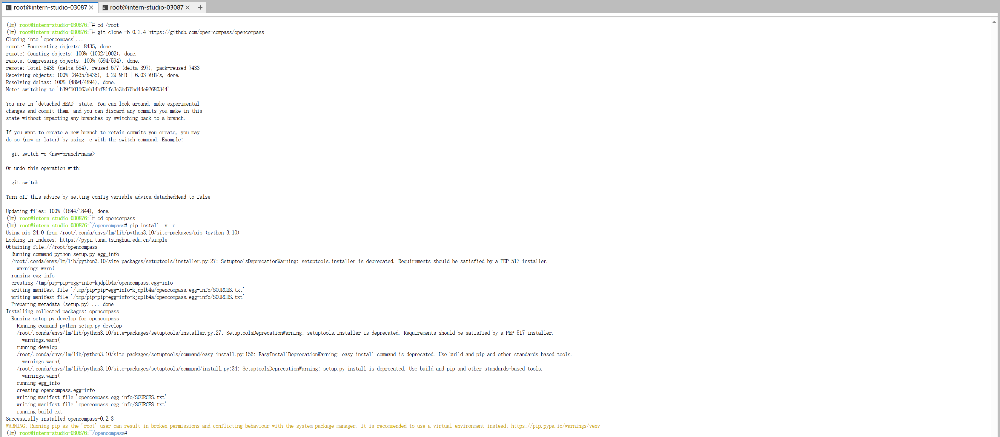

# 基础作业

## 使用 OpenCompass 评测 internlm2-chat-1_8b 模型在 C-Eval 数据集上的性能

### 概览


在 OpenCompass 中评估一个模型通常包括以下几个阶段：配置 -> 推理 -> 评估 -> 可视化。

- 配置：这是整个工作流的起点。您需要配置整个评估过程，选择要评估的模型和数据集。此外，还可以选择评估策略、计算后端等，并定义显示结果的方式。
- 推理与评估：在这个阶段，OpenCompass 将会开始对模型和数据集进行并行推理和评估。推理阶段主要是让模型从数据集产生输出，而评估阶段则是衡量这些输出与标准答案的匹配程度。这两个过程会被拆分为多个同时运行的“任务”以提高效率，但请注意，如果计算资源有限，这种策略可能会使评测变得更慢。如果需要了解该问题及解决方案，可以参考 FAQ: 效率。
- 可视化：评估完成后，OpenCompass 将结果整理成易读的表格，并将其保存为 CSV 和 TXT 文件。你也可以激活飞书状态上报功能，此后可以在飞书客户端中及时获得评测状态报告。 接下来，我们将展示 OpenCompass 的基础用法，展示书生浦语在 `C-Eval` 基准任务上的评估。它们的配置文件可以在 `configs/eval_demo.py` 中找到。

### 安装

```sh
cd /root

git clone -b 0.2.4 https://github.com/open-compass/opencompass
cd opencompass
pip install -v -e .

# 补充安装
pip install -r requirements.txt
pip install protobuf
```



### 数据准备

解压评测数据集到 data/ 处

```sh
cd /root/opencompass
cp /share/temp/datasets/OpenCompassData-core-20231110.zip /root/opencompass/
unzip OpenCompassData-core-20231110.zip
rm OpenCompassData-core-20231110.zip
```


### 查看支持的数据集和模型

列出所有跟 internlm 及 ceval 相关的配置

```sh
cd /root/opencompass
python tools/list_configs.py internlm ceval
```

运行命令

```sh
(lm) root@intern-studio-030876:~/opencompass# python tools/list_configs.py internlm ceval
+----------------------------------------+----------------------------------------------------------------------+
| Model                                  | Config Path                                                          |
|----------------------------------------+----------------------------------------------------------------------|
| hf_internlm2_1_8b                      | configs/models/hf_internlm/hf_internlm2_1_8b.py                      |
| hf_internlm2_20b                       | configs/models/hf_internlm/hf_internlm2_20b.py                       |
| hf_internlm2_7b                        | configs/models/hf_internlm/hf_internlm2_7b.py                        |
| hf_internlm2_base_20b                  | configs/models/hf_internlm/hf_internlm2_base_20b.py                  |
| hf_internlm2_base_7b                   | configs/models/hf_internlm/hf_internlm2_base_7b.py                   |
| hf_internlm2_chat_1_8b                 | configs/models/hf_internlm/hf_internlm2_chat_1_8b.py                 |
| hf_internlm2_chat_1_8b_sft             | configs/models/hf_internlm/hf_internlm2_chat_1_8b_sft.py             |
| hf_internlm2_chat_20b                  | configs/models/hf_internlm/hf_internlm2_chat_20b.py                  |
| hf_internlm2_chat_20b_sft              | configs/models/hf_internlm/hf_internlm2_chat_20b_sft.py              |
| hf_internlm2_chat_20b_with_system      | configs/models/hf_internlm/hf_internlm2_chat_20b_with_system.py      |
| hf_internlm2_chat_7b                   | configs/models/hf_internlm/hf_internlm2_chat_7b.py                   |
| hf_internlm2_chat_7b_sft               | configs/models/hf_internlm/hf_internlm2_chat_7b_sft.py               |
| hf_internlm2_chat_7b_with_system       | configs/models/hf_internlm/hf_internlm2_chat_7b_with_system.py       |
| hf_internlm2_chat_math_20b             | configs/models/hf_internlm/hf_internlm2_chat_math_20b.py             |
| hf_internlm2_chat_math_20b_with_system | configs/models/hf_internlm/hf_internlm2_chat_math_20b_with_system.py |
| hf_internlm2_chat_math_7b              | configs/models/hf_internlm/hf_internlm2_chat_math_7b.py              |
| hf_internlm2_chat_math_7b_with_system  | configs/models/hf_internlm/hf_internlm2_chat_math_7b_with_system.py  |
| hf_internlm_20b                        | configs/models/hf_internlm/hf_internlm_20b.py                        |
| hf_internlm_7b                         | configs/models/hf_internlm/hf_internlm_7b.py                         |
| hf_internlm_chat_20b                   | configs/models/hf_internlm/hf_internlm_chat_20b.py                   |
| hf_internlm_chat_7b                    | configs/models/hf_internlm/hf_internlm_chat_7b.py                    |
| hf_internlm_chat_7b_8k                 | configs/models/hf_internlm/hf_internlm_chat_7b_8k.py                 |
| hf_internlm_chat_7b_v1_1               | configs/models/hf_internlm/hf_internlm_chat_7b_v1_1.py               |
| internlm_7b                            | configs/models/internlm/internlm_7b.py                               |
| lmdeploy_internlm2_chat_20b            | configs/models/hf_internlm/lmdeploy_internlm2_chat_20b.py            |
| lmdeploy_internlm2_chat_7b             | configs/models/hf_internlm/lmdeploy_internlm2_chat_7b.py             |
| ms_internlm_chat_7b_8k                 | configs/models/ms_internlm/ms_internlm_chat_7b_8k.py                 |
+----------------------------------------+----------------------------------------------------------------------+
+--------------------------------+------------------------------------------------------------------+
| Dataset                        | Config Path                                                      |
|--------------------------------+------------------------------------------------------------------|
| ceval_clean_ppl                | configs/datasets/ceval/ceval_clean_ppl.py                        |
| ceval_contamination_ppl_810ec6 | configs/datasets/contamination/ceval_contamination_ppl_810ec6.py |
| ceval_gen                      | configs/datasets/ceval/ceval_gen.py                              |
| ceval_gen_2daf24               | configs/datasets/ceval/ceval_gen_2daf24.py                       |
| ceval_gen_5f30c7               | configs/datasets/ceval/ceval_gen_5f30c7.py                       |
| ceval_internal_ppl_1cd8bf      | configs/datasets/ceval/ceval_internal_ppl_1cd8bf.py              |
| ceval_ppl                      | configs/datasets/ceval/ceval_ppl.py                              |
| ceval_ppl_1cd8bf               | configs/datasets/ceval/ceval_ppl_1cd8bf.py                       |
| ceval_ppl_578f8d               | configs/datasets/ceval/ceval_ppl_578f8d.py                       |
| ceval_ppl_93e5ce               | configs/datasets/ceval/ceval_ppl_93e5ce.py                       |
| ceval_zero_shot_gen_bd40ef     | configs/datasets/ceval/ceval_zero_shot_gen_bd40ef.py             |
+--------------------------------+------------------------------------------------------------------+
```


### 启动评测 

确保按照上述步骤正确安装 OpenCompass 并准备好数据集后，可以通过以下命令评测 InternLM2-Chat-1.8B 模型在 C-Eval 数据集上的性能。由于 OpenCompass 默认并行启动评估过程，我们可以在第一次运行时以 --debug 模式启动评估，并检查是否存在问题。在 --debug 模式下，任务将按顺序执行，并实时打印输出。

```sh
cd /root/opencompass

export MKL_SERVICE_FORCE_INTEL=1
#或
export MKL_THREADING_LAYER=GNU

python run.py \
--datasets ceval_gen \
--hf-path /share/new_models/Shanghai_AI_Laboratory/internlm2-chat-1_8b \  # HuggingFace 模型路径
--tokenizer-path /share/new_models/Shanghai_AI_Laboratory/internlm2-chat-1_8b \  # HuggingFace tokenizer 路径（如果与模型路径相同，可以省略）
--tokenizer-kwargs padding_side='left' truncation='left' trust_remote_code=True \  # 构建 tokenizer 的参数
--model-kwargs device_map='auto' trust_remote_code=True \  # 构建模型的参数
--max-seq-len 1024 \  # 模型可以接受的最大序列长度
--max-out-len 16 \  # 生成的最大 token 数
--batch-size 2  \  # 批量大小
--num-gpus 1  \  # 运行模型所需的 GPU 数量
--debug

```

运行命令

```sh
(opencompass) root@intern-studio-030876:~/opencompass# cd /root/opencompass
(opencompass) root@intern-studio-030876:~/opencompass# export MKL_SERVICE_FORCE_INTEL=1
(opencompass) root@intern-studio-030876:~/opencompass# python run.py \
> --datasets ceval_gen \
> --hf-path /share/new_models/Shanghai_AI_Laboratory/internlm2-chat-1_8b \
> --tokenizer-path /share/new_models/Shanghai_AI_Laboratory/internlm2-chat-1_8b \
> --tokenizer-kwargs padding_side='left' truncation='left' trust_remote_code=True \
> --model-kwargs device_map='auto' trust_remote_code=True \
> --max-seq-len 1024 \
> --max-out-len 16 \
> --batch-size 2  \
> --num-gpus 1
04/19 19:22:32 - OpenCompass - INFO - Loading ceval_gen: configs/datasets/ceval/ceval_gen.py
04/19 19:22:32 - OpenCompass - INFO - Loading example: configs/summarizers/example.py
04/19 19:22:32 - OpenCompass - WARNING - SlurmRunner is not used, so the partition argument is ignored.
04/19 19:22:32 - OpenCompass - INFO - Partitioned into 1 tasks.
launch OpenICLInfer[opencompass.models.huggingface.HuggingFace_Shanghai_AI_Laboratory_internlm2-chat-1_8b/ceval-college_economics,opencompass.models.huggingface.HuggingFace_Shanghai_AI_Laboratory_internlm2-chat-1_8b/ceval-accountant,opencompass.models.huggingface.HuggingFace_Shanghai_AI_Laboratory_internlm2-chat-1_8b/ceval-tax_accountant,opencompass.models.huggingface.HuggingFace_Shanghai_AI_Laboratory_internlm2-chat-1_8b/ceval-physician,opencompass.models.huggingface.HuggingFace_Shanghai_AI_Laboratory_internlm2-chat-1_8b/ceval-civil_servant,opencompass.models.huggingface.HuggingFace_Shanghai_AI_Laboratory_internlm2-chat-1_8b/ceval-urban_and_rural_planner,opencompass.models.huggingface.HuggingFace_Shanghai_AI_Laboratory_internlm2-chat-1_8b/ceval-teacher_qualification,opencompass.models.huggingface.HuggingFace_Shanghai_AI_Laboratory_internlm2-chat-1_8b/ceval-college_programming,opencompass.models.huggingface.HuggingFace_Shanghai_AI_Laboratory_internlm2-chat-1_8b/ceval-electrical_engineer,opencompass.models.huggingface.HuggingFace_Shanghai_AI_Laboratory_internlm2-chat-1_8b/ceval-business_administration,opencompass.models.huggingface.HuggingFace_Shanghai_AI_Laboratory_internlm2-chat-1_8b/ceval-art_studies,opencompass.models.huggingface.HuggingFace_Shanghai_AI_Laboratory_internlm2-chat-1_8b/ceval-fire_engineer,opencompass.models.huggingface.HuggingFace_Shanghai_AI_Laboratory_internlm2-chat-1_8b/ceval-environmental_impact_assessment_engineer,opencompass.models.huggingface.HuggingFace_Shanghai_AI_Laboratory_internlm2-chat-1_8b/ceval-education_science,opencompass.models.huggingface.HuggingFace_Shanghai_AI_Laboratory_internlm2-chat-1_8b/ceval-professional_tour_guide,opencompass.models.huggingface.HuggingFace_Shanghai_AI_Laboratory_internlm2-chat-1_8b/ceval-college_chemistry,opencompass.models.huggingface.HuggingFace_Shanghai_AI_Laboratory_internlm2-chat-1_8b/ceval-metrology_engineer,opencompass.models.huggingface.HuggingFace_Shanghai_AI_Laboratory_internlm2-chat-1_8b/ceval-mao_zedong_thought,opencompass.models.huggingface.HuggingFace_Shanghai_AI_Laboratory_internlm2-chat-1_8b/ceval-law,opencompass.models.huggingface.HuggingFace_Shanghai_AI_Laboratory_internlm2-chat-1_8b/ceval-veterinary_medicine,opencompass.models.huggingface.HuggingFace_Shanghai_AI_Laboratory_internlm2-chat-1_8b/ceval-modern_chinese_history,opencompass.models.huggingface.HuggingFace_Shanghai_AI_Laboratory_internlm2-chat-1_8b/ceval-chinese_language_and_literature,opencompass.models.huggingface.HuggingFace_Shanghai_AI_Laboratory_internlm2-chat-1_8b/ceval-legal_professional,opencompass.models.huggingface.HuggingFace_Shanghai_AI_Laboratory_internlm2-chat-1_8b/ceval-logic,opencompass.models.huggingface.HuggingFace_Shanghai_AI_Laboratory_internlm2-chat-1_8b/ceval-middle_school_history,opencompass.models.huggingface.HuggingFace_Shanghai_AI_Laboratory_internlm2-chat-1_8b/ceval-plant_protection,opencompass.models.huggingface.HuggingFace_Shanghai_AI_Laboratory_internlm2-chat-1_8b/ceval-clinical_medicine,opencompass.models.huggingface.HuggingFace_Shanghai_AI_Laboratory_internlm2-chat-1_8b/ceval-computer_architecture,opencompass.models.huggingface.HuggingFace_Shanghai_AI_Laboratory_internlm2-chat-1_8b/ceval-middle_school_biology,opencompass.models.huggingface.HuggingFace_Shanghai_AI_Laboratory_internlm2-chat-1_8b/ceval-middle_school_politics,opencompass.models.huggingface.HuggingFace_Shanghai_AI_Laboratory_internlm2-chat-1_8b/ceval-middle_school_chemistry,opencompass.models.huggingface.HuggingFace_Shanghai_AI_Laboratory_internlm2-chat-1_8b/ceval-high_school_history,opencompass.models.huggingface.HuggingFace_Shanghai_AI_Laboratory_internlm2-chat-1_8b/ceval-computer_network,opencompass.models.huggingface.HuggingFace_Shanghai_AI_Laboratory_internlm2-chat-1_8b/ceval-operating_system,opencompass.models.huggingface.HuggingFace_Shanghai_AI_Laboratory_internlm2-chat-1_8b/ceval-college_physics,opencompass.models.huggingface.HuggingFace_Shanghai_AI_Laboratory_internlm2-chat-1_8b/ceval-advanced_mathematics,opencompass.models.huggingface.HuggingFace_Shanghai_AI_Laboratory_internlm2-chat-1_8b/ceval-high_school_physics,opencompass.models.huggingface.HuggingFace_Shanghai_AI_Laboratory_internlm2-chat-1_8b/ceval-high_school_chemistry,opencompass.models.huggingface.HuggingFace_Shanghai_AI_Laboratory_internlm2-chat-1_8b/ceval-high_school_biology,opencompass.models.huggingface.HuggingFace_Shanghai_AI_Laboratory_internlm2-chat-1_8b/ceval-middle_school_mathematics,opencompass.models.huggingface.HuggingFace_Shanghai_AI_Laboratory_internlm2-chat-1_8b/ceval-middle_school_physics,opencompass.models.huggingface.HuggingFace_Shanghai_AI_Laboratory_internlm2-chat-1_8b/ceval-marxism,opencompass.models.huggingface.HuggingFace_Shanghai_AI_Laboratory_internlm2-chat-1_8b/ceval-high_school_politics,opencompass.models.huggingface.HuggingFace_Shanghai_AI_Laboratory_internlm2-chat-1_8b/ceval-high_school_geography,opencompass.models.huggingface.HuggingFace_Shanghai_AI_Laboratory_internlm2-chat-1_8b/ceval-ideological_and_moral_cultivation,opencompass.models.huggingface.HuggingFace_Shanghai_AI_Laboratory_internlm2-chat-1_8b/ceval-high_school_chinese,opencompass.models.huggingface.HuggingFace_Shanghai_AI_Laboratory_internlm2-chat-1_8b/ceval-sports_science,opencompass.models.huggingface.HuggingFace_Shanghai_AI_Laboratory_internlm2-chat-1_8b/ceval-basic_medicine,opencompass.models.huggingface.HuggingFace_Shanghai_AI_Laboratory_internlm2-chat-1_8b/ceval-probability_and_statistics,opencompass.models.huggingface.HuggingFace_Shanghai_AI_Laboratory_internlm2-chat-1_8b/ceval-high_school_mathematics,opencompass.models.huggingface.HuggingFace_Shanghai_AI_Laboratory_internlm2-chat-1_8b/ceval-discrete_mathematics,opencompass.models.huggingface.HuggingFace_Shanghai_AI_Laboratory_internlm2-chat-1_8b/ceval-middle_school_geography] on GPU 0
100%|███████████████████████████████████████████████████████████| 1/1 [14:00<00:00, 840.07s/it]
04/19 19:36:33 - OpenCompass - INFO - Partitioned into 52 tasks.
launch OpenICLEval[opencompass.models.huggingface.HuggingFace_Shanghai_AI_Laboratory_internlm2-chat-1_8b/ceval-computer_network] on CPU 
launch OpenICLEval[opencompass.models.huggingface.HuggingFace_Shanghai_AI_Laboratory_internlm2-chat-1_8b/ceval-operating_system] on CPU 
launch OpenICLEval[opencompass.models.huggingface.HuggingFace_Shanghai_AI_Laboratory_internlm2-chat-1_8b/ceval-computer_architecture] on CPU 
launch OpenICLEval[opencompass.models.huggingface.HuggingFace_Shanghai_AI_Laboratory_internlm2-chat-1_8b/ceval-college_programming] on CPU 
launch OpenICLEval[opencompass.models.huggingface.HuggingFace_Shanghai_AI_Laboratory_internlm2-chat-1_8b/ceval-college_physics] on CPU 
launch OpenICLEval[opencompass.models.huggingface.HuggingFace_Shanghai_AI_Laboratory_internlm2-chat-1_8b/ceval-college_chemistry] on CPU 
launch OpenICLEval[opencompass.models.huggingface.HuggingFace_Shanghai_AI_Laboratory_internlm2-chat-1_8b/ceval-advanced_mathematics] on CPU 
launch OpenICLEval[opencompass.models.huggingface.HuggingFace_Shanghai_AI_Laboratory_internlm2-chat-1_8b/ceval-probability_and_statistics] on CPU 
launch OpenICLEval[opencompass.models.huggingface.HuggingFace_Shanghai_AI_Laboratory_internlm2-chat-1_8b/ceval-discrete_mathematics] on CPU 
launch OpenICLEval[opencompass.models.huggingface.HuggingFace_Shanghai_AI_Laboratory_internlm2-chat-1_8b/ceval-electrical_engineer] on CPU 
launch OpenICLEval[opencompass.models.huggingface.HuggingFace_Shanghai_AI_Laboratory_internlm2-chat-1_8b/ceval-metrology_engineer] on CPU 
launch OpenICLEval[opencompass.models.huggingface.HuggingFace_Shanghai_AI_Laboratory_internlm2-chat-1_8b/ceval-high_school_mathematics] on CPU 
launch OpenICLEval[opencompass.models.huggingface.HuggingFace_Shanghai_AI_Laboratory_internlm2-chat-1_8b/ceval-high_school_physics] on CPU 
launch OpenICLEval[opencompass.models.huggingface.HuggingFace_Shanghai_AI_Laboratory_internlm2-chat-1_8b/ceval-high_school_chemistry] on CPU 
launch OpenICLEval[opencompass.models.huggingface.HuggingFace_Shanghai_AI_Laboratory_internlm2-chat-1_8b/ceval-middle_school_biology] on CPU 
launch OpenICLEval[opencompass.models.huggingface.HuggingFace_Shanghai_AI_Laboratory_internlm2-chat-1_8b/ceval-high_school_biology] on CPU 
launch OpenICLEval[opencompass.models.huggingface.HuggingFace_Shanghai_AI_Laboratory_internlm2-chat-1_8b/ceval-middle_school_mathematics] on CPU 
launch OpenICLEval[opencompass.models.huggingface.HuggingFace_Shanghai_AI_Laboratory_internlm2-chat-1_8b/ceval-middle_school_physics] on CPU 
launch OpenICLEval[opencompass.models.huggingface.HuggingFace_Shanghai_AI_Laboratory_internlm2-chat-1_8b/ceval-middle_school_chemistry] on CPU 
launch OpenICLEval[opencompass.models.huggingface.HuggingFace_Shanghai_AI_Laboratory_internlm2-chat-1_8b/ceval-veterinary_medicine] on CPU 
launch OpenICLEval[opencompass.models.huggingface.HuggingFace_Shanghai_AI_Laboratory_internlm2-chat-1_8b/ceval-college_economics] on CPU 
launch OpenICLEval[opencompass.models.huggingface.HuggingFace_Shanghai_AI_Laboratory_internlm2-chat-1_8b/ceval-business_administration] on CPU 
launch OpenICLEval[opencompass.models.huggingface.HuggingFace_Shanghai_AI_Laboratory_internlm2-chat-1_8b/ceval-marxism] on CPU    
launch OpenICLEval[opencompass.models.huggingface.HuggingFace_Shanghai_AI_Laboratory_internlm2-chat-1_8b/ceval-education_science] on CPU 
launch OpenICLEval[opencompass.models.huggingface.HuggingFace_Shanghai_AI_Laboratory_internlm2-chat-1_8b/ceval-mao_zedong_thought] on CPU 
launch OpenICLEval[opencompass.models.huggingface.HuggingFace_Shanghai_AI_Laboratory_internlm2-chat-1_8b/ceval-teacher_qualification] on CPU 
launch OpenICLEval[opencompass.models.huggingface.HuggingFace_Shanghai_AI_Laboratory_internlm2-chat-1_8b/ceval-high_school_politics] on CPU 
launch OpenICLEval[opencompass.models.huggingface.HuggingFace_Shanghai_AI_Laboratory_internlm2-chat-1_8b/ceval-high_school_geography] on CPU 
launch OpenICLEval[opencompass.models.huggingface.HuggingFace_Shanghai_AI_Laboratory_internlm2-chat-1_8b/ceval-middle_school_politics] on CPU 
launch OpenICLEval[opencompass.models.huggingface.HuggingFace_Shanghai_AI_Laboratory_internlm2-chat-1_8b/ceval-middle_school_geography] on CPU 
launch OpenICLEval[opencompass.models.huggingface.HuggingFace_Shanghai_AI_Laboratory_internlm2-chat-1_8b/ceval-modern_chinese_history] on CPU 
launch OpenICLEval[opencompass.models.huggingface.HuggingFace_Shanghai_AI_Laboratory_internlm2-chat-1_8b/ceval-ideological_and_moral_cultivation] on CPU 
launch OpenICLEval[opencompass.models.huggingface.HuggingFace_Shanghai_AI_Laboratory_internlm2-chat-1_8b/ceval-logic] on CPU      
launch OpenICLEval[opencompass.models.huggingface.HuggingFace_Shanghai_AI_Laboratory_internlm2-chat-1_8b/ceval-law] on CPU        
launch OpenICLEval[opencompass.models.huggingface.HuggingFace_Shanghai_AI_Laboratory_internlm2-chat-1_8b/ceval-professional_tour_guide] on CPU 
launch OpenICLEval[opencompass.models.huggingface.HuggingFace_Shanghai_AI_Laboratory_internlm2-chat-1_8b/ceval-chinese_language_and_literature] on CPU 
launch OpenICLEval[opencompass.models.huggingface.HuggingFace_Shanghai_AI_Laboratory_internlm2-chat-1_8b/ceval-art_studies] on CPU 
launch OpenICLEval[opencompass.models.huggingface.HuggingFace_Shanghai_AI_Laboratory_internlm2-chat-1_8b/ceval-legal_professional] on CPU 
launch OpenICLEval[opencompass.models.huggingface.HuggingFace_Shanghai_AI_Laboratory_internlm2-chat-1_8b/ceval-high_school_chinese] on CPU 
launch OpenICLEval[opencompass.models.huggingface.HuggingFace_Shanghai_AI_Laboratory_internlm2-chat-1_8b/ceval-high_school_history] on CPU 
launch OpenICLEval[opencompass.models.huggingface.HuggingFace_Shanghai_AI_Laboratory_internlm2-chat-1_8b/ceval-middle_school_history] on CPU 
launch OpenICLEval[opencompass.models.huggingface.HuggingFace_Shanghai_AI_Laboratory_internlm2-chat-1_8b/ceval-civil_servant] on CPU 
launch OpenICLEval[opencompass.models.huggingface.HuggingFace_Shanghai_AI_Laboratory_internlm2-chat-1_8b/ceval-sports_science] on CPU 
launch OpenICLEval[opencompass.models.huggingface.HuggingFace_Shanghai_AI_Laboratory_internlm2-chat-1_8b/ceval-plant_protection] on CPU 
launch OpenICLEval[opencompass.models.huggingface.HuggingFace_Shanghai_AI_Laboratory_internlm2-chat-1_8b/ceval-basic_medicine] on CPU 
launch OpenICLEval[opencompass.models.huggingface.HuggingFace_Shanghai_AI_Laboratory_internlm2-chat-1_8b/ceval-clinical_medicine] on CPU 
launch OpenICLEval[opencompass.models.huggingface.HuggingFace_Shanghai_AI_Laboratory_internlm2-chat-1_8b/ceval-urban_and_rural_planner] on CPU 
launch OpenICLEval[opencompass.models.huggingface.HuggingFace_Shanghai_AI_Laboratory_internlm2-chat-1_8b/ceval-accountant] on CPU 
launch OpenICLEval[opencompass.models.huggingface.HuggingFace_Shanghai_AI_Laboratory_internlm2-chat-1_8b/ceval-fire_engineer] on CPU 
launch OpenICLEval[opencompass.models.huggingface.HuggingFace_Shanghai_AI_Laboratory_internlm2-chat-1_8b/ceval-environmental_impact_assessment_engineer] on CPU 
launch OpenICLEval[opencompass.models.huggingface.HuggingFace_Shanghai_AI_Laboratory_internlm2-chat-1_8b/ceval-tax_accountant] on CPU 
launch OpenICLEval[opencompass.models.huggingface.HuggingFace_Shanghai_AI_Laboratory_internlm2-chat-1_8b/ceval-physician] on CPU  
100%|█████████████████████████████████████████████████████████████████████████████████████████████| 52/52 [07:34<00:00,  8.74s/it]
dataset                                         version    metric         mode      opencompass.models.huggingface.HuggingFace_Shanghai_AI_Laboratory_internlm2-chat-1_8b
----------------------------------------------  ---------  -------------  ------  ---------------------------------------------------------------------------------------
ceval-computer_network                          db9ce2     accuracy       gen                                                                                       47.37
ceval-operating_system                          1c2571     accuracy       gen                                                                                       47.37
ceval-computer_architecture                     a74dad     accuracy       gen                                                                                       23.81
ceval-college_programming                       4ca32a     accuracy       gen                                                                                       13.51
ceval-college_physics                           963fa8     accuracy       gen                                                                                       42.11
ceval-college_chemistry                         e78857     accuracy       gen                                                                                       33.33
ceval-advanced_mathematics                      ce03e2     accuracy       gen                                                                                       10.53
ceval-probability_and_statistics                65e812     accuracy       gen                                                                                       38.89
ceval-discrete_mathematics                      e894ae     accuracy       gen                                                                                       25
ceval-electrical_engineer                       ae42b9     accuracy       gen                                                                                       27.03
ceval-metrology_engineer                        ee34ea     accuracy       gen                                                                                       54.17
ceval-high_school_mathematics                   1dc5bf     accuracy       gen                                                                                       16.67
ceval-high_school_physics                       adf25f     accuracy       gen                                                                                       42.11
ceval-high_school_chemistry                     2ed27f     accuracy       gen                                                                                       47.37
ceval-high_school_biology                       8e2b9a     accuracy       gen                                                                                       26.32
ceval-middle_school_mathematics                 bee8d5     accuracy       gen                                                                                       36.84
ceval-middle_school_biology                     86817c     accuracy       gen                                                                                       80.95
ceval-middle_school_physics                     8accf6     accuracy       gen                                                                                       47.37
ceval-middle_school_chemistry                   167a15     accuracy       gen                                                                                       80
ceval-veterinary_medicine                       b4e08d     accuracy       gen                                                                                       43.48
ceval-college_economics                         f3f4e6     accuracy       gen                                                                                       32.73
ceval-business_administration                   c1614e     accuracy       gen                                                                                       36.36
ceval-marxism                                   cf874c     accuracy       gen                                                                                       68.42
ceval-mao_zedong_thought                        51c7a4     accuracy       gen                                                                                       70.83
ceval-education_science                         591fee     accuracy       gen                                                                                       55.17
ceval-teacher_qualification                     4e4ced     accuracy       gen                                                                                       59.09
ceval-high_school_politics                      5c0de2     accuracy       gen                                                                                       57.89
ceval-high_school_geography                     865461     accuracy       gen                                                                                       47.37
ceval-middle_school_politics                    5be3e7     accuracy       gen                                                                                       71.43
ceval-middle_school_geography                   8a63be     accuracy       gen                                                                                       75
ceval-modern_chinese_history                    fc01af     accuracy       gen                                                                                       52.17
ceval-ideological_and_moral_cultivation         a2aa4a     accuracy       gen                                                                                       73.68
ceval-logic                                     f5b022     accuracy       gen                                                                                       27.27
ceval-law                                       a110a1     accuracy       gen                                                                                       29.17
ceval-chinese_language_and_literature           0f8b68     accuracy       gen                                                                                       47.83
ceval-art_studies                               2a1300     accuracy       gen                                                                                       42.42
ceval-professional_tour_guide                   4e673e     accuracy       gen                                                                                       51.72
ceval-legal_professional                        ce8787     accuracy       gen                                                                                       34.78
ceval-high_school_chinese                       315705     accuracy       gen                                                                                       42.11
ceval-high_school_history                       7eb30a     accuracy       gen                                                                                       65
ceval-middle_school_history                     48ab4a     accuracy       gen                                                                                       86.36
ceval-civil_servant                             87d061     accuracy       gen                                                                                       42.55
ceval-sports_science                            70f27b     accuracy       gen                                                                                       52.63
ceval-plant_protection                          8941f9     accuracy       gen                                                                                       40.91
ceval-basic_medicine                            c409d6     accuracy       gen                                                                                       68.42
ceval-clinical_medicine                         49e82d     accuracy       gen                                                                                       31.82
ceval-urban_and_rural_planner                   95b885     accuracy       gen                                                                                       47.83
ceval-accountant                                002837     accuracy       gen                                                                                       36.73
ceval-fire_engineer                             bc23f5     accuracy       gen                                                                                       38.71
ceval-environmental_impact_assessment_engineer  c64e2d     accuracy       gen                                                                                       51.61
ceval-tax_accountant                            3a5e3c     accuracy       gen                                                                                       36.73
ceval-physician                                 6e277d     accuracy       gen                                                                                       42.86
ceval-stem                                      -          naive_average  gen                                                                                       39.21
ceval-social-science                            -          naive_average  gen                                                                                       57.43
ceval-humanities                                -          naive_average  gen                                                                                       50.23
ceval-other                                     -          naive_average  gen                                                                                       44.62
ceval-hard                                      -          naive_average  gen                                                                                       32
ceval                                           -          naive_average  gen                                                                                       46.19
04/19 19:44:07 - OpenCompass - INFO - write summary to /root/opencompass/outputs/default/20240419_192232/summary/summary_20240419_192232.txt
04/19 19:44:07 - OpenCompass - INFO - write csv to /root/opencompass/outputs/default/20240419_192232/summary/summary_20240419_192232.csv
```


# 进阶作业


## 将自定义数据集提交至OpenCompass官网

### 使用kimi生成小学数学选择题

每次让它生成20道，重复5次生成100道题


让它将答案转换为格式

`"2 + 3 = (),A.4,B.5,C.6,D.7,B"` 转换为 `2 + 3 = (),4,5,6,7,B`


复制它的脚本和数据，检查数据错误，之后运行脚本，生成csv文件

```python
import csv

# 原始CSV数据
original_data = [
    "2 + 3 = (),A.4,B.5,C.6,D.7,B",
    "4 - 1 = (),A.2,B.3,C.5,D.1,B",
    "6 * 2 = (),A.12,B.10,C.8,D.6,A",
    "8 ÷ 2 = (),A.4,B.3,C.5,D.6,A",
    "5 + 5 = (),A.8,B.10,C.9,D.7,B",
    "9 - 3 = (),A.6,B.12,C.9,D.3,A",
    "7 * 3 = (),A.21,B.14,C.22,D.23,A",
    "12 ÷ 3 = (),A.4,B.6,C.3,D.5,A",
    "3 + 7 = (),A.10,B.8,C.9,D.11,A",
    "5 - 2 = (),A.3,B.7,C.6,D.2,A",
    "4 * 4 = (),A.16,B.12,C.14,D.10,A",
    "20 ÷ 5 = (),A.4,B.3,C.5,D.2,A",
    "8 + 4 = (),A.12,B.10,C.9,D.7,A",
    "6 - 3 = (),A.3,B.9,C.6,D.2,A",
    "5 * 5 = (),A.25,B.20,C.15,D.30,A",
    "15 ÷ 3 = (),A.5,B.10,C.3,D.7,A",
    "9 + 2 = (),A.11,B.7,C.6,D.12,A",
    "7 - 4 = (),A.3,B.8,C.5,D.2,A",
    "3 * 6 = (),A.18,B.12,C.24,D.9,A",
    "24 ÷ 6 = (),A.4,B.3,C.8,D.12,A",
    "1 + 8 = (),A.9,B.7,C.6,D.10,A",
    "10 - 5 = (),A.5,B.8,C.3,D.7,A",
    "11 + 7 = (),A.18,B.16,C.19,D.17,A",
    "13 - 9 = (),A.4,B.5,C.3,D.6,A",
    "2 * 9 = (),A.18,B.12,C.17,D.11,A",
    "18 ÷ 3 = (),A.6,B.5,C.7,D.8,A",
    "14 + 1 = (),A.15,B.13,C.14,D.12,A",
    "8 - 5 = (),A.3,B.4,C.2,D.6,A",
    "7 * 4 = (),A.28,B.21,C.30,D.24,A",
    "25 ÷ 5 = (),A.5,B.4,C.3,D.6,A",
    "5 + 6 = (),A.11,B.9,C.10,D.8,C",
    "3 - 1 = (),A.2,B.4,C.1,D.3,A",
    "6 * 3 = (),A.18,B.15,C.12,D.9,A",
    "30 ÷ 6 = (),A.5,B.4,C.10,D.8,A",
    "15 + 10 = (),A.25,B.20,C.24,D.22,A",
    "12 - 7 = (),A.5,B.8,C.7,D.4,A",
    "4 * 5 = (),A.20,B.15,C.25,D.12,A",
    "36 ÷ 9 = (),A.4,B.3,C.6,D.5,A",
    "11 + 8 = (),A.19,B.17,C.18,D.20,A",
    "9 - 6 = (),A.3,B.5,C.2,D.4,A",
    "8 * 2 = (),A.16,B.14,C.12,D.10,A",
    "27 ÷ 9 = (),A.3,B.2,C.4,D.5,A",
    "16 + 3 = (),A.19,B.18,C.17,D.15,A",
    "10 - 4 = (),A.6,B.8,C.5,D.7,A",
    "5 * 8 = (),A.40,B.35,C.30,D.25,A",
    "1 + 9 = (),A.10,B.8,C.9,D.7,A",
    "14 - 6 = (),A.8,B.7,C.6,D.5,A",
    "3 * 7 = (),A.21,B.14,C.22,D.23,A",
    "21 ÷ 3 = (),A.7,B.6,C.5,D.8,A",
    "17 + 2 = (),A.19,B.18,C.20,D.17,A",
    "5 - 3 = (),A.2,B.5,C.1,D.3,A",
    "4 * 6 = (),A.24,B.18,C.20,D.22,A",
    "28 ÷ 7 = (),A.4,B.3,C.5,D.6,A",
    "20 + 0 = (),A.20,B.19,C.21,D.18,A",
    "7 - 1 = (),A.6,B.8,C.5,D.7,A",
    "5 * 3 = (),A.15,B.10,C.12,D.14,A",
    "35 ÷ 5 = (),A.7,B.6,C.5,D.8,A",
    "19 + 1 = (),A.20,B.18,C.19,D.17,A",
    "13 - 8 = (),A.5,B.7,C.4,D.6,A",
    "2 * 8 = (),A.16,B.12,C.14,D.10,A",
    "36 ÷ 6 = (),A.6,B.5,C.7,D.8,A",
    "22 + 8 = (),A.30,B.28,C.29,D.27,A",
    "10 - 7 = (),A.3,B.6,C.2,D.5,A",
    "9 * 4 = (),A.36,B.32,C.38,D.34,A",
    "42 ÷ 7 = (),A.6,B.5,C.7,D.8,A",
    "1 + 2 = (),A.2,B.3,C.4,D.5,B",
    "3 - 2 = (),A.1,B.0,C.2,D.3,A",
    "2 * 5 = (),A.10,B.8,C.6,D.5,A",
    "10 ÷ 5 = (),A.2,B.1,C.3,D.4,A",
    "4 + 6 = (),A.10,B.8,C.9,D.7,A",
    "7 - 4 = (),A.3,B.2,C.1,D.5,A",
    "3 * 4 = (),A.12,B.9,C.7,D.6,A",
    "12 ÷ 4 = (),A.3,B.2,C.4,D.5,A",
    "5 + 3 = (),A.8,B.6,C.7,D.9,A",
    "6 - 1 = (),A.5,B.7,C.4,D.3,A",
    "4 * 3 = (),A.12,B.10,C.9,D.8,A",
    "20 ÷ 4 = (),A.5,B.4,C.3,D.6,A",
    "8 + 7 = (),A.15,B.13,C.12,D.11,A",
    "9 - 5 = (),A.4,B.3,C.2,D.5,A",
    "2 * 6 = (),A.12,B.10,C.8,D.7,A",
    "18 ÷ 3 = (),A.6,B.5,C.7,D.8,A",
    "11 + 4 = (),A.15,B.13,C.14,D.12,A",
    "5 - 3 = (),A.2,B.3,C.1,D.4,A",
    "3 * 5 = (),A.15,B.12,C.10,D.14,A",
    "25 ÷ 5 = (),A.5,B.4,C.3,D.6,A",
    "9 + 1 = (),A.10,B.9,C.8,D.7,A",
    "5 - 1 = (),A.4,B.5,C.3,D.6,A",
    "3 * 8 = (),A.24,B.26,C.25,D.23,A",
    "27 ÷ 9 = (),A.3,B.2,C.4,D.5,A",
    "13 + 12 = (),A.25,B.24,C.23,D.22,A",
    "11 - 7 = (),A.4,B.3,C.5,D.6,A",
    "7 * 2 = (),A.14,B.13,C.12,D.11,A",
    "16 ÷ 4 = (),A.4,B.3,C.5,D.6,A",
    "15 + 5 = (),A.20,B.19,C.18,D.17,A",
    "8 - 2 = (),A.6,B.8,C.5,D.7,A",
    "6 * 4 = (),A.24,B.22,C.20,D.21,A",
    "40 ÷ 8 = (),A.5,B.4,C.3,D.6,A",
    "14 + 3 = (),A.17,B.16,C.15,D.14,A",
    "10 - 6 = (),A.4,B.5,C.3,D.2,A",
    "5 * 9 = (),A.45,B.40,C.42,D.43,A",
    "33 ÷ 11 = (),A.3,B.2,C.4,D.5,A",
    "21 + 4 = (),A.25,B.24,C.23,D.22,A",
    "6 - 3 = (),A.3,B.4,C.2,D.5,A",
    "4 * 7 = (),A.28,B.27,C.26,D.25,A",
    "56 ÷ 7 = (),A.8,B.7,C.6,D.5,A",
]

# 转换函数
def transform_line(line):
    parts = line.split(',')
    question = parts[0]  # 获取问题部分
    choices = parts[1:-1]  # 获取选项部分
    correct_answer = parts[-1]  # 获取正确答案部分
    # 移除选项前的字母，并组合问题和选项
    choices = [choice.split('.')[1] for choice in choices]  # 提取数字部分
    return question, choices[0], choices[1], choices[2], choices[3], correct_answer

# 转换所有行
transformed_data = [transform_line(line) for line in original_data]

# 写入CSV文件
with open('primary_math.csv', 'w', newline='') as file:
    writer = csv.writer(file)
    writer.writerow(['Question', 'A', 'B', 'C', 'D', 'Answer'])  # 写入表头
    for data in transformed_data:
        writer.writerow(data)

print("CSV file has been created.")生成的csv所示
```

### 创建测试文件

创建 `/root/opencompass/data/primary_math` 目录，在文件夹内建立脚本，运行上面的文件。

创建三个文件夹 `test val dev` ，将这个csv文件复制三份放到这三个文件夹中 分别命名为`primary_math_test.csv primary_math_val.csv primary_math_dev.csv` 大概命名为你的数据集名字+_+三个文件夹名


模仿`/root/opencompass/opencompass/datasets/ceval.py`文件 

在 `/root/opencompass/opencompass/datasets/` 创建一个文件 名为`primary_math.py`, 创建一个类如下图所示 由于ceval 数据的格式和我们创建的数据基本相同，所以`load`方法可以直接用它的

```python
import csv
import json
import os.path as osp

from datasets import Dataset, DatasetDict

from opencompass.registry import LOAD_DATASET

from .base import BaseDataset


@LOAD_DATASET.register_module()
class PrimaryMathDataset(BaseDataset):

    @staticmethod
    def load(path: str, name: str):
        dataset = {}
        for split in ['dev', 'val', 'test']:
            filename = osp.join(path, split, f'{name}_{split}.csv')
            with open(filename, encoding='utf-8') as f:
                reader = csv.reader(f)
                header = next(reader)
                for row in reader:
                    item = dict(zip(header, row))
                    item.setdefault('explanation', '')
                    item.setdefault('answer', '')
                    dataset.setdefault(split, []).append(item)
        dataset = {i: Dataset.from_list(dataset[i]) for i in dataset}
        return DatasetDict(dataset)


class PrimaryMathDatasetClean(BaseDataset):

    # load the contamination annotations of CEval from
    # https://github.com/liyucheng09/Contamination_Detector
    @staticmethod
    def load_contamination_annotations(path, split='val'):
        import requests

        assert split == 'val', 'Now we only have annotations for val set'
        annotation_cache_path = osp.join(
            path, split, 'ceval_contamination_annotations.json')
        if osp.exists(annotation_cache_path):
            with open(annotation_cache_path, 'r') as f:
                annotations = json.load(f)
            return annotations
        link_of_annotations = 'https://github.com/liyucheng09/Contamination_Detector/releases/download/v0.1.1rc/ceval_annotations.json'  # noqa
        annotations = json.loads(requests.get(link_of_annotations).text)
        with open(annotation_cache_path, 'w') as f:
            json.dump(annotations, f)
        return annotations

    @staticmethod
    def load(path: str, name: str):
        dataset = {}
        for split in ['dev', 'val', 'test']:
            if split == 'val':
                annotations = CEvalDatasetClean.load_contamination_annotations(
                    path, split)
            filename = osp.join(path, split, f'{name}_{split}.csv')
            with open(filename, encoding='utf-8') as f:
                reader = csv.reader(f)
                header = next(reader)
                for row_index, row in enumerate(reader):
                    item = dict(zip(header, row))
                    item.setdefault('explanation', '')
                    item.setdefault('answer', '')
                    if split == 'val':
                        row_id = f'{name}-{row_index}'
                        if row_id in annotations:
                            item['is_clean'] = annotations[row_id][0]
                        else:
                            item['is_clean'] = 'not labeled'
                    dataset.setdefault(split, []).append(item)
        dataset = {i: Dataset.from_list(dataset[i]) for i in dataset}
        return DatasetDict(dataset)
```

### 创建配置文件

我们修改 `/root/opencompass/opencompass/datasets/__init__.py` 添加如下


在`/root/opencompass/configs/datasets` 下创建我们自己的配置文件

模仿 `/root/opencompass/configs/datasets/ceval/ceval_gen_5f30c7.py` 这个文件

在 `/root/opencompass/configs/datasets/`同样创建`primary_math`文件夹，并在该文件夹下创建 `primary_math_gen.py`

修改为如下

```python
from opencompass.openicl.icl_prompt_template import PromptTemplate
from opencompass.openicl.icl_retriever import FixKRetriever
from opencompass.openicl.icl_inferencer import GenInferencer
from opencompass.openicl.icl_evaluator import AccEvaluator
from opencompass.datasets import PrimaryMathDataset
from opencompass.utils.text_postprocessors import first_capital_postprocess

primary_math_subject_mapping = {
    'primary_math': ['primary math', '小学数学', 'STEM'],
}
primary_math_all_sets = list(primary_math_subject_mapping.keys())

primary_datasets = []
for _split in ["val"]:
    for _name in primary_math_all_sets:
        _ch_name = primary_math_subject_mapping[_name][1]
        primary_infer_cfg = dict(
            ice_template=dict(
                type=PromptTemplate,
                template=dict(
                    begin="</E>",
                    round=[
                        dict(
                            role="HUMAN",
                            prompt=
                            f"以下是中国关于{_ch_name}考试的单项选择题，请选出其中的正确答案。\n{{question}}\nA. {{A}}\nB. {{B}}\nC. {{C}}\nD. {{D}}\n答案: "
                        ),
                        dict(role="BOT", prompt="{answer}"),
                    ]),
                ice_token="</E>",
            ),
            retriever=dict(type=FixKRetriever, fix_id_list=[0, 1, 2, 3, 4]),
            inferencer=dict(type=GenInferencer),
        )

        primary_eval_cfg = dict(
            evaluator=dict(type=AccEvaluator),
            pred_postprocessor=dict(type=first_capital_postprocess))

        primary_datasets.append(
            dict(
                type=PrimaryMathDataset,
                path="./data/primary_math/",
                name=_name,
                abbr="primary_math-" + _name if _split == "val" else "primary_math-test-" +
                _name,
                reader_cfg=dict(
                    input_columns=["question", "A", "B", "C", "D"],
                    output_column="answer",
                    train_split="dev",
                    test_split=_split),
                infer_cfg=primary_infer_cfg,
                eval_cfg=primary_eval_cfg,
            ))

del _split, _name, _ch_name
```

### 评测自己的数据集

执行代码只需要更改 `--datasets` 参数即可 `primary_math_gen`

```sh
cd /root/opencompass

export MKL_SERVICE_FORCE_INTEL=1
#或
export MKL_THREADING_LAYER=GNU

python run.py \
--datasets primary_math_gen \
--hf-path /share/new_models/Shanghai_AI_Laboratory/internlm2-chat-1_8b \
--tokenizer-path /share/new_models/Shanghai_AI_Laboratory/internlm2-chat-1_8b \
--tokenizer-kwargs padding_side='left' truncation='left' trust_remote_code=True \
--model-kwargs device_map='auto' trust_remote_code=True \
--max-seq-len 1024 \
--max-out-len 16 \
--batch-size 2  \
--num-gpus 1 \
--debug
```

```sh
(opencompass) root@intern-studio-030876:~/opencompass# python run.py --datasets primary_math_gen --hf-path /share/new_models/Shanghai_AI_Laboratory/internlm2-chat-1_8b --tokenizer-path /share/new_models/Shanghai_AI_Laboratory/internlm2-chat-1_8b --tokenizer-kwargs padding_side='left' truncation='left' trust_remote_code=True --model-kwargs device_map='auto' trust_remote_code=True --max-seq-len 1024 --max-out-len 16 --batch-size 2  --num-gpus 1 --debug
04/23 17:39:58 - OpenCompass - INFO - Loading primary_math_gen: configs/datasets/primary_math/primary_math_gen.py
04/23 17:39:58 - OpenCompass - INFO - Loading example: configs/summarizers/example.py
04/23 17:39:58 - OpenCompass - WARNING - SlurmRunner is not used, so the partition argument is ignored.
04/23 17:39:58 - OpenCompass - INFO - Partitioned into 1 tasks.
Error: mkl-service + Intel(R) MKL: MKL_THREADING_LAYER=INTEL is incompatible with libgomp.so.1 library.
        Try to import numpy first or set the threading layer accordingly. Set MKL_SERVICE_FORCE_INTEL to force it.
04/23 17:41:38 - OpenCompass - INFO - Task [opencompass.models.huggingface.HuggingFace_Shanghai_AI_Laboratory_internlm2-chat-1_8b/primary_math-primary_math]
Loading checkpoint shards: 100%|███████████████████████████████████████████████████████████████████████████████████████████████████████████████████████████████████████████| 2/2 [01:14<00:00, 37.32s/it]
04/23 17:45:31 - OpenCompass - INFO - Start inferencing [opencompass.models.huggingface.HuggingFace_Shanghai_AI_Laboratory_internlm2-chat-1_8b/primary_math-primary_math]
100%|█████████████████████████████████████████████████████████████████████████████████████████████████████████████████████████████████████████████████████████████| 105/105 [00:00<00:00, 1223338.67it/s]
[2024-04-23 17:45:31,928] [opencompass.openicl.icl_inferencer.icl_gen_inferencer] [INFO] Starting inference process...
100%|████████████████████████████████████████████████████████████████████████████████████████████████████████████████████████████████████████████████████████████████████| 53/53 [00:46<00:00,  1.13it/s]
04/23 17:46:18 - OpenCompass - INFO - time elapsed: 280.30s
04/23 17:46:26 - OpenCompass - INFO - Partitioned into 1 tasks.
04/23 17:46:28 - OpenCompass - INFO - Task [opencompass.models.huggingface.HuggingFace_Shanghai_AI_Laboratory_internlm2-chat-1_8b/primary_math-primary_math]: {'accuracy': 0.0}
dataset                    version    metric    mode      opencompass.models.huggingface.HuggingFace_Shanghai_AI_Laboratory_internlm2-chat-1_8b
-------------------------  ---------  --------  ------  ---------------------------------------------------------------------------------------
primary_math-primary_math  f491ee     accuracy  gen                                                                                           0
04/23 17:46:28 - OpenCompass - INFO - write summary to /root/opencompass/outputs/default/20240423_173958/summary/summary_20240423_173958.txt
04/23 17:46:28 - OpenCompass - INFO - write csv to /root/opencompass/outputs/default/20240423_173958/summary/summary_20240423_173958.csv
```

### 上传数据集


创建 `README_OPENCOMPASS.md` 文件

```md
---
name: primary_math
desc: 小学数学选择题
language:
- cn
dimension:
- knowledge
sub_dimension:
- math
website: https://github.com/NagatoYuki0943/InternLM-homework/blob/main/InternLM2_homework7.md
github: https://github.com/NagatoYuki0943/InternLM-homework/blob/main/InternLM2_homework7.md
paper: https://github.com/NagatoYuki0943/InternLM-homework/blob/main/InternLM2_homework7.md
release_date: 2024-04-23
tag:
- math
download_url: https://github.com/NagatoYuki0943/InternLM-homework/blob/main/InternLM2_homework7.md
cn: # optional, for chinese version website
    name: 小学数学选择题评测
    desc: 小学数学选择题(实战测试)
---
## Introduction
## Meta Data
## Example
## Citation
```

上传 `README_OPENCOMPASS.md` 


上传完成

